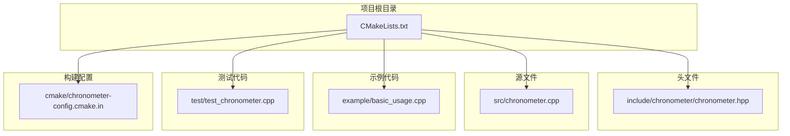
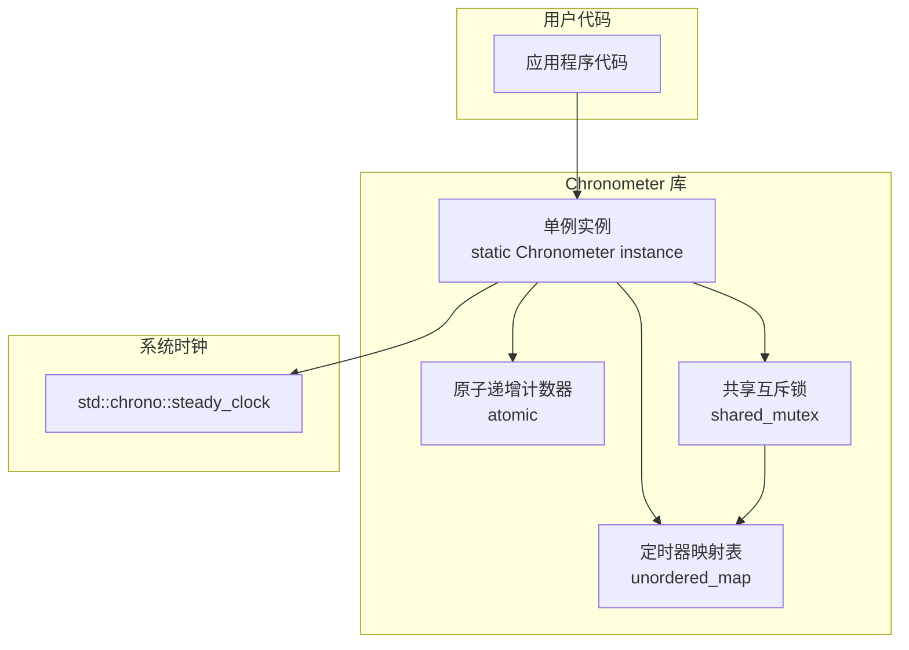
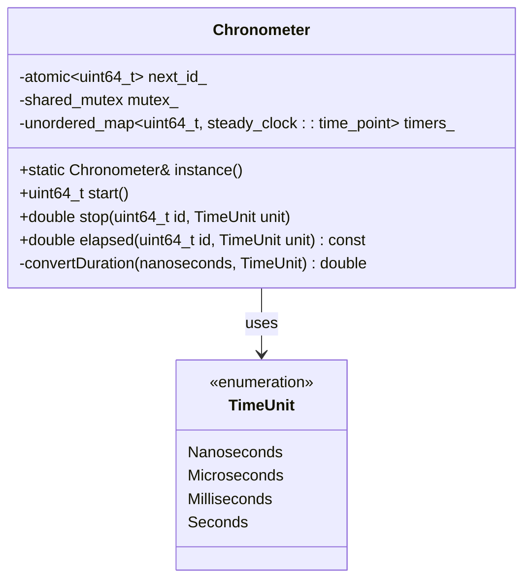
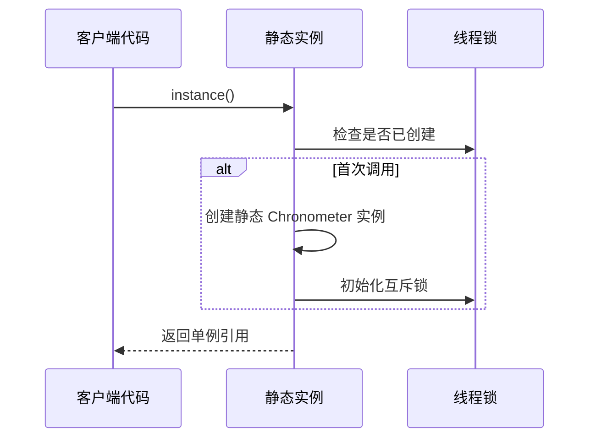
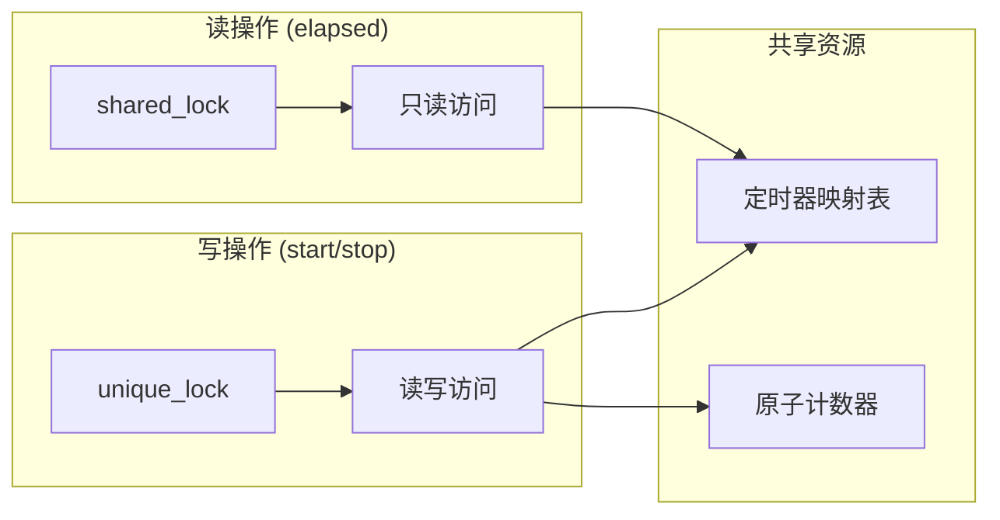
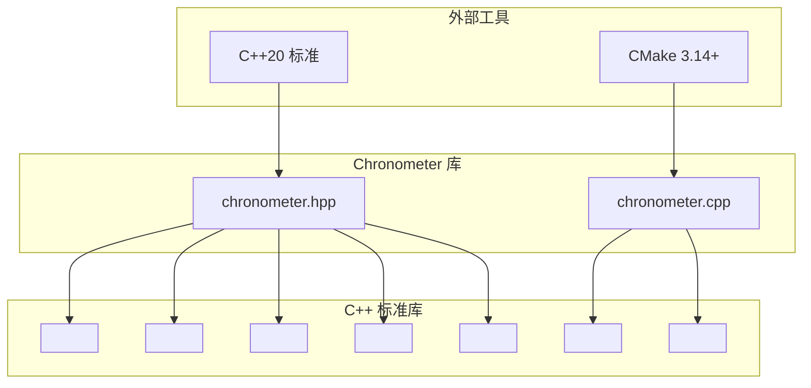

# API 参考文档

<cite>
**本文档引用的文件**
- [chronometer.hpp](file://include/chronometer/chronometer.hpp)
- [chronometer.cpp](file://src/chronometer.cpp)
- [basic_usage.cpp](file://example/basic_usage.cpp)
- [test_chronometer.cpp](file://test/test_chronometer.cpp)
- [CMakeLists.txt](file://CMakeLists.txt)
</cite>

## 目录
1. [简介](#简介)
2. [项目结构](#项目结构)
3. [核心组件](#核心组件)
4. [架构概览](#架构概览)
5. [详细组件分析](#详细组件分析)
6. [依赖关系分析](#依赖关系分析)
7. [性能考虑](#性能考虑)
8. [故障排除指南](#故障排除指南)
9. [结论](#结论)

## 简介

Chronometer 是一个高性能的 C++20 计时器库，提供了简单易用的单例计时接口。该库基于 C++11 的原子操作和互斥锁，支持多线程环境下的安全计时操作。它通过 `std::chrono::steady_clock` 提供高精度的时间测量，并支持多种时间单位的转换。

## 项目结构

Chronometer 项目采用标准的 CMake 项目布局，主要包含以下组件：



**图表来源**
- [CMakeLists.txt:1-82](file://CMakeLists.txt#L1-L82)
- [chronometer.hpp:1-40](file://include/chronometer/chronometer.hpp#L1-L40)

**章节来源**
- [CMakeLists.txt:1-82](file://CMakeLists.txt#L1-L82)

## 核心组件

Chronometer 库的核心是 `Chronometer` 类，它提供了完整的计时功能。该类实现了单例模式，确保在整个应用程序中只有一个计时器实例。

### 主要特性

- **单例模式**: 通过静态工厂方法提供全局唯一的计时器实例
- **线程安全**: 支持多线程并发访问，无死锁风险
- **高精度**: 基于 `std::chrono::steady_clock` 提供纳秒级精度
- **灵活的时间单位**: 支持纳秒、微秒、毫秒和秒四种时间单位
- **轻量级设计**: 最小化内存占用和 CPU 开销

**章节来源**
- [chronometer.hpp:18-37](file://include/chronometer/chronometer.hpp#L18-L37)

## 架构概览

Chronometer 的整体架构基于单例模式和现代 C++ 并发原语：



**图表来源**
- [chronometer.hpp:32-37](file://include/chronometer/chronometer.hpp#L32-L37)
- [chronometer.cpp:37-42](file://src/chronometer.cpp#L37-L42)

## 详细组件分析

### Chronometer 类

`Chronometer` 类是整个库的核心，提供了完整的计时功能接口。

#### 类定义



**图表来源**
- [chronometer.hpp:18-37](file://include/chronometer/chronometer.hpp#L18-L37)

#### 单例模式实现

Chronometer 实现了经典的 C++ 单例模式，通过静态局部变量确保线程安全的延迟初始化：



**图表来源**
- [chronometer.cpp:32-35](file://src/chronometer.cpp#L32-L35)

**章节来源**
- [chronometer.hpp:18-37](file://include/chronometer/chronometer.hpp#L18-L37)
- [chronometer.cpp:32-35](file://src/chronometer.cpp#L32-L35)

### TimeUnit 枚举

TimeUnit 枚举定义了支持的时间单位，为计时结果提供灵活的单位选择：

| 时间单位 | 描述 | 精度级别 |
|---------|------|----------|
| Nanoseconds | 纳秒 | 最高精度 |
| Microseconds | 微秒 | 高精度 |
| Milliseconds | 毫秒 | 中等精度 |
| Seconds | 秒 | 最低精度 |

**章节来源**
- [chronometer.hpp:11-16](file://include/chronometer/chronometer.hpp#L11-L16)

### 核心 API 方法

#### start() 方法

`start()` 方法用于启动一个新的计时器，返回一个唯一的 64 位标识符。

**方法签名**: `uint64_t start()`

**返回值**: 
- 返回类型: `uint64_t`
- 含义: 新创建计时器的唯一标识符
- 特性: 原子递增，保证全局唯一性

**使用场景**:
- 启动独立的性能测量任务
- 标记代码段的开始时间
- 作为后续 `stop()` 和 `elapsed()` 调用的参数

**线程安全**: 完全线程安全，使用原子操作确保 ID 的唯一性

**章节来源**
- [chronometer.hpp:27](file://include/chronometer/chronometer.hpp#L27)
- [chronometer.cpp:37-42](file://src/chronometer.cpp#L37-L42)

#### stop() 方法

`stop()` 方法用于结束指定计时器的计时，并返回经过的时间。

**方法签名**: `double stop(uint64_t id, TimeUnit unit = TimeUnit::Microseconds)`

**参数**:
- `id`: 计时器标识符（由 `start()` 返回）
- `unit`: 时间单位枚举，默认为微秒

**返回值**:
- 返回类型: `double`
- 含义: 计时器从开始到结束经过的时间
- 单位: 由 `unit` 参数决定

**异常处理**:
- 当 `id` 不存在时抛出 `std::out_of_range`

**使用场景**:
- 结束性能测量并获取最终结果
- 清理计时器资源
- 获取精确的执行时间

**章节来源**
- [chronometer.hpp:28](file://include/chronometer/chronometer.hpp#L28)
- [chronometer.cpp:44-56](file://src/chronometer.cpp#L44-L56)

#### elapsed() 方法

`elapsed()` 方法用于查询指定计时器当前的经过时间，但不结束计时。

**方法签名**: `double elapsed(uint64_t id, TimeUnit unit = TimeUnit::Microseconds) const`

**参数**:
- `id`: 计时器标识符（由 `start()` 返回）
- `unit`: 时间单位枚举，默认为微秒

**返回值**:
- 返回类型: `double`
- 含义: 计时器从开始到现在经过的时间
- 单位: 由 `unit` 参数决定

**异常处理**:
- 当 `id` 不存在时抛出 `std::out_of_range`

**使用场景**:
- 实时监控长时间运行任务的进度
- 分阶段性能分析
- 动态调整算法参数

**与 stop() 的区别**:
- `elapsed()`: 查询当前时间，不结束计时器
- `stop()`: 结束计时并删除计时器记录

**章节来源**
- [chronometer.hpp:29](file://include/chronometer/chronometer.hpp#L29)
- [chronometer.cpp:58-69](file://src/chronometer.cpp#L58-L69)

### 内部实现细节

#### 原子计数器

计时器 ID 通过原子操作生成，确保在多线程环境下的一致性：

```mermaid
flowchart TD
Start([start() 调用]) --> FetchAdd[fetch_add(1, memory_order_relaxed)]
FetchAdd --> GetTime[获取当前时间点]
GetTime --> StoreTimer[存储到映射表]
StoreTimer --> ReturnID[返回唯一 ID]
ReturnID --> End([函数结束])
```

**图表来源**
- [chronometer.cpp:37-42](file://src/chronometer.cpp#L37-L42)

#### 线程同步机制

Chronometer 使用读写锁实现高效的并发访问：



**图表来源**
- [chronometer.cpp:39-41](file://src/chronometer.cpp#L39-L41)
- [chronometer.cpp:59](file://src/chronometer.cpp#L59)

**章节来源**
- [chronometer.cpp:37-69](file://src/chronometer.cpp#L37-L69)

## 依赖关系分析

Chronometer 库的依赖关系相对简单，主要依赖于 C++ 标准库：



**图表来源**
- [chronometer.hpp:3-7](file://include/chronometer/chronometer.hpp#L3-L7)
- [chronometer.cpp:3-4](file://src/chronometer.cpp#L3-L4)

**章节来源**
- [chronometer.hpp:3-7](file://include/chronometer/chronometer.hpp#L3-L7)
- [chronometer.cpp:3-4](file://src/chronometer.cpp#L3-L4)

## 性能考虑

### 时间复杂度分析

- **start()**: O(1) - 原子操作 + 哈希表插入
- **stop()**: O(1) - 哈希表查找 + 删除
- **elapsed()**: O(1) - 哈希表查找 + 时间计算

### 内存使用

- 每个活跃计时器占用约 16 字节内存（64 位 ID + 64 位时间点）
- 原子计数器占用 8 字节
- 互斥锁占用平台相关的内存空间

### 并发性能

- 读操作（elapsed）使用共享锁，允许多个线程同时读取
- 写操作（start/stop）使用独占锁，避免竞争
- 原子操作最小化锁竞争

## 故障排除指南

### 常见问题及解决方案

#### 1. 计时器 ID 不存在异常

**症状**: 调用 `stop()` 或 `elapsed()` 时抛出 `std::out_of_range` 异常

**原因**:
- 使用了无效的计时器 ID
- 计时器已被 `stop()` 方法自动清理
- ID 跨越了不同的程序实例

**解决方案**:
- 确保使用 `start()` 返回的有效 ID
- 避免重复使用同一个 ID
- 检查计时器是否已被清理

#### 2. 性能测量不准确

**症状**: 计时结果与预期不符

**可能原因**:
- 使用了不合适的计时单位
- 系统时钟精度限制
- 线程调度影响

**建议**:
- 使用 `TimeUnit::Nanoseconds` 进行高精度测量
- 进行多次测量取平均值
- 在稳定的系统环境下进行测试

#### 3. 并发访问问题

**症状**: 多线程环境下出现数据竞争或死锁

**解决方案**:
- 确保每个线程使用独立的计时器 ID
- 避免在不同线程间共享计时器状态
- 使用适当的同步机制保护共享资源

**章节来源**
- [test_chronometer.cpp:87-96](file://test/test_chronometer.cpp#L87-L96)

## 结论

Chronometer 库提供了一个简洁而强大的计时解决方案，具有以下优势：

1. **简单易用**: 单例模式和直观的 API 设计
2. **高性能**: 原子操作和高效的数据结构
3. **线程安全**: 完善的并发控制机制
4. **灵活配置**: 支持多种时间单位和精度级别
5. **标准兼容**: 符合 C++20 标准要求

该库适用于各种性能测量场景，从简单的代码段计时到复杂的系统性能分析。通过遵循本文档的最佳实践，开发者可以充分利用 Chronometer 的功能来优化应用程序性能。