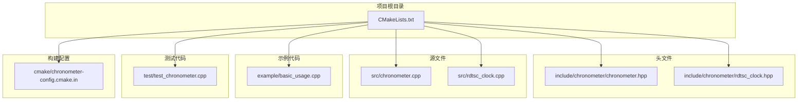
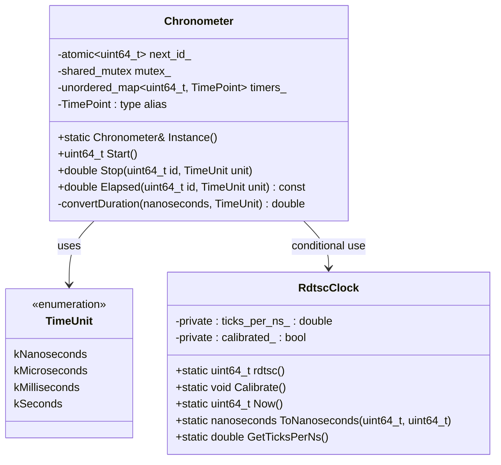
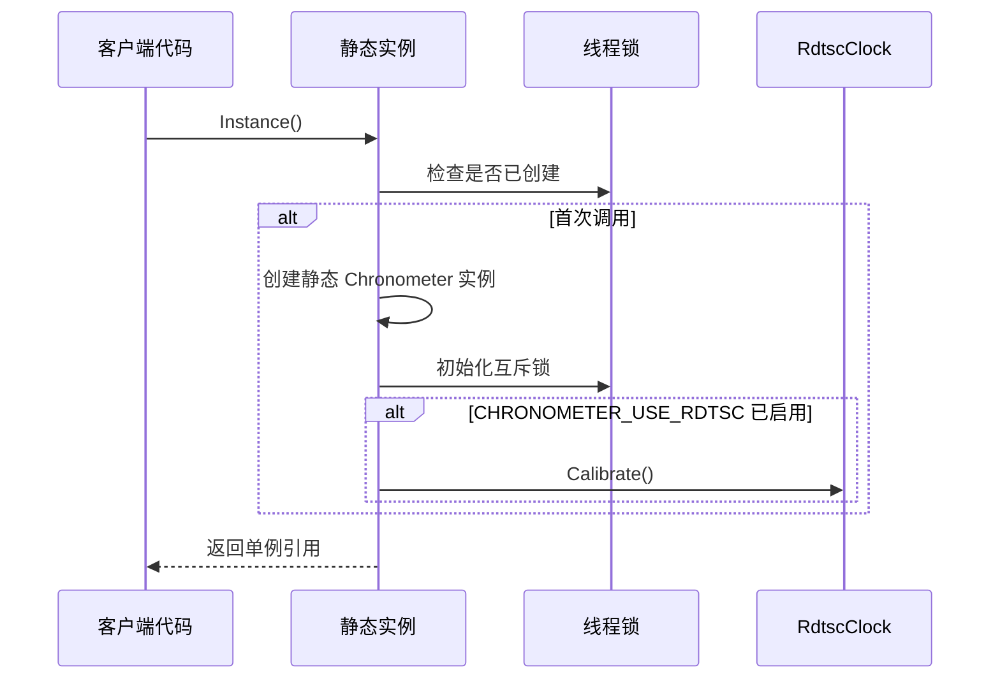
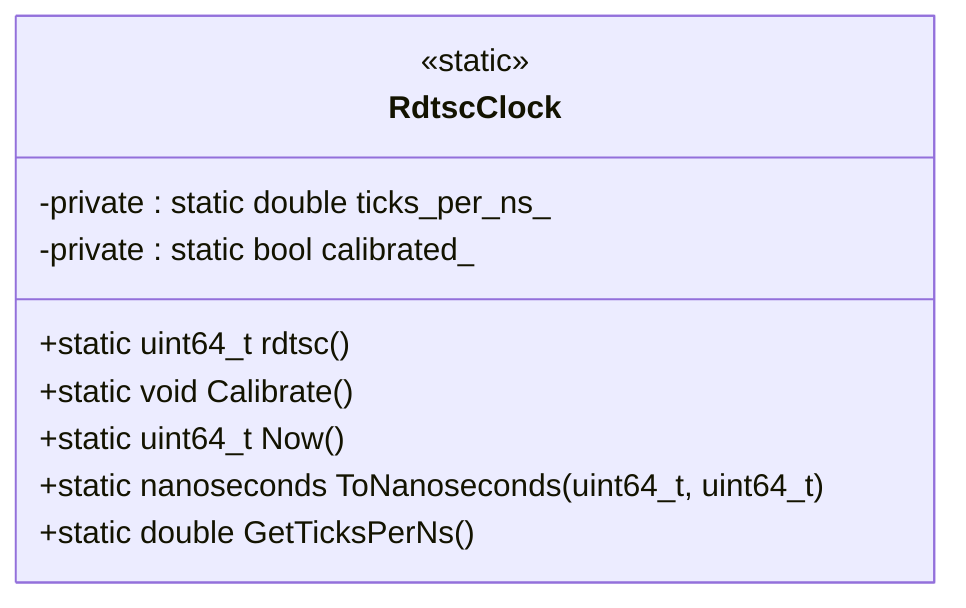
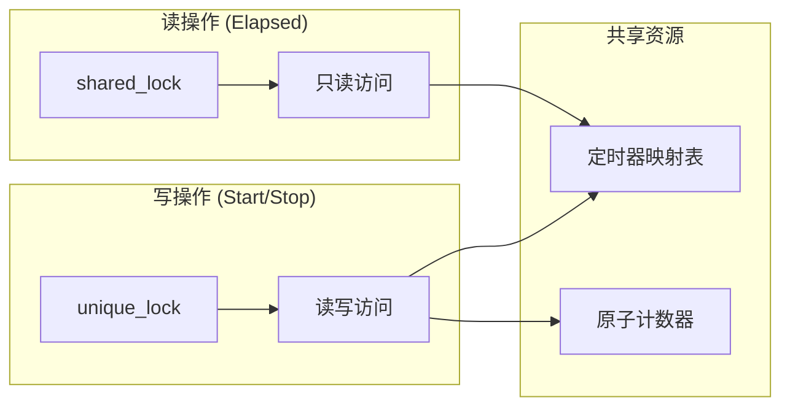
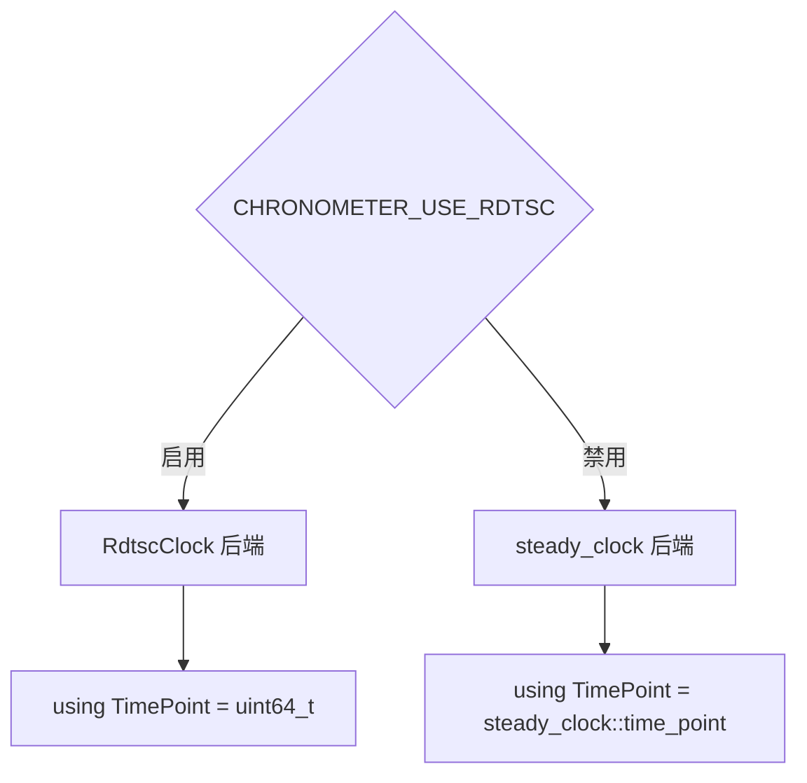

# API 参考文档

<cite>
**本文档引用的文件**
- [chronometer.hpp](file://include/chronometer/chronometer.hpp)
- [chronometer.cpp](file://src/chronometer.cpp)
- [rdtsc_clock.hpp](file://include/chronometer/rdtsc_clock.hpp)
- [rdtsc_clock.cpp](file://src/rdtsc_clock.cpp)
- [basic_usage.cpp](file://example/basic_usage.cpp)
- [test_chronometer.cpp](file://test/test_chronometer.cpp)
- [CMakeLists.txt](file://CMakeLists.txt)
</cite>

## 更新摘要
**变更内容**
- 新增 RDTSC 高精度计时器类 `RdtscClock`
- 添加条件编译配置选项 `CHRONOMETER_USE_RDTSC`
- 更新 `Chronometer` 类以支持双后端计时系统
- 新增 RDTSC 校准和精度测试功能
- 更新构建系统以支持可选的 RDTSC 功能

## 目录
1. [简介](#简介)
2. [项目结构](#项目结构)
3. [核心组件](#核心组件)
4. [架构概览](#架构概览)
5. [详细组件分析](#详细组件分析)
6. [条件编译配置](#条件编译配置)
7. [依赖关系分析](#依赖关系分析)
8. [性能考虑](#性能考虑)
9. [故障排除指南](#故障排除指南)
10. [结论](#结论)

## 简介

Chronometer 是一个高性能的 C++20 计时器库，提供了简单易用的单例计时接口。该库基于 C++11 的原子操作和互斥锁，支持多线程环境下的安全计时操作。它通过 `std::chrono::steady_clock` 提供高精度的时间测量，并支持多种时间单位的转换。

**新增特性**: 库现已支持基于 x86 RDTSC 指令的高精度计时器，可在 x86_64 架构上提供纳秒级精度的计时能力。

## 项目结构

Chronometer 项目采用标准的 CMake 项目布局，主要包含以下组件：



**图表来源**
- [CMakeLists.txt:1-93](file://CMakeLists.txt#L1-L93)
- [chronometer.hpp:1-103](file://include/chronometer/chronometer.hpp#L1-L103)

**章节来源**
- [CMakeLists.txt:1-93](file://CMakeLists.txt#L1-L93)

## 核心组件

Chronometer 库包含两个核心组件：主计时器类和可选的 RDTSC 高精度计时器。

### 主要特性

- **单例模式**: 通过静态工厂方法提供全局唯一的计时器实例
- **双后端支持**: 支持 `std::chrono::steady_clock` 和 RDTSC 两种计时后端
- **线程安全**: 支持多线程并发访问，无死锁风险
- **高精度**: 基于 `std::chrono::steady_clock` 提供纳秒级精度，RDTSC 提供更高精度
- **灵活的时间单位**: 支持纳秒、微秒、毫秒和秒四种时间单位
- **轻量级设计**: 最小化内存占用和 CPU 开销

**章节来源**
- [chronometer.hpp:34-100](file://include/chronometer/chronometer.hpp#L34-L100)

## 架构概览

Chronometer 的整体架构基于单例模式和现代 C++ 并发原语，支持两种计时后端：

```mermaid
graph TB
subgraph "用户代码"
App[应用程序代码]
end
subgraph "Chronometer 库"
Instance[单例实例<br/>static Chronometer instance]
TimerMap[定时器映射表<br/>unordered_map<uint64_t, time_point>]
AtomicCounter[原子递增计数器<br/>atomic<uint64_t>]
SharedMutex[共享互斥锁<br/>shared_mutex]
end
subgraph "计时后端选择"
BackendSelect{后端选择}
SteadyClock[std::chrono::steady_clock]
RdtscClock[RdtscClock::Now()]
BackendSelect --> SteadyClock
BackendSelect --> RdtscClock
end
subgraph "RDTSC 高精度计时"
Calibration[Calibration()<br/>ticks_per_ns_]
TicksPerNs[GetTicksPerNs()<br/>频率校准]
end
App --> Instance
Instance --> TimerMap
Instance --> AtomicCounter
Instance --> SharedMutex
Instance --> BackendSelect
SteadyClock --> TimerMap
RdtscClock --> Calibration
RdtscClock --> TicksPerNs
```

**图表来源**
- [chronometer.hpp:90-94](file://include/chronometer/chronometer.hpp#L90-L94)
- [chronometer.cpp:50-56](file://src/chronometer.cpp#L50-L56)
- [rdtsc_clock.hpp:28-81](file://include/chronometer/rdtsc_clock.hpp#L28-L81)

## 详细组件分析

### Chronometer 类

`Chronometer` 类是整个库的核心，提供了完整的计时功能接口。

#### 类定义



**图表来源**
- [chronometer.hpp:41-100](file://include/chronometer/chronometer.hpp#L41-L100)
- [rdtsc_clock.hpp:28-81](file://include/chronometer/rdtsc_clock.hpp#L28-L81)

#### 单例模式实现

Chronometer 实现了经典的 C++ 单例模式，通过静态局部变量确保线程安全的延迟初始化：



**图表来源**
- [chronometer.cpp:47-58](file://src/chronometer.cpp#L47-L58)

**章节来源**
- [chronometer.hpp:41-100](file://include/chronometer/chronometer.hpp#L41-L100)
- [chronometer.cpp:47-58](file://src/chronometer.cpp#L47-L58)

### TimeUnit 枚举

TimeUnit 枚举定义了支持的时间单位，为计时结果提供灵活的单位选择：

| 时间单位 | 描述 | 精度级别 |
|---------|------|----------|
| kNanoseconds | 纳秒 | 最高精度 |
| kMicroseconds | 微秒 | 高精度 |
| kMilliseconds | 毫秒 | 中等精度 |
| kSeconds | 秒 | 最低精度 |

**章节来源**
- [chronometer.hpp:27-32](file://include/chronometer/chronometer.hpp#L27-L32)

### 核心 API 方法

#### Start() 方法

`Start()` 方法用于启动一个新的计时器，返回一个唯一的 64 位标识符。

**方法签名**: `uint64_t Start()`

**返回值**: 
- 返回类型: `uint64_t`
- 含义: 新创建计时器的唯一标识符
- 特性: 原子递增，保证全局唯一性

**后端选择**:
- 当启用 `CHRONOMETER_USE_RDTSC`: 使用 `RdtscClock::Now()` 获取 TSC 计数
- 默认: 使用 `std::chrono::steady_clock::now()` 获取时间点

**使用场景**:
- 启动独立的性能测量任务
- 标记代码段的开始时间
- 作为后续 `Stop()` 和 `Elapsed()` 调用的参数

**线程安全**: 完全线程安全，使用原子操作确保 ID 的唯一性

**章节来源**
- [chronometer.hpp:62](file://include/chronometer/chronometer.hpp#L62)
- [chronometer.cpp:60-73](file://src/chronometer.cpp#L60-L73)

#### Stop() 方法

`Stop()` 方法用于结束指定计时器的计时，并返回经过的时间。

**方法签名**: `double Stop(uint64_t id, TimeUnit unit = TimeUnit::kMicroseconds)`

**参数**:
- `id`: 计时器标识符（由 `Start()` 返回）
- `unit`: 时间单位枚举，默认为微秒

**返回值**:
- 返回类型: `double`
- 含义: 计时器从开始到结束经过的时间
- 单位: 由 `unit` 参数决定

**异常处理**:
- 当 `id` 不存在时抛出 `std::out_of_range`

**后端选择**:
- 当启用 `CHRONOMETER_USE_RDTSC`: 使用 `RdtscClock::ToNanoseconds()` 进行转换
- 默认: 使用 `std::chrono::duration_cast<std::chrono::nanoseconds>()`

**使用场景**:
- 结束性能测量并获取最终结果
- 清理计时器资源
- 获取精确的执行时间

**章节来源**
- [chronometer.hpp:74](file://include/chronometer/chronometer.hpp#L74)
- [chronometer.cpp:75-98](file://src/chronometer.cpp#L75-L98)

#### Elapsed() 方法

`Elapsed()` 方法用于查询指定计时器当前的经过时间，但不结束计时。

**方法签名**: `double Elapsed(uint64_t id, TimeUnit unit = TimeUnit::kMicroseconds) const`

**参数**:
- `id`: 计时器标识符（由 `Start()` 返回）
- `unit`: 时间单位枚举，默认为微秒

**返回值**:
- 返回类型: `double`
- 含义: 计时器从开始到现在经过的时间
- 单位: 由 `unit` 参数决定

**异常处理**:
- 当 `id` 不存在时抛出 `std::out_of_range`

**后端选择**:
- 当启用 `CHRONOMETER_USE_RDTSC`: 使用 `RdtscClock::ToNanoseconds()` 进行转换
- 默认: 使用 `std::chrono::duration_cast<std::chrono::nanoseconds>()`

**使用场景**:
- 实时监控长时间运行任务的进度
- 分阶段性能分析
- 动态调整算法参数

**与 Stop() 的区别**:
- `Elapsed()`: 查询当前时间，不结束计时器
- `Stop()`: 结束计时并删除计时器记录

**章节来源**
- [chronometer.hpp:85](file://include/chronometer/chronometer.hpp#L85)
- [chronometer.cpp:100-122](file://src/chronometer.cpp#L100-L122)

### RdtscClock 类

`RdtscClock` 类提供了基于 x86 RDTSC 指令的高精度计时功能。

#### 类定义



**图表来源**
- [rdtsc_clock.hpp:28-81](file://include/chronometer/rdtsc_clock.hpp#L28-L81)

#### 核心方法

**rdtsc() 方法**
- **功能**: 读取当前 TSC 计数
- **返回值**: `uint64_t` 当前 TSC 计数值
- **实现**: 使用 RDTSCP 指令配合 LFENCE 序列化确保准确性

**Calibrate() 方法**
- **功能**: 校准 TSC 与纳秒的转换比率
- **实现**: 使用 `std::chrono::steady_clock` 作为参考时钟，通过多次采样计算比率
- **精度**: 目标误差 < 1%
- **注意**: 非线程安全，应在程序初始化阶段单线程调用

**Now() 方法**
- **功能**: 获取当前 TSC 计数
- **返回值**: `uint64_t` 当前 TSC 计数值

**ToNanoseconds() 方法**
- **功能**: 将 TSC 差值转换为纳秒
- **参数**: 起始和结束 TSC 计数
- **返回值**: `std::chrono::nanoseconds` 转换后的纳秒时间

**GetTicksPerNs() 方法**
- **功能**: 获取校准后的 TSC ticks 每纳秒比率
- **返回值**: `double` TSC ticks 每纳秒的比率

**章节来源**
- [rdtsc_clock.hpp:28-81](file://include/chronometer/rdtsc_clock.hpp#L28-L81)
- [rdtsc_clock.cpp:14-64](file://src/rdtsc_clock.cpp#L14-L64)

### 内部实现细节

#### 原子计数器

计时器 ID 通过原子操作生成，确保在多线程环境下的一致性：

```mermaid
flowchart TD
Start([Start() 调用]) --> FetchAdd[fetch_add(1, memory_order_relaxed)]
FetchAdd --> GetTime[获取当前时间点]
GetTime --> StoreTimer[存储到映射表]
StoreTimer --> ReturnID[返回唯一 ID]
ReturnID --> End([函数结束])
```

**图表来源**
- [chronometer.cpp:60-73](file://src/chronometer.cpp#L60-L73)

#### 线程同步机制

Chronometer 使用读写锁实现高效的并发访问：



**图表来源**
- [chronometer.cpp:69-72](file://src/chronometer.cpp#L69-L72)
- [chronometer.cpp:107-113](file://src/chronometer.cpp#L107-L113)

**章节来源**
- [chronometer.cpp:60-122](file://src/chronometer.cpp#L60-L122)

## 条件编译配置

### CHRONOMETER_USE_RDTSC 选项

Chronometer 提供了可选的 RDTSC 高精度计时功能，通过 CMake 选项控制：

**配置选项**:
- `CHRONOMETER_USE_RDTSC`: 启用 RDTSC 高精度计时功能（默认关闭）

**构建配置**:
- 仅在 x86_64 架构上可用
- 自动添加编译定义 `CHRONOMETER_USE_RDTSC`
- 条件性编译 `src/rdtsc_clock.cpp`

**使用场景**:
- 需要纳秒级精度的性能测量
- 低开销的高频计时需求
- 高性能计算环境

**章节来源**
- [CMakeLists.txt:20-27](file://CMakeLists.txt#L20-L27)
- [chronometer.hpp:16-18](file://include/chronometer/chronometer.hpp#L16-L18)
- [chronometer.cpp:50-56](file://src/chronometer.cpp#L50-L56)

### 编译时后端选择

Chronometer 在编译时根据配置选择计时后端：



**图表来源**
- [chronometer.hpp:90-94](file://include/chronometer/chronometer.hpp#L90-L94)

**章节来源**
- [chronometer.hpp:90-94](file://include/chronometer/chronometer.hpp#L90-L94)

## 依赖关系分析

Chronometer 库的依赖关系根据配置有所不同：

```mermaid
graph TB
subgraph "Chronometer 库"
ChronoHeader[chronometer.hpp]
ChronoSource[chronometer.cpp]
end
subgraph "C++ 标准库"
Atomic[<atomic>]
Chrono[<chrono>]
Cstdint[<cstdint>]
SharedMutex[<shared_mutex>]
UnorderedMap[<unordered_map>]
Mutex[<mutex>]
Exception[<stdexcept>]
end
subgraph "RDTSC 依赖"
Intrinsics[x86intrin.h]
Thread[<thread>]
end
subgraph "外部工具"
CMake[CMake 3.14+]
Cpp20[C++20 标准]
end
ChronoHeader --> Atomic
ChronoHeader --> Chrono
ChronoHeader --> Cstdint
ChronoHeader --> SharedMutex
ChronoHeader --> UnorderedMap
ChronoSource --> Mutex
ChronoSource --> Exception
#ifdef CHRONOMETER_USE_RDTSC
ChronoHeader --> Intrinsics
ChronoSource --> Thread
end
CMake --> ChronoSource
CMake --> Intrinsics
Cpp20 --> ChronoHeader
```

**图表来源**
- [chronometer.hpp:10-18](file://include/chronometer/chronometer.hpp#L10-L18)
- [chronometer.cpp:11-13](file://src/chronometer.cpp#L11-L13)
- [rdtsc_clock.hpp:14](file://include/chronometer/rdtsc_clock.hpp#L14)
- [rdtsc_clock.cpp:10](file://src/rdtsc_clock.cpp#L10)

**章节来源**
- [chronometer.hpp:10-18](file://include/chronometer/chronometer.hpp#L10-L18)
- [chronometer.cpp:11-13](file://src/chronometer.cpp#L11-L13)
- [rdtsc_clock.hpp:14](file://include/chronometer/rdtsc_clock.hpp#L14)
- [rdtsc_clock.cpp:10](file://src/rdtsc_clock.cpp#L10)

## 性能考虑

### 时间复杂度分析

- **Start()**: O(1) - 原子操作 + 哈希表插入
- **Stop()**: O(1) - 哈希表查找 + 删除
- **Elapsed()**: O(1) - 哈希表查找 + 时间计算

### 内存使用

- 每个活跃计时器占用约 16 字节内存（64 位 ID + 64 位时间点）
- 原子计数器占用 8 字节
- 互斥锁占用平台相关的内存空间
- RDTSC 校准数据占用少量静态内存

### 并发性能

- 读操作（Elapsed）使用共享锁，允许多个线程同时读取
- 写操作（Start/Stop）使用独占锁，避免竞争
- 原子操作最小化锁竞争

### RDTSC 特殊考虑

- **校准开销**: 首次使用时需要进行校准，但只在单例初始化时发生一次
- **CPU 特定**: 仅在 x86_64 架构上可用
- **序列化**: 使用 RDTSCP + LFENCE 确保读取准确性
- **频率稳定性**: 依赖 CPU 时钟频率，可能受电源管理影响

## 故障排除指南

### 常见问题及解决方案

#### 1. 计时器 ID 不存在异常

**症状**: 调用 `Stop()` 或 `Elapsed()` 时抛出 `std::out_of_range` 异常

**原因**:
- 使用了无效的计时器 ID
- 计时器已被 `Stop()` 方法自动清理
- ID 跨越了不同的程序实例

**解决方案**:
- 确保使用 `Start()` 返回的有效 ID
- 避免重复使用同一个 ID
- 检查计时器是否已被清理

#### 2. RDTSC 功能不可用

**症状**: 启用 `CHRONOMETER_USE_RDTSC` 时编译失败

**原因**:
- 非 x86_64 架构
- 缺少必要的编译器内建函数支持

**解决方案**:
- 确保在 x86_64 架构上编译
- 使用支持 x86intrin.h 的编译器
- 检查编译器版本和配置

#### 3. RDTSC 校准失败

**症状**: `RdtscClock::Calibrate()` 返回不合理结果

**可能原因**:
- 系统时钟不稳定
- 线程调度干扰
- CPU 频率动态调整

**建议**:
- 在稳定的系统环境下进行校准
- 确保校准过程不被其他线程干扰
- 检查 CPU 电源管理设置

#### 4. 性能测量不准确

**症状**: 计时结果与预期不符

**可能原因**:
- 使用了不合适的计时单位
- 系统时钟精度限制
- 线程调度影响

**建议**:
- 使用 `TimeUnit::kNanoseconds` 进行高精度测量
- 进行多次测量取平均值
- 在稳定的系统环境下进行测试

#### 5. 并发访问问题

**症状**: 多线程环境下出现数据竞争或死锁

**解决方案**:
- 确保每个线程使用独立的计时器 ID
- 避免在不同线程间共享计时器状态
- 使用适当的同步机制保护共享资源

**章节来源**
- [test_chronometer.cpp:91-102](file://test/test_chronometer.cpp#L91-L102)
- [CMakeLists.txt:22-24](file://CMakeLists.txt#L22-L24)

## 结论

Chronometer 库提供了一个简洁而强大的计时解决方案，具有以下优势：

1. **简单易用**: 单例模式和直观的 API 设计
2. **高性能**: 原子操作和高效的数据结构
3. **线程安全**: 完善的并发控制机制
4. **灵活配置**: 支持多种时间单位和精度级别
5. **双后端支持**: 可选的 RDTSC 高精度计时功能
6. **标准兼容**: 符合 C++20 标准要求

**新增特性优势**:
- **RDTSC 高精度**: 在 x86_64 架构上提供纳秒级精度
- **条件编译**: 可根据需求选择最优的计时后端
- **自动校准**: RDTSC 功能包含自动频率校准机制
- **向后兼容**: 默认行为保持不变，不影响现有代码

该库适用于各种性能测量场景，从简单的代码段计时到复杂的系统性能分析。通过遵循本文档的最佳实践，开发者可以充分利用 Chronometer 的功能来优化应用程序性能。RDTSC 功能特别适合需要极高精度和低开销计时的应用场景。