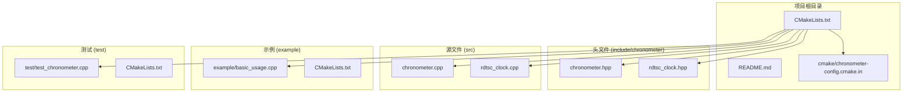
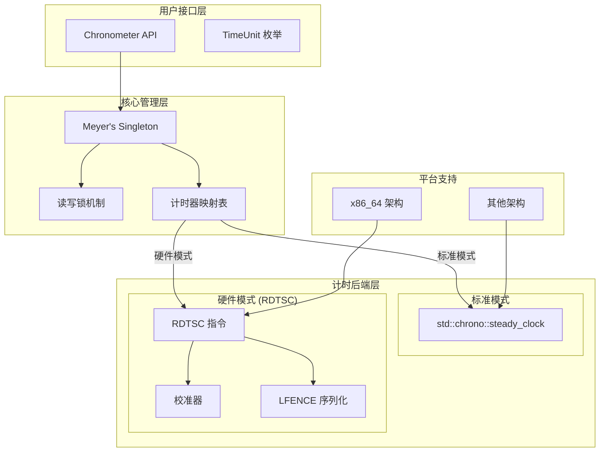
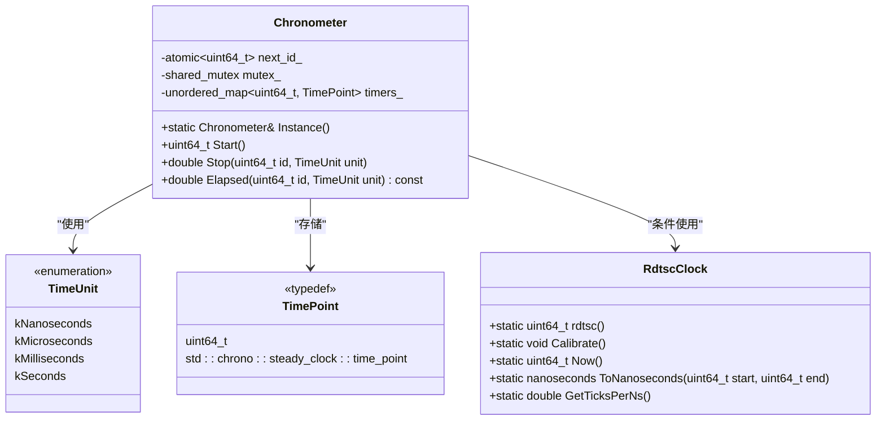
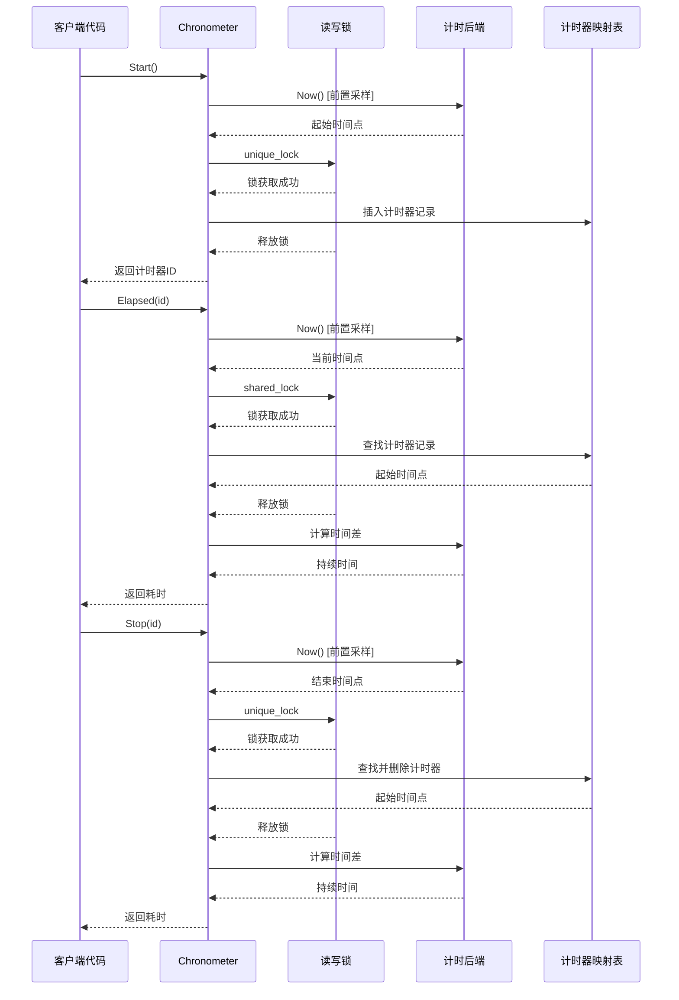
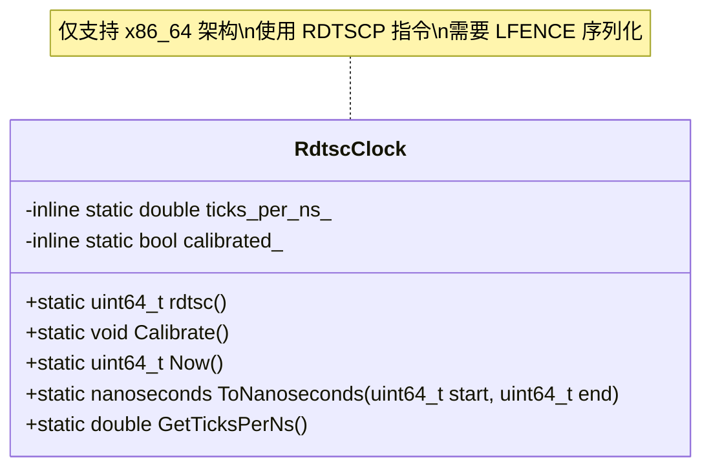
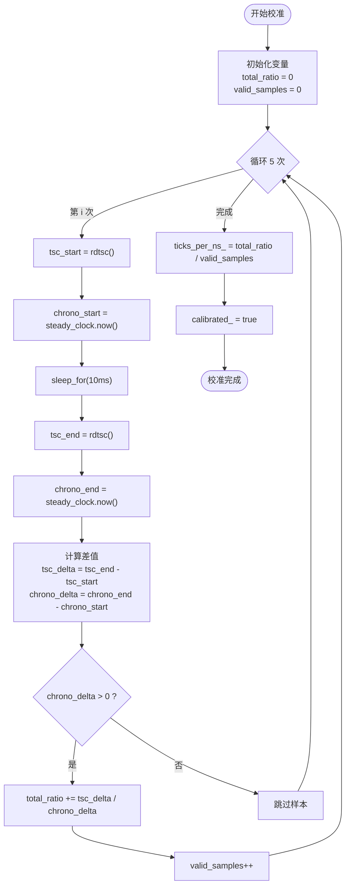
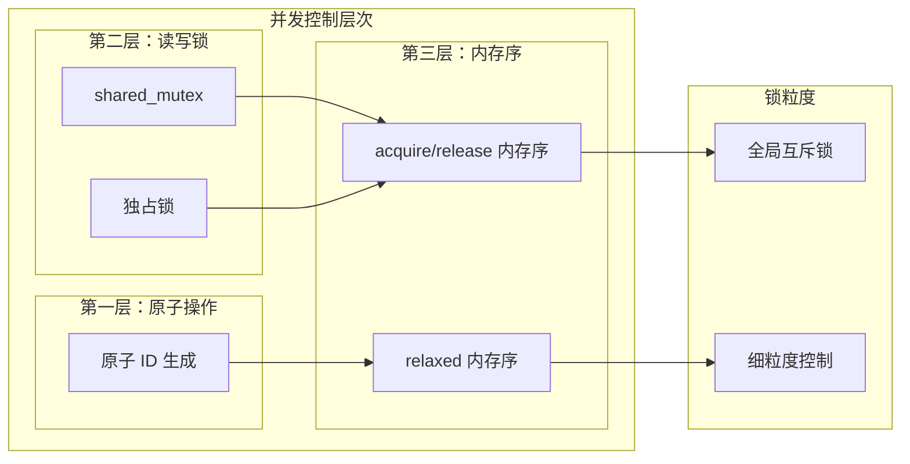
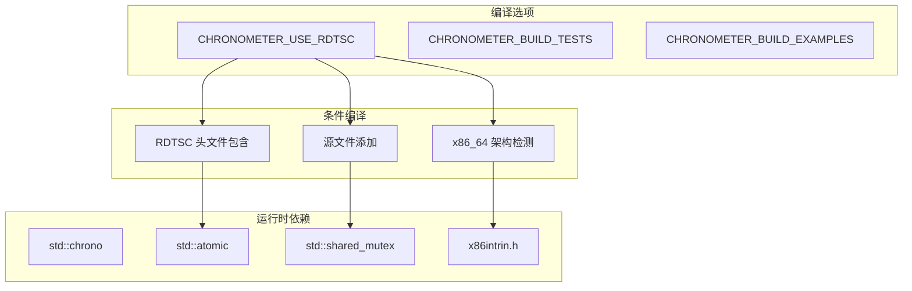

# 高精度计时 - RDTSC 支持

<cite>
**本文档中引用的文件**
- [README.md](file://README.md)
- [CMakeLists.txt](file://CMakeLists.txt)
- [chronometer.hpp](file://include/chronometer/chronometer.hpp)
- [rdtsc_clock.hpp](file://include/chronometer/rdtsc_clock.hpp)
- [chronometer.cpp](file://src/chronometer.cpp)
- [rdtsc_clock.cpp](file://src/rdtsc_clock.cpp)
- [basic_usage.cpp](file://example/basic_usage.cpp)
- [test_chronometer.cpp](file://test/test_chronometer.cpp)
- [chronometer-config.cmake.in](file://cmake/chronometer-config.cmake.in)
</cite>

## 更新摘要
**变更内容**
- 更新了 RDTSC 实现细节，反映完全重写的硬件计时器实现
- 增强了校准机制的描述，包括新的采样策略和精度目标
- 添加了条件编译支持的详细说明
- 更新了示例代码展示新的高精度功能
- 完善了架构图以反映实际的实现细节

## 目录
1. [简介](#简介)
2. [项目结构](#项目结构)
3. [核心组件](#核心组件)
4. [架构概览](#架构概览)
5. [详细组件分析](#详细组件分析)
6. [依赖关系分析](#依赖关系分析)
7. [性能考虑](#性能考虑)
8. [故障排除指南](#故障排除指南)
9. [结论](#结论)

## 简介

Chronometer 是一个基于 C++20 的线程安全高精度计时器管理库，提供纳秒级精度的计时功能。该项目的核心特色是支持基于 x86 RDTSC（Read Time Stamp Counter）指令的硬件计时器，能够在 x86_64 架构上实现极高的计时精度和极低的调用开销。

### 主要特性

- **Meyer's Singleton 线程安全单例**：使用 C++11 起保证线程安全的单例模式
- **原子操作生成计时器 ID**：使用 `std::atomic<uint64_t>` 确保 ID 的唯一性和原子性
- **读写锁并发控制**：使用 `std::shared_mutex` 实现高效的并发访问
- **双模式计时后端**：
  - 基于 `std::chrono::steady_clock` 的标准计时
  - 基于 x86 RDTSC 指令的硬件计时（需要 x86_64 架构）
- **多时间单位支持**：纳秒、微秒、毫秒、秒四种时间单位
- **高性能设计**：RDTSC 模式下调用开销小于 1000ns

## 项目结构

项目采用标准的 CMake 项目布局，包含头文件、源文件、示例和测试模块：



**图表来源**
- [CMakeLists.txt:1-93](file://CMakeLists.txt#L1-L93)
- [chronometer.hpp:1-103](file://include/chronometer/chronometer.hpp#L1-L103)
- [rdtsc_clock.hpp:1-86](file://include/chronometer/rdtsc_clock.hpp#L1-L86)

**章节来源**
- [CMakeLists.txt:1-93](file://CMakeLists.txt#L1-L93)
- [README.md:1-103](file://README.md#L1-L103)

## 核心组件

### Chronometer 类

`Chronometer` 类是整个库的核心，实现了线程安全的计时器管理功能。它提供了以下关键接口：

- `Instance()`：获取单例实例
- `Start()`：启动新的计时器并返回唯一 ID
- `Stop(id, unit)`：停止指定计时器并返回耗时
- `Elapsed(id, unit)`：获取指定计时器当前已运行时间

### RdtscClock 类

`RdtscClock` 类提供了基于 x86 RDTSC 指令的硬件计时功能：

- `rdtsc()`：使用 RDTSCP 指令读取 TSC 计数，并通过 LFENCE 序列化确保准确性
- `Calibrate()`：校准 TSC 与纳秒的转换比率，使用 5 次采样计算平均值
- `Now()`：获取当前 TSC 计数
- `ToNanoseconds(start, end)`：将 TSC 差值转换为纳秒
- `GetTicksPerNs()`：获取校准后的 TSC ticks 每纳秒比率

**章节来源**
- [chronometer.hpp:41-100](file://include/chronometer/chronometer.hpp#L41-L100)
- [rdtsc_clock.hpp:28-81](file://include/chronometer/rdtsc_clock.hpp#L28-L81)

## 架构概览

系统采用双模式架构设计，根据编译选项选择不同的计时后端：



**图表来源**
- [chronometer.cpp:47-58](file://src/chronometer.cpp#L47-L58)
- [chronometer.hpp:90-94](file://include/chronometer/chronometer.hpp#L90-L94)
- [rdtsc_clock.cpp:14-19](file://src/rdtsc_clock.cpp#L14-L19)

## 详细组件分析

### Chronometer 类详细分析

`Chronometer` 类实现了完整的计时器生命周期管理：



**图表来源**
- [chronometer.hpp:41-100](file://include/chronometer/chronometer.hpp#L41-L100)
- [rdtsc_clock.hpp:28-81](file://include/chronometer/rdtsc_clock.hpp#L28-L81)

#### 计时流程序列图



**图表来源**
- [chronometer.cpp:60-122](file://src/chronometer.cpp#L60-L122)

**章节来源**
- [chronometer.cpp:47-122](file://src/chronometer.cpp#L47-L122)

### RdtscClock 类详细分析

`RdtscClock` 类提供了高性能的硬件计时功能：



**图表来源**
- [rdtsc_clock.hpp:28-81](file://include/chronometer/rdtsc_clock.hpp#L28-L81)

#### 校准流程



**图表来源**
- [rdtsc_clock.cpp:21-53](file://src/rdtsc_clock.cpp#L21-L53)

#### RDTSC 实现细节

**更新** 反映了完全重写的 RDTSC 实现，使用了更精确的硬件指令和序列化机制：

- **硬件指令**：使用 `__builtin_ia32_rdtscp` 替代传统的 `__rdtscp`
- **序列化保证**：在每次读取后调用 `_mm_lfence()` 确保指令序列化
- **条件编译**：仅在 x86_64 架构上启用 RDTSC 功能
- **精度提升**：通过 5 次采样计算平均值，目标误差 < 1%

**章节来源**
- [rdtsc_clock.cpp:14-64](file://src/rdtsc_clock.cpp#L14-L64)

### 并发控制机制

系统采用了分层的并发控制策略：



**图表来源**
- [chronometer.cpp:60-122](file://src/chronometer.cpp#L60-L122)

**章节来源**
- [chronometer.cpp:60-122](file://src/chronometer.cpp#L60-L122)

## 依赖关系分析

### 编译时依赖



**图表来源**
- [CMakeLists.txt:20-27](file://CMakeLists.txt#L20-L27)
- [chronometer.hpp:16-18](file://include/chronometer/chronometer.hpp#L16-L18)

### 运行时依赖

系统的主要运行时依赖包括：

- **C++20 标准库**：`std::chrono`、`std::atomic`、`std::shared_mutex`
- **x86_64 平台特定**：`x86intrin.h` 头文件
- **测试框架**：Google Test (仅测试构建时)
- **构建系统**：CMake 3.14+

**章节来源**
- [CMakeLists.txt:1-93](file://CMakeLists.txt#L1-L93)
- [chronometer.hpp:10-18](file://include/chronometer/chronometer.hpp#L10-L18)

## 性能考虑

### RDTSC 模式性能特征

在启用 RDTSC 模式时，系统具有以下性能特征：

- **调用开销**：< 1000ns（1微秒）
- **精度**：纳秒级
- **CPU 序列化**：使用 RDTSCP + LFENCE 确保读取准确性
- **校准要求**：首次使用前必须调用 `Calibrate()`
- **采样精度**：5次采样取平均值，目标误差 < 1%

### 并发性能优化

系统通过以下方式优化并发性能：

- **前置采样**：在获取锁之前进行时间采样，减少锁持有时间
- **读写分离**：使用 `std::shared_mutex` 支持多个并发读取
- **原子 ID 生成**：使用 `memory_order_relaxed` 减少内存屏障开销
- **细粒度锁定**：仅在必要时获取独占锁

### 内存使用优化

- **无动态分配**：所有数据结构使用栈或静态存储
- **紧凑数据结构**：使用 `std::unordered_map` 存储计时器状态
- **最小化缓存失效**：优化数据结构布局以提高缓存效率

## 故障排除指南

### 常见问题及解决方案

#### 1. RDTSC 模式编译错误

**问题**：启用 `CHRONOMETER_USE_RDTSC` 时编译失败

**原因**：当前系统架构不是 x86_64

**解决方案**：
```cmake
# 禁用 RDTSC 支持
cmake -B build -DCHRONOMETER_USE_RDTSC=OFF

# 或者在 CMakeLists.txt 中注释掉相关选项
# option(CHRONOMETER_USE_RDTSC "Use RDTSC for high-precision timing (x86_64 only)" OFF)
```

#### 2. 计时器 ID 不存在异常

**问题**：调用 `Stop()` 或 `Elapsed()` 时抛出 `std::out_of_range`

**原因**：使用了无效的计时器 ID

**解决方案**：
```cpp
try {
    double elapsed = chrono.Stop(invalid_id);
} catch (const std::out_of_range& e) {
    // 处理无效 ID 的情况
    std::cerr << "Invalid timer ID: " << e.what() << std::endl;
}
```

#### 3. RDTSC 校准失败

**问题**：RDTSC 模式下计时结果不准确

**原因**：未进行校准或校准失败

**解决方案**：
```cpp
#ifdef CHRONOMETER_USE_RDTSC
// 在程序初始化阶段调用
chronometer::RdtscClock::Calibrate();
#endif
```

#### 4. 并发访问问题

**问题**：多线程环境下出现死锁或数据竞争

**原因**：违反了锁的使用约定

**解决方案**：
- 确保在 `Stop()` 调用中正确使用计时器 ID
- 避免在锁保护的代码块中进行长时间阻塞操作
- 使用 `Elapsed()` 进行非阻塞的中间检查

**章节来源**
- [test_chronometer.cpp:91-102](file://test/test_chronometer.cpp#L91-L102)
- [chronometer.cpp:84-87](file://src/chronometer.cpp#L84-L87)

## 结论

Chronometer 是一个设计精良的高精度计时器库，具有以下突出特点：

### 技术优势

1. **双模式架构**：既支持标准的软件计时，又提供高性能的硬件计时
2. **线程安全**：采用现代 C++20 特性实现高效的安全并发
3. **低开销设计**：RDTSC 模式下调用开销极低
4. **灵活的时间单位**：支持多种时间单位的自动转换
5. **精确的硬件计时**：使用 RDTSCP 指令和 LFENCE 序列化确保准确性

### 应用场景

- **性能基准测试**：测量代码片段的执行时间
- **实时系统监控**：监控系统延迟和响应时间
- **科学计算**：高精度的时间测量需求
- **游戏开发**：帧率统计和性能监控

### 发展建议

1. **跨平台支持**：考虑为 ARM64 架构提供类似的功能
2. **更多时间单位**：扩展支持皮秒、飞秒等更精细的时间单位
3. **批量计时**：提供批量计时器管理功能
4. **可视化工具**：开发配套的计时结果可视化工具

该库为需要高精度时间测量的应用程序提供了可靠的基础设施，其优雅的设计和优秀的性能使其成为 C++ 性能测量领域的优秀选择。