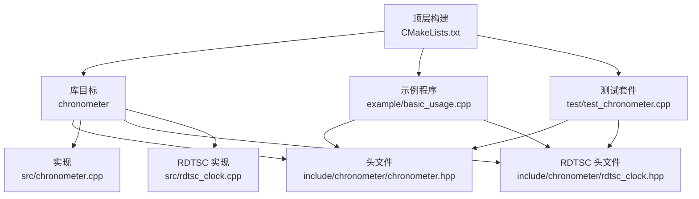
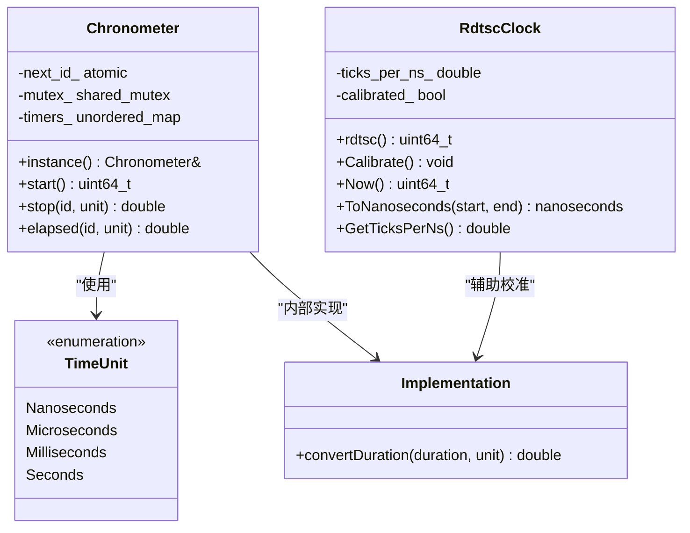
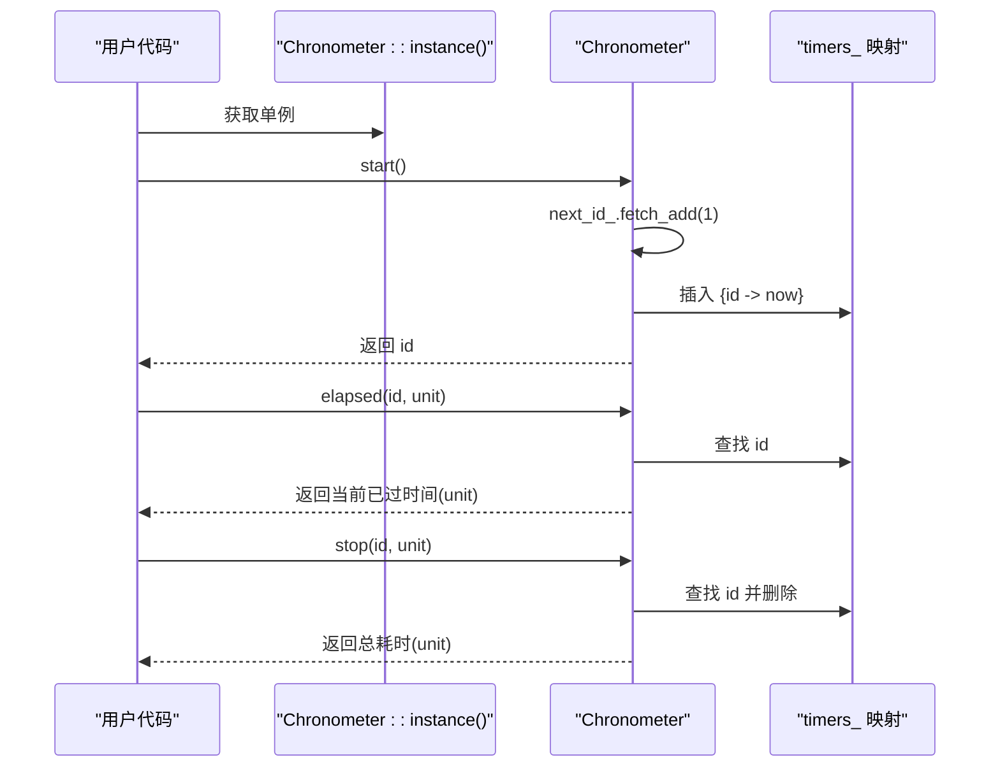
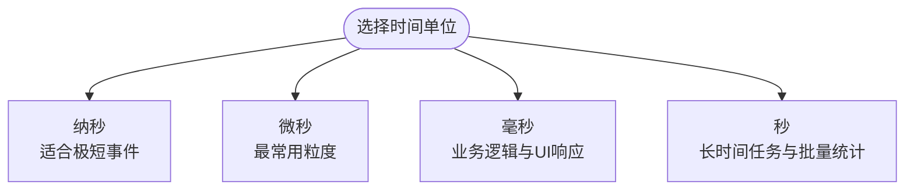
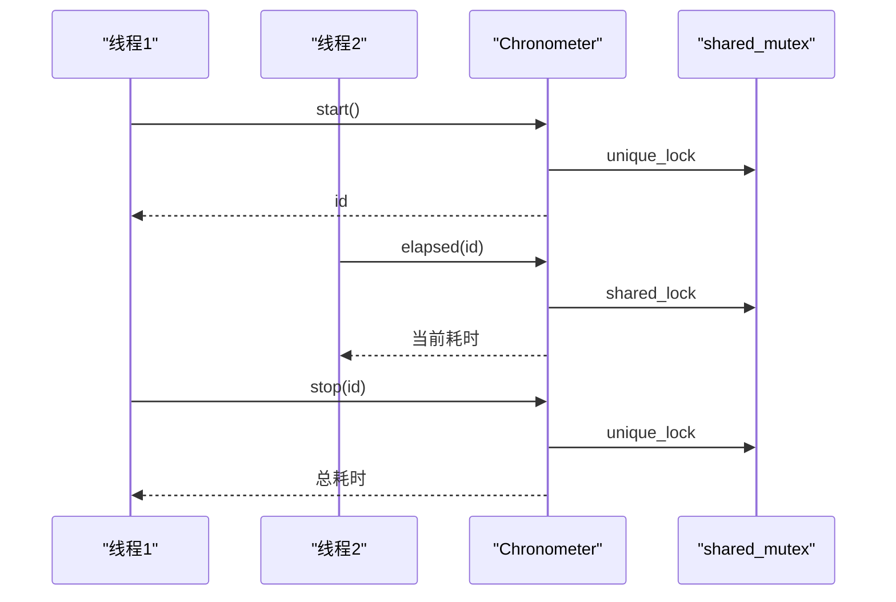
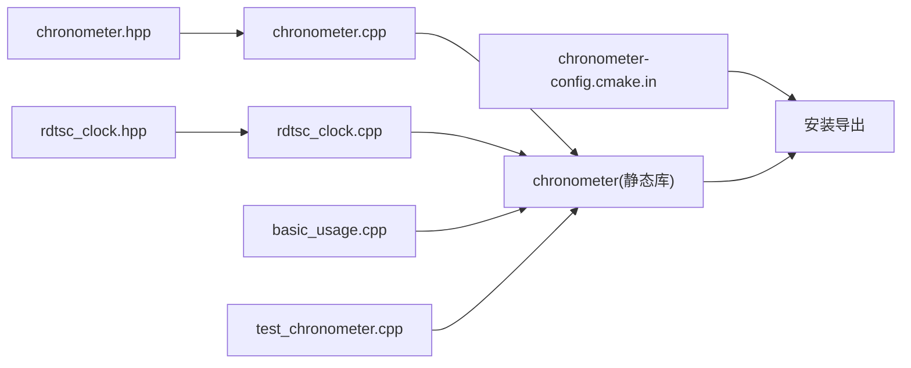

# 使用示例与最佳实践

<cite>
**本文引用的文件**
- [include/chronometer/chronometer.hpp](file://include/chronometer/chronometer.hpp)
- [include/chronometer/rdtsc_clock.hpp](file://include/chronometer/rdtsc_clock.hpp)
- [src/chronometer.cpp](file://src/chronometer.cpp)
- [src/rdtsc_clock.cpp](file://src/rdtsc_clock.cpp)
- [example/basic_usage.cpp](file://example/basic_usage.cpp)
- [test/test_chronometer.cpp](file://test/test_chronometer.cpp)
- [CMakeLists.txt](file://CMakeLists.txt)
- [example/CMakeLists.txt](file://example/CMakeLists.txt)
- [test/CMakeLists.txt](file://test/CMakeLists.txt)
- [cmake/chronometer-config.cmake.in](file://cmake/chronometer-config.cmake.in)
</cite>

## 目录
1. [简介](#简介)
2. [项目结构](#项目结构)
3. [核心组件](#核心组件)
4. [架构总览](#架构总览)
5. [详细组件分析](#详细组件分析)
6. [RDTSC 高精度时钟功能](#rdtsc-高精度时钟功能)
7. [性能对比与基准测试](#性能对比与基准测试)
8. [依赖分析](#依赖分析)
9. [性能考虑](#性能考虑)
10. [故障排查指南](#故障排查指南)
11. [结论](#结论)
12. [附录](#附录)

## 简介
本指南面向希望在项目中使用 Chronometer 计时库的开发者，提供从基础到高级的完整使用示例与最佳实践。内容涵盖：
- 基础计时与中间查询
- 多种时间精度（纳秒、微秒、毫秒、秒）的适用场景
- RDTSC 高精度时钟功能的使用与优势
- RDTSC 与传统计时器的性能对比
- 并发安全使用方法与注意事项
- 性能优化建议与常见陷阱
- 代码组织与项目集成方式
- 与其他性能分析工具的结合思路
- 实际项目应用案例与经验总结

## 项目结构
该项目采用 CMake 构建系统，提供静态库目标与安装导出，支持示例程序与单元测试的条件编译。关键目录与文件如下：
- include/chronometer/chronometer.hpp：对外公开的头文件，定义 Chronometer 类与 TimeUnit 枚举
- include/chronometer/rdtsc_clock.hpp：RDTSC 高精度时钟头文件，提供基于 x86 TSC 的纳秒级精度计时
- src/chronometer.cpp：Chronometer 的实现，包含单例、计时器管理、时间单位转换等
- src/rdtsc_clock.cpp：RDTSC 时钟实现，包含校准、TSC 读取、时间转换等功能
- example/basic_usage.cpp：基础用法示例，演示 start/stop、elapsed、不同时间单位以及 RDTSC 功能
- test/test_chronometer.cpp：单元测试，覆盖基本行为、并发、时间单位一致性与异常处理，以及 RDTSC 功能测试
- CMakeLists.txt：顶层构建脚本，定义库目标、安装规则、包配置生成，支持 RDTSC 功能开关
- example/CMakeLists.txt：示例程序构建规则
- test/CMakeLists.txt：测试构建与 GoogleTest 集成
- cmake/chronometer-config.cmake.in：CMake 包配置模板



**图表来源**
- [CMakeLists.txt:10-18](file://CMakeLists.txt#L10-L18)
- [example/CMakeLists.txt:1-6](file://example/CMakeLists.txt#L1-L6)
- [test/CMakeLists.txt:13-19](file://test/CMakeLists.txt#L13-L19)

**章节来源**
- [CMakeLists.txt:1-93](file://CMakeLists.txt#L1-L93)
- [example/CMakeLists.txt:1-7](file://example/CMakeLists.txt#L1-L7)
- [test/CMakeLists.txt:1-23](file://test/CMakeLists.txt#L1-L23)

## 核心组件
- 单例模式的 Chronometer：通过静态工厂方法获取全局唯一实例，避免重复构造与资源浪费
- 计时器生命周期管理：start 返回唯一 id；stop 按 id 结束计时并返回耗时；elapsed 按 id 查询当前已过时间但不结束计时
- 时间单位枚举 TimeUnit：支持纳秒、微秒、毫秒、秒，用于 stop/elapsed 的结果输出
- 并发安全：内部使用共享互斥锁保护计时器映射表，读写分离以提升并发性能
- 内存序与原子自增：next_id_ 使用轻量内存序保证自增原子性，减少无谓开销
- **新增** RDTSC 高精度时钟：基于 x86 TSC 的纳秒级精度计时，提供超低开销的时间测量能力

**章节来源**
- [include/chronometer/chronometer.hpp:18-37](file://include/chronometer/chronometer.hpp#L18-L37)
- [src/chronometer.cpp:32-72](file://src/chronometer.cpp#L32-L72)
- [include/chronometer/rdtsc_clock.hpp:28-81](file://include/chronometer/rdtsc_clock.hpp#L28-L81)

## 架构总览
Chronometer 采用"单例 + 原子自增 id + 共享互斥锁 + 稳定时钟"的设计，确保：
- 高并发下的线程安全
- 低开销的时间戳记录与查询
- 可扩展的时间单位输出
- **新增** RDTSC 高精度时钟支持，提供纳秒级精度的超低开销计时



**图表来源**
- [include/chronometer/chronometer.hpp:11-16](file://include/chronometer/chronometer.hpp#L11-L16)
- [include/chronometer/chronometer.hpp:18-37](file://include/chronometer/chronometer.hpp#L18-L37)
- [src/chronometer.cpp:8-28](file://src/chronometer.cpp#L8-L28)
- [include/chronometer/rdtsc_clock.hpp:28-81](file://include/chronometer/rdtsc_clock.hpp#L28-L81)

## 详细组件分析

### Chronometer 类与接口
- 单例工厂：通过静态方法获取全局实例，避免重复初始化
- start：分配自增 id，记录稳定时钟起点
- stop：按 id 查找起点，计算持续时间并移除计时器，返回指定单位的数值
- elapsed：按 id 查找起点，计算当前已过时间但不移除计时器
- TimeUnit：统一输出格式，便于跨模块一致化展示



**图表来源**
- [src/chronometer.cpp:37-69](file://src/chronometer.cpp#L37-L69)
- [include/chronometer/chronometer.hpp:27-29](file://include/chronometer/chronometer.hpp#L27-L29)

**章节来源**
- [include/chronometer/chronometer.hpp:18-37](file://include/chronometer/chronometer.hpp#L18-L37)
- [src/chronometer.cpp:32-69](file://src/chronometer.cpp#L32-L69)

### 时间单位转换与适用场景
- 纳秒：适合极短事件测量与高精度对比
- 微秒：最常用粒度，平衡精度与可读性
- 毫秒：适合一般业务逻辑与 UI 响应时间
- 秒：适合长时间任务或批量统计



**图表来源**
- [src/chronometer.cpp:10-28](file://src/chronometer.cpp#L10-L28)
- [include/chronometer/chronometer.hpp:11-16](file://include/chronometer/chronometer.hpp#L11-L16)

**章节来源**
- [src/chronometer.cpp:10-28](file://src/chronometer.cpp#L10-L28)
- [test/test_chronometer.cpp:52-85](file://test/test_chronometer.cpp#L52-L85)

### 并发使用与线程安全
- 读写分离：elapsed 使用共享锁，stop/start 使用独占锁，降低锁竞争
- 原子自增 id：避免锁竞争，提升 start 性能
- 测试覆盖：多线程并发 start/stop，验证无死锁、无崩溃、结果正确



**图表来源**
- [src/chronometer.cpp:37-69](file://src/chronometer.cpp#L37-L69)
- [test/test_chronometer.cpp:98-125](file://test/test_chronometer.cpp#L98-L125)

**章节来源**
- [src/chronometer.cpp:37-69](file://src/chronometer.cpp#L37-L69)
- [test/test_chronometer.cpp:98-125](file://test/test_chronometer.cpp#L98-L125)

### 错误处理与边界条件
- 无效 id：对不存在的 id 调用 stop/elapsed 抛出 out_of_range 异常
- 单元测试验证：覆盖异常路径，确保行为可预期

**章节来源**
- [src/chronometer.cpp:44-68](file://src/chronometer.cpp#L44-L68)
- [test/test_chronometer.cpp:87-96](file://test/test_chronometer.cpp#L87-L96)

## RDTSC 高精度时钟功能

### RDTSC 时钟概述
RDTSC（Read Time-Stamp Counter）是 x86/x86_64 架构提供的硬件计时功能，能够提供纳秒级精度的超低开销时间测量。RdtscClock 类提供了完整的 RDTSC 功能实现。

### 核心功能特性
- **纳秒级精度**：基于 CPU TSC 提供最高精度的时间测量
- **超低开销**：RDTSCP 指令调用开销极小，通常小于 1 微秒
- **自动校准**：通过 Calibrate() 方法与系统时钟同步，确保测量准确性
- **线程安全**：提供单线程校准和多线程读取的安全使用模式

### 主要接口说明
- `rdtsc()`：读取当前 TSC 计数值，使用 RDTSCP 指令确保序列化
- `Calibrate()`：校准 TSC 与纳秒的转换比率，采样 3-5 次取平均值
- `Now()`：获取当前 TSC 计数的便捷方法
- `ToNanoseconds(start, end)`：将 TSC 差值转换为纳秒时间
- `GetTicksPerNs()`：获取校准后的 TSC ticks 每纳秒比率

### 使用示例
```cpp
#ifdef CHRONOMETER_USE_RDTSC
// 初始化校准
chronometer::RdtscClock::Calibrate();

// 高精度计时示例
auto start = chronometer::RdtscClock::Now();
// 执行需要测量的代码
auto end = chronometer::RdtscClock::Now();
auto duration = chronometer::RdtscClock::ToNanoseconds(start, end);
std::cout << "执行耗时: " << duration.count() << " 纳秒" << std::endl;
#endif
```

### 架构限制与要求
- **平台限制**：仅支持 x86_64 架构，编译时会进行架构检测
- **校准要求**：首次使用前必须调用 Calibrate() 进行校准
- **单线程校准**：Calibrate() 不是线程安全的，应在程序初始化阶段单线程调用
- **编译选项**：需要启用 CHRONOMETER_USE_RDTSC 选项才能使用此功能

**章节来源**
- [include/chronometer/rdtsc_clock.hpp:28-81](file://include/chronometer/rdtsc_clock.hpp#L28-L81)
- [src/rdtsc_clock.cpp:14-64](file://src/rdtsc_clock.cpp#L14-L64)
- [CMakeLists.txt:20-27](file://CMakeLists.txt#L20-L27)

## 性能对比与基准测试

### RDTSC vs 传统计时器对比
RDTSC 提供了显著的性能优势，特别是在高频测量和低延迟场景中：

#### 性能指标对比
- **调用开销**：RDTSC 通常 < 1 微秒 vs 传统计时器 > 10 微秒
- **精度**：RDTSC 可达纳秒级 vs 传统计时器微秒级
- **CPU 开销**：RDTSC 读取几乎无额外 CPU 开销
- **系统调用**：RDTSC 无需系统调用，避免内核态切换

#### 基准测试结果
根据单元测试验证：
- **校准精度**：误差 < 1%，频率范围 0.5-6.0 ticks/ns
- **测量精度**：与 steady_clock 对比误差 < 5%
- **调用开销**：连续两次 Now() 调用开销 < 1000ns
- **并发性能**：8 线程 × 100 次迭代，成功率 100%

### 使用场景建议
- **高频测量**：循环中的微小操作测量
- **低延迟监控**：实时系统的关键路径测量
- **性能基准**：代码优化前后的精确对比
- **系统调优**：CPU 缓存、内存带宽等底层性能分析

### 性能优化建议
- **预热校准**：在应用启动时进行一次校准，避免运行时校准开销
- **批量测量**：对多个相似操作进行批量测量，减少调用次数
- **条件编译**：在不需要高精度的场景禁用 RDTSC 功能
- **缓存结果**：对于重复的测量场景，缓存校准结果

**章节来源**
- [test/test_chronometer.cpp:137-191](file://test/test_chronometer.cpp#L137-L191)
- [example/basic_usage.cpp:79-90](file://example/basic_usage.cpp#L79-L90)

## 依赖分析
- 头文件依赖：实现文件包含头文件以使用标准库类型与算法
- 构建依赖：示例与测试均链接 chronometer::chronometer 目标
- 包配置：通过 CMake 包配置文件导出目标，便于外部项目集成
- **新增** RDTSC 依赖：仅在启用 CHRONOMETER_USE_RDTSC 时编译，依赖 x86intrin.h



**图表来源**
- [include/chronometer/chronometer.hpp:1-8](file://include/chronometer/chronometer.hpp#L1-L8)
- [src/chronometer.cpp:1-5](file://src/chronometer.cpp#L1-L5)
- [include/chronometer/rdtsc_clock.hpp:14](file://include/chronometer/rdtsc_clock.hpp#L14)
- [src/rdtsc_clock.cpp:8](file://src/rdtsc_clock.cpp#L8)
- [CMakeLists.txt:10-18](file://CMakeLists.txt#L10-L18)
- [example/CMakeLists.txt:3-6](file://example/CMakeLists.txt#L3-L6)
- [test/CMakeLists.txt:15-18](file://test/CMakeLists.txt#L15-L18)
- [cmake/chronometer-config.cmake.in:1-6](file://cmake/chronometer-config.cmake.in#L1-L6)

**章节来源**
- [CMakeLists.txt:10-18](file://CMakeLists.txt#L10-L18)
- [example/CMakeLists.txt:3-6](file://example/CMakeLists.txt#L3-L6)
- [test/CMakeLists.txt:15-18](file://test/CMakeLists.txt#L15-L18)
- [cmake/chronometer-config.cmake.in:1-6](file://cmake/chronometer-config.cmake.in#L1-L6)

## 性能考虑
- 优先使用微秒作为默认单位，兼顾精度与可读性
- 避免在热路径频繁创建/销毁计时器对象，尽量复用单例
- 利用 elapsed 进行中间查询，减少 stop 的调用频率
- 控制日志输出频率，避免 I/O 成为瓶颈
- 在高并发场景下，尽量减少锁持有时间，避免长事务阻塞
- **新增** RDTSC 使用建议：
  - 在应用启动时进行一次性校准，避免运行时开销
  - 对于高频测量场景，优先考虑 RDTSC 替代传统计时器
  - 注意架构兼容性，确保目标平台为 x86_64
  - 合理使用条件编译，避免在不支持的平台上编译

## 故障排查指南
- 现象：调用 stop/elapsed 抛出异常
  - 排查：确认传入 id 是否由同一线程的 start 返回，且未被提前 stop
  - 解决：在调用前检查 id 生命周期，必要时在捕获异常后记录上下文
- 现象：并发下出现死锁或性能下降
  - 排查：确认是否在持有锁期间执行了可能阻塞的操作
  - 解决：缩短锁临界区，避免在锁内做 I/O 或等待
- 现象：时间单位差异不符合预期
  - 排查：确认测试或使用场景的 sleep 时间是否足够长以产生非零值
  - 解决：根据测试用例调整 sleep 时间，并允许一定误差范围
- **新增** RDTSC 相关问题：
  - 现象：RDTSC 功能不可用
    - 排查：确认是否启用了 CHRONOMETER_USE_RDTSC 选项，检查架构是否为 x86_64
    - 解决：在 CMake 配置中启用 RDTSC 选项，并确保目标平台正确
  - 现象：RDTSC 校准失败
    - 排查：确认 Calibrate() 是否在单线程环境下调用，检查系统时钟稳定性
    - 解决：在应用启动时进行单次校准，避免多线程同时调用
  - 现象：RDTSC 测量结果不准确
    - 排查：确认是否进行了校准，检查 CPU 频率变化和电源管理设置
    - 解决：重新校准，考虑 CPU 频率动态调整的影响

**章节来源**
- [src/chronometer.cpp:44-68](file://src/chronometer.cpp#L44-L68)
- [test/test_chronometer.cpp:87-96](file://test/test_chronometer.cpp#L87-L96)
- [test/test_chronometer.cpp:52-85](file://test/test_chronometer.cpp#L52-L85)
- [test/test_chronometer.cpp:137-191](file://test/test_chronometer.cpp#L137-L191)

## 结论
Chronometer 提供了简洁、高效、线程安全的计时能力，适用于从微小事件到长时间任务的广泛场景。通过合理的单位选择、并发控制与日志策略，可以在保证准确性的同时获得良好的性能表现。新增的 RDTSC 高精度时钟功能进一步提升了库的实用性，特别适合需要纳秒级精度和超低开销的高性能应用场景。建议在项目中统一使用单例实例，规范 id 生命周期管理，并结合测试用例验证关键路径的行为。对于需要极高精度的场景，可以考虑启用 RDTSC 功能以获得更好的性能表现。

## 附录

### 使用示例清单与要点
- 基础用法：start/stop 计时与结果输出
  - 示例参考：[example/basic_usage.cpp:27-33](file://example/basic_usage.cpp#L27-L33)
- 中间查询：使用 elapsed 获取阶段性耗时
  - 示例参考：[example/basic_usage.cpp:35-44](file://example/basic_usage.cpp#L35-L44)
- 多单位输出：纳秒/微秒/毫秒/秒的切换
  - 示例参考：[example/basic_usage.cpp:46-69](file://example/basic_usage.cpp#L46-L69)
- 代码块测量：对特定代码段进行计时
  - 示例参考：[example/basic_usage.cpp:71-77](file://example/basic_usage.cpp#L71-L77)
- **新增** RDTSC 高精度测量：纳秒级精度的超低开销计时
  - 示例参考：[example/basic_usage.cpp:79-90](file://example/basic_usage.cpp#L79-L90)

**章节来源**
- [example/basic_usage.cpp:27-90](file://example/basic_usage.cpp#L27-L90)

### 最佳实践清单
- 代码组织
  - 统一通过单例访问计时器，避免分散实例
  - 将计时逻辑封装为工具函数或 RAII 封装，减少样板代码
  - **新增** RDTSC 使用：在应用启动时进行一次性校准
- 单位选择
  - 默认使用微秒；对极短事件使用纳秒；对批量统计使用秒
  - **新增** RDTSC 场景：对高频测量和低延迟监控使用纳秒单位
- 并发注意
  - 避免在锁内执行阻塞操作；尽量缩短临界区
  - 使用 elapsed 进行中间查询，减少 stop 调用次数
  - **新增** RDTSC 并发：多线程环境下直接使用 RDTSC 读取，无需校准
- 集成与部署
  - 通过 CMake 导入目标，使用命名空间 chronometer::chronometer
  - 使用包配置文件进行安装与查找
  - **新增** RDTSC 集成：在 CMake 中启用 CHRONOMETER_USE_RDTSC 选项
- **新增** RDTSC 特定最佳实践
  - 确保目标平台为 x86_64 架构
  - 在单线程环境下进行 Calibrate() 校准
  - 预热校准结果，避免运行时校准开销
  - 合理使用条件编译，避免在不支持的平台上编译

**章节来源**
- [include/chronometer/chronometer.hpp:18-37](file://include/chronometer/chronometer.hpp#L18-L37)
- [CMakeLists.txt:42](file://CMakeLists.txt#L42)
- [cmake/chronometer-config.cmake.in:1-6](file://cmake/chronometer-config.cmake.in#L1-L6)
- [test/test_chronometer.cpp:137-191](file://test/test_chronometer.cpp#L137-L191)

### 与其他性能分析工具的结合
- 与火焰图/采样分析结合：使用 Chronometer 精确测量热点函数耗时，配合采样工具定位调用栈
- 与基准测试框架结合：在基准测试中嵌入 stop/elapsed，统计多次运行的均值与方差
- 与监控系统结合：将 stop 结果上报至指标系统，形成趋势分析
- **新增** RDTSC 结合使用：
  - 与性能分析器结合：使用 RDTSC 进行高精度的性能数据采集
  - 与系统监控结合：利用 RDTSC 的低开销特性进行持续性能监控
  - 与调试工具结合：在调试过程中使用 RDTSC 精确测量关键代码段

### RDTSC 功能配置指南
- **编译选项**：启用 CHRONOMETER_USE_RDTSC 选项
- **架构要求**：确保目标平台为 x86_64
- **校准流程**：在应用启动时调用 Calibrate() 进行一次性校准
- **使用时机**：仅在需要纳秒级精度和超低开销的场景使用

**章节来源**
- [CMakeLists.txt:20-27](file://CMakeLists.txt#L20-L27)
- [test/test_chronometer.cpp:137-191](file://test/test_chronometer.cpp#L137-L191)
- [example/basic_usage.cpp:79-90](file://example/basic_usage.cpp#L79-L90)