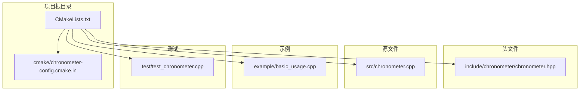
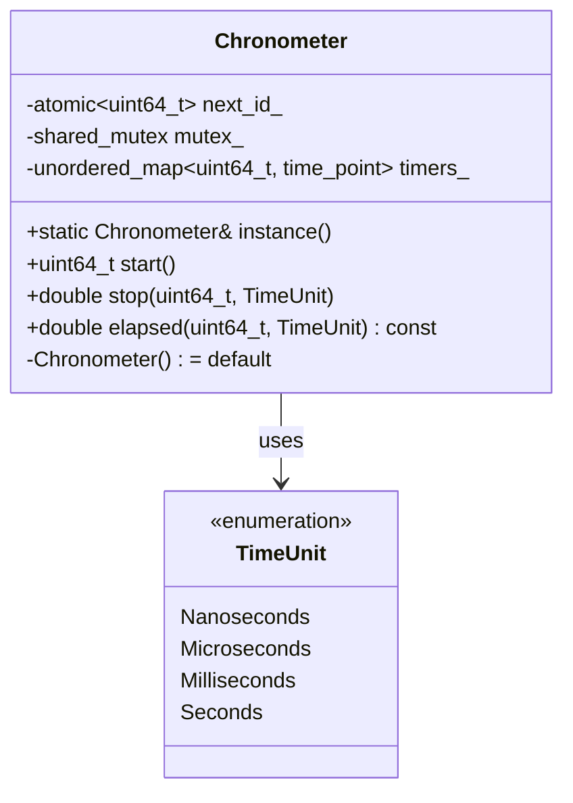
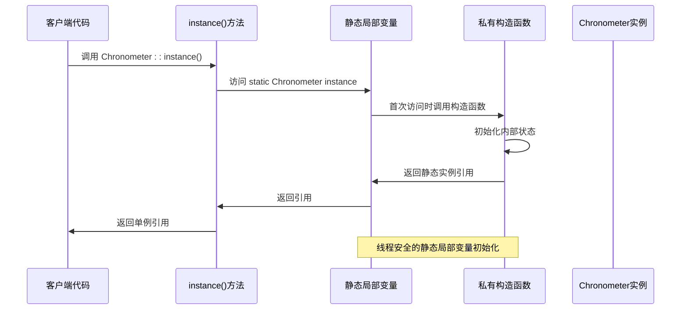
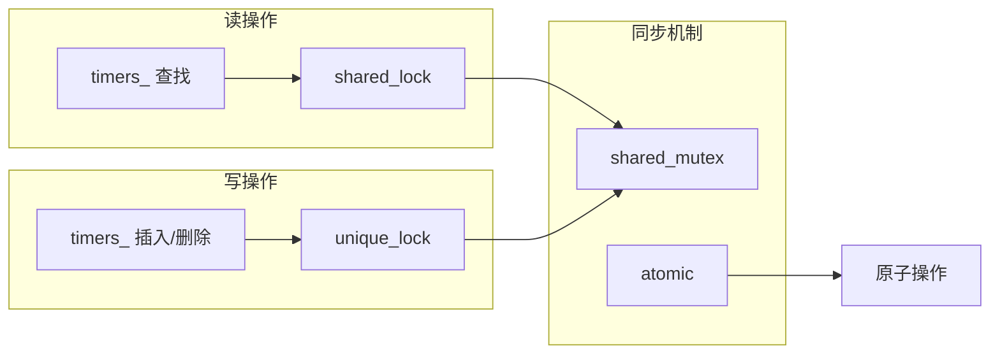
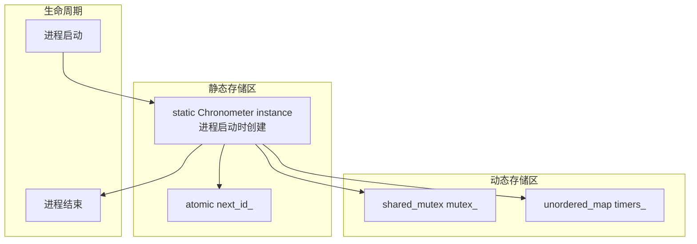
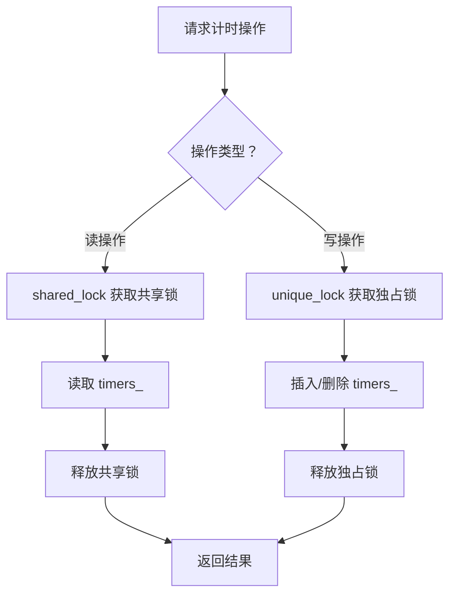
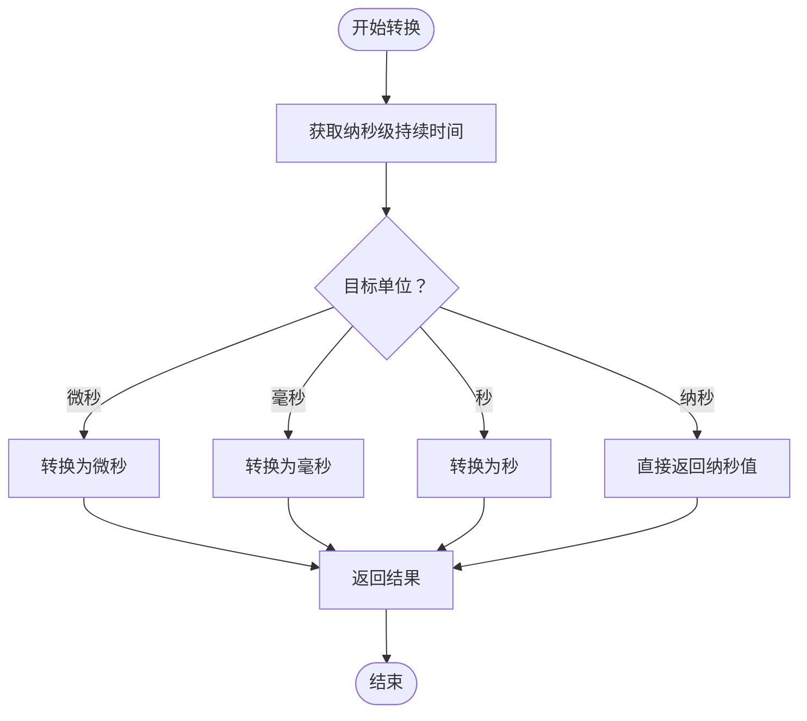
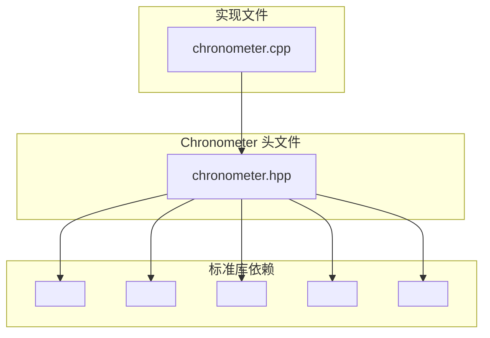

# 单例模式实现

<cite>
**本文档引用的文件**
- [include/chronometer/chronometer.hpp](file://include/chronometer/chronometer.hpp)
- [src/chronometer.cpp](file://src/chronometer.cpp)
- [example/basic_usage.cpp](file://example/basic_usage.cpp)
- [test/test_chronometer.cpp](file://test/test_chronometer.cpp)
- [CMakeLists.txt](file://CMakeLists.txt)
- [cmake/chronometer-config.cmake.in](file://cmake/chronometer-config.cmake.in)
</cite>

## 目录
1. [引言](#引言)
2. [项目结构](#项目结构)
3. [核心组件](#核心组件)
4. [架构概览](#架构概览)
5. [详细组件分析](#详细组件分析)
6. [依赖分析](#依赖分析)
7. [性能考虑](#性能考虑)
8. [故障排除指南](#故障排除指南)
9. [结论](#结论)

## 引言

本文档深入分析了 Chronometer 类中的单例模式实现，这是一个基于 C++20 标准的高性能计时器类。单例模式确保整个应用程序中只有一个 Chronometer 实例，提供了统一的性能测量功能。本文将详细解释静态 instance() 方法的设计原理、线程安全保证机制、私有构造函数的作用、生命周期管理以及与传统单例实现相比的优势。

## 项目结构

该项目采用标准的 CMake 构建系统，具有清晰的模块化结构：



**图表来源**
- [CMakeLists.txt:1-82](file://CMakeLists.txt#L1-L82)
- [include/chronometer/chronometer.hpp:1-40](file://include/chronometer/chronometer.hpp#L1-L40)

**章节来源**
- [CMakeLists.txt:1-82](file://CMakeLists.txt#L1-L82)
- [cmake/chronometer-config.cmake.in:1-6](file://cmake/chronometer-config.cmake.in#L1-L6)

## 核心组件

### Chronometer 类设计

Chronometer 类是一个线程安全的单例计时器，提供以下核心功能：

- **全局唯一实例**：通过静态 instance() 方法确保单例
- **多线程支持**：使用 shared_mutex 实现读写分离
- **高精度计时**：基于 std::chrono::steady_clock
- **灵活的时间单位**：支持纳秒、微秒、毫秒、秒
- **无泄漏设计**：静态局部变量自动管理生命周期

### 关键数据结构



**图表来源**
- [include/chronometer/chronometer.hpp:18-37](file://include/chronometer/chronometer.hpp#L18-L37)

**章节来源**
- [include/chronometer/chronometer.hpp:18-37](file://include/chronometer/chronometer.hpp#L18-L37)

## 架构概览

### 单例模式实现架构



**图表来源**
- [src/chronometer.cpp:32-35](file://src/chronometer.cpp#L32-L35)
- [include/chronometer/chronometer.hpp:32](file://include/chronometer/chronometer.hpp#L32)

### 线程安全架构



**图表来源**
- [src/chronometer.cpp:37-69](file://src/chronometer.cpp#L37-L69)
- [include/chronometer/chronometer.hpp:34-36](file://include/chronometer/chronometer.hpp#L34-L36)

## 详细组件分析

### 静态 instance() 方法实现

#### 设计原理

Chronometer::instance() 方法采用了现代 C++ 的静态局部变量技术，这是 C++11 及以后版本推荐的单例实现方式：

```mermaid
flowchart TD
Start([调用 instance()]) --> CheckStatic["检查 static Chronometer instance 是否已存在"]
CheckStatic --> Exists{"已存在？"}
Exists --> |是| ReturnRef["直接返回引用"]
Exists --> |否| CallConstructor["调用私有构造函数"]
CallConstructor --> InitMembers["初始化成员变量"]
InitMembers --> StoreInstance["存储到静态变量"]
StoreInstance --> ReturnRef
ReturnRef --> End([返回单例引用])
```

**图表来源**
- [src/chronometer.cpp:32-35](file://src/chronometer.cpp#L32-L35)

#### 线程安全保证

静态局部变量的初始化在 C++11 标准中被定义为线程安全的。这意味着：

1. **首次访问时的原子性**：多个线程同时访问 instance() 时，只会有一个线程实际执行构造函数
2. **避免竞态条件**：不需要额外的互斥锁来保护初始化过程
3. **性能优化**：后续访问无需任何同步开销

**章节来源**
- [src/chronometer.cpp:32-35](file://src/chronometer.cpp#L32-L35)

### 构造函数和访问控制

#### 私有构造函数设计

```mermaid
classDiagram
class Chronometer {
-Chronometer() = default
-Chronometer(const Chronometer&) = delete
-Chronometer& operator=(const Chronometer&) = delete
-Chronometer(Chronometer&&) = delete
-Chronometer& operator=(Chronometer&&) = delete
+static Chronometer& instance()
+uint64_t start()
+double stop(uint64_t, TimeUnit)
+double elapsed(uint64_t, TimeUnit) const
}
note for Chronometer : "防止外部直接实例化\n确保只有单例模式可用"
```

**图表来源**
- [include/chronometer/chronometer.hpp:22-32](file://include/chronometer/chronometer.hpp#L22-L32)

#### 防止外部实例化的机制

通过删除拷贝和移动构造函数，确保了以下约束：

1. **禁止拷贝构造**：防止通过复制现有实例创建新实例
2. **禁止赋值操作**：防止对现有实例进行赋值
3. **禁止移动构造**：防止通过移动现有实例创建新实例
4. **禁止移动赋值**：防止对现有实例进行移动赋值

这些删除的操作确保了：
- 编译时错误：任何尝试创建副本的行为都会导致编译错误
- 运行时安全：即使通过指针或引用也无法绕过单例约束

**章节来源**
- [include/chronometer/chronometer.hpp:22-25](file://include/chronometer/chronometer.hpp#L22-L25)

### 内存布局和生命周期管理

#### 内存布局分析



**图表来源**
- [src/chronometer.cpp:32-35](file://src/chronometer.cpp#L32-L35)
- [include/chronometer/chronometer.hpp:34-36](file://include/chronometer/chronometer.hpp#L34-L36)

#### 生命周期管理优势

1. **自动初始化**：静态局部变量在首次访问时自动创建
2. **自动销毁**：进程结束时自动清理，无需手动释放
3. **异常安全**：即使发生异常，静态对象也会正确销毁
4. **无泄漏风险**：避免了传统堆分配可能产生的内存泄漏

**章节来源**
- [src/chronometer.cpp:32-35](file://src/chronometer.cpp#L32-L35)

### 多线程并发控制

#### 读写分离设计



**图表来源**
- [src/chronometer.cpp:37-69](file://src/chronometer.cpp#L37-L69)

#### 锁策略选择

1. **shared_mutex 的优势**：
   - 读操作使用共享锁，允许多个读操作并发
   - 写操作使用独占锁，确保数据一致性
   - 减少锁竞争，提高并发性能

2. **原子操作的应用**：
   - next_id_ 使用 atomic<uint64_t> 确保 ID 生成的原子性
   - 避免了额外的锁开销

**章节来源**
- [src/chronometer.cpp:37-69](file://src/chronometer.cpp#L37-L69)
- [include/chronometer/chronometer.hpp:34-36](file://include/chronometer/chronometer.hpp#L34-L36)

### 时间单位转换机制

#### 转换算法实现



**图表来源**
- [src/chronometer.cpp:10-28](file://src/chronometer.cpp#L10-L28)

**章节来源**
- [src/chronometer.cpp:10-28](file://src/chronometer.cpp#L10-L28)

## 依赖分析

### 头文件依赖关系



**图表来源**
- [include/chronometer/chronometer.hpp:3-7](file://include/chronometer/chronometer.hpp#L3-L7)
- [src/chronometer.cpp:1-5](file://src/chronometer.cpp#L1-L5)

### 构建系统依赖

**章节来源**
- [CMakeLists.txt:1-82](file://CMakeLists.txt#L1-L82)

## 性能考虑

### 并发性能优化

1. **锁粒度优化**：
   - 读操作使用共享锁，写操作使用独占锁
   - 减少锁竞争，提高并发吞吐量

2. **原子操作优化**：
   - next_id_ 使用原子操作，避免锁开销
   - 提供线程安全的 ID 生成

3. **内存访问优化**：
   - 使用 unordered_map 存储定时器状态
   - 提供 O(1) 平均查找复杂度

### 内存使用分析

- **静态实例**：占用固定内存，随进程生命周期存在
- **定时器映射**：动态增长，最大大小取决于活跃计时器数量
- **锁开销**：shared_mutex 提供细粒度同步

## 故障排除指南

### 常见问题诊断

#### 单例访问问题

**症状**：编译错误提示无法访问私有构造函数
**原因**：尝试直接创建 Chronometer 实例
**解决方案**：始终使用 `Chronometer::instance()` 获取单例

#### 线程安全问题

**症状**：多线程环境下出现数据竞争或死锁
**原因**：直接访问内部状态而未使用提供的接口
**解决方案**：使用类提供的线程安全方法

#### 时间单位转换异常

**症状**：时间转换结果不符合预期
**原因**：时间单位设置错误或数值溢出
**解决方案**：检查 TimeUnit 枚举值和数值范围

**章节来源**
- [test/test_chronometer.cpp:88-96](file://test/test_chronometer.cpp#L88-L96)

### 单元测试验证

测试套件验证了以下关键特性：

1. **基本功能测试**：start/stop 操作的正确性
2. **并发安全性**：多线程环境下的稳定性
3. **边界条件**：无效 ID 的异常处理
4. **精度验证**：不同时间单位的转换准确性

**章节来源**
- [test/test_chronometer.cpp:10-125](file://test/test_chronometer.cpp#L10-L125)

## 结论

Chronometer 类的单例模式实现展现了现代 C++ 的最佳实践：

### 主要优势

1. **线程安全**：利用 C++11 标准的静态局部变量初始化保证
2. **性能卓越**：读写分离锁和原子操作优化并发性能
3. **内存安全**：静态存储管理，自动生命周期控制
4. **接口简洁**：提供直观的 start/stop/elapsed 方法
5. **类型安全**：完整的类型系统和编译时检查

### 技术创新点

1. **现代 C++ 实现**：采用 C++20 标准特性
2. **高性能设计**：optimized shared_mutex 和 atomic 操作
3. **全面测试**：完整的单元测试覆盖并发场景
4. **清晰接口**：良好的抽象和易用性设计

### 最佳实践建议

1. **始终使用单例接口**：通过 `Chronometer::instance()` 获取实例
2. **注意线程安全**：利用类提供的线程安全方法
3. **合理使用时间单位**：根据需求选择合适的时间精度
4. **监控内存使用**：注意活跃计时器的数量控制

这个实现为 C++ 单例模式提供了一个优秀的参考范例，展示了如何在现代 C++ 环境下实现既安全又高效的单例设计。