# 实现细节

<cite>
**本文引用的文件**
- [include/chronometer/chronometer.hpp](file://include/chronometer/chronometer.hpp)
- [src/chronometer.cpp](file://src/chronometer.cpp)
- [example/basic_usage.cpp](file://example/basic_usage.cpp)
- [test/test_chronometer.cpp](file://test/test_chronometer.cpp)
- [CMakeLists.txt](file://CMakeLists.txt)
- [cmake/chronometer-config.cmake.in](file://cmake/chronometer-config.cmake.in)
</cite>

## 目录
1. [简介](#简介)
2. [项目结构](#项目结构)
3. [核心组件](#核心组件)
4. [架构概览](#架构概览)
5. [详细组件分析](#详细组件分析)
6. [依赖关系分析](#依赖关系分析)
7. [性能考虑](#性能考虑)
8. [故障排除指南](#故障排除指南)
9. [结论](#结论)
10. [附录](#附录)

## 简介

Chronometer 是一个基于 C++20 标准设计的高性能计时器库，采用单例模式实现全局唯一的计时器实例。该库提供了线程安全的时间测量功能，支持多种时间单位的转换，并通过原子操作和共享互斥锁确保并发访问的安全性。

该库的核心特性包括：
- 单例模式的线程安全实现
- 原子计数器驱动的唯一标识符生成
- 共享互斥锁的读写分离优化
- C++20 chrono 库的深度集成
- 多种时间单位的精确转换
- 非阻塞操作的设计考虑

## 项目结构

项目采用标准的 CMake 构建系统，遵循现代 C++ 库的组织结构：

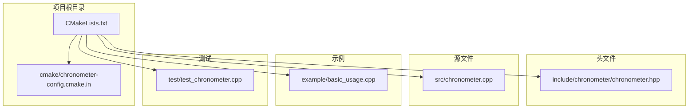

**图表来源**
- [CMakeLists.txt:1-82](file://CMakeLists.txt#L1-L82)
- [include/chronometer/chronometer.hpp:1-40](file://include/chronometer/chronometer.hpp#L1-L40)
- [src/chronometer.cpp:1-72](file://src/chronometer.cpp#L1-L72)

**章节来源**
- [CMakeLists.txt:1-82](file://CMakeLists.txt#L1-L82)
- [cmake/chronometer-config.cmake.in:1-6](file://cmake/chronometer-config.cmake.in#L1-L6)

## 核心组件

### Chronometer 类设计

Chronometer 类是整个库的核心，实现了单例模式和计时器管理功能：

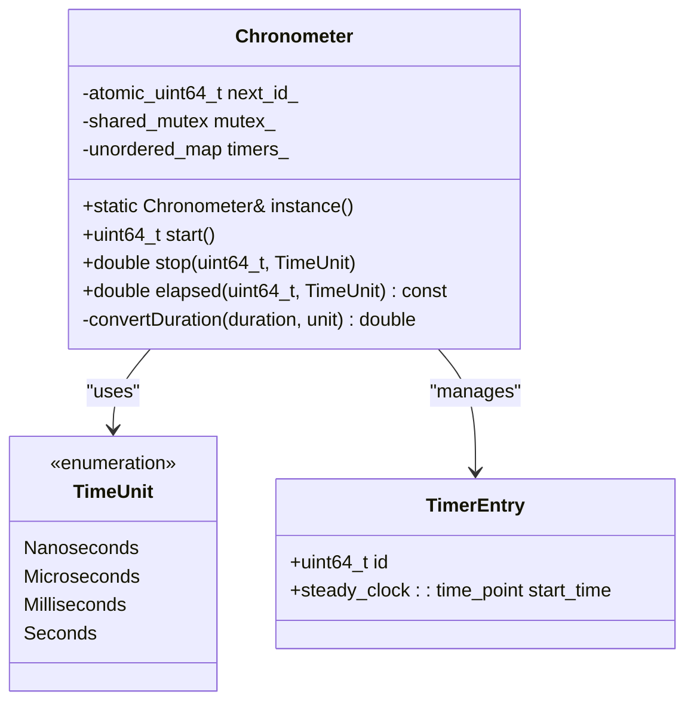

**图表来源**
- [include/chronometer/chronometer.hpp:18-37](file://include/chronometer/chronometer.hpp#L18-L37)

### 时间单位枚举

库定义了四种标准时间单位，支持纳秒到秒的完整范围：

- **Nanoseconds**: 纳秒级精度，适合微基准测试
- **Microseconds**: 微秒级精度，平衡精度与性能
- **Milliseconds**: 毫秒级精度，适合一般性能测量
- **Seconds**: 秒级精度，适合长时间任务监控

**章节来源**
- [include/chronometer/chronometer.hpp:11-16](file://include/chronometer/chronometer.hpp#L11-L16)

## 架构概览

Chronometer 采用了分层架构设计，确保了高内聚低耦合的代码结构：

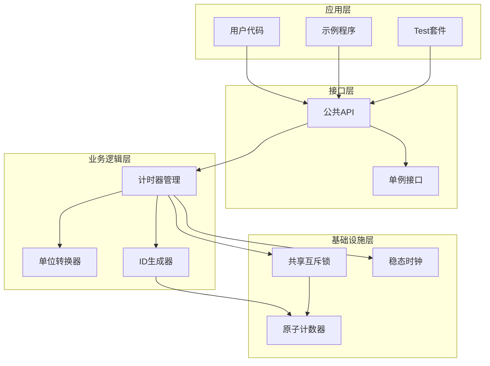

**图表来源**
- [src/chronometer.cpp:32-72](file://src/chronometer.cpp#L32-L72)
- [include/chronometer/chronometer.hpp:18-37](file://include/chronometer/chronometer.hpp#L18-L37)

## 详细组件分析

### 单例模式实现

Chronometer 采用经典的"局部静态变量"模式实现线程安全的单例：

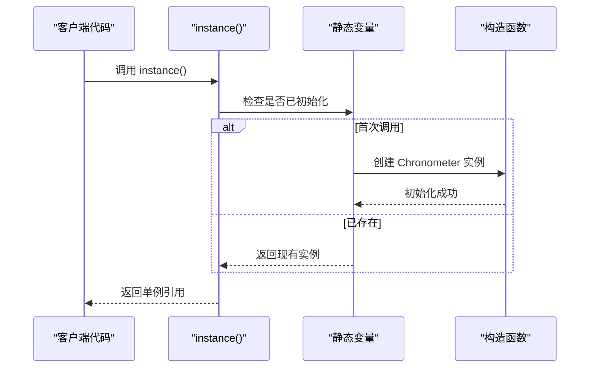

**图表来源**
- [src/chronometer.cpp:32-35](file://src/chronometer.cpp#L32-L35)

这种实现方式的优势：
- **线程安全**：C++11 规范保证局部静态变量的初始化是线程安全的
- **延迟初始化**：只有在首次使用时才创建实例
- **自动清理**：程序结束时自动销毁，无需手动清理

**章节来源**
- [src/chronometer.cpp:32-35](file://src/chronometer.cpp#L32-L35)

### 原子计数器设计

ID 生成器使用原子计数器确保多线程环境下的唯一性和安全性：

```mermaid
flowchart TD
Start([start() 调用]) --> FetchAdd["fetch_add(1, memory_order_relaxed)"]
FetchAdd --> GetId["获取自增后的 ID"]
GetId --> Lock["获取独占锁"]
Lock --> Insert["插入到映射表"]
Insert --> Unlock["释放锁"]
Unlock --> Return["返回 ID"]
style FetchAdd fill:#e1f5fe
style Lock fill:#fff3e0
style Insert fill:#fff3e0
style Unlock fill:#e8f5e8
style Return fill:#e8f5e8
```

**图表来源**
- [src/chronometer.cpp:37-42](file://src/chronometer.cpp#L37-L42)
- [include/chronometer/chronometer.hpp:34](file://include/chronometer/chronometer.hpp#L34)

原子操作的选择考虑：
- **memory_order_relaxed**：由于 ID 只用于标识，不需要强一致性
- **无锁生成**：避免了锁竞争，提高并发性能
- **单调递增**：确保 ID 的唯一性和可预测性

**章节来源**
- [src/chronometer.cpp:37-42](file://src/chronometer.cpp#L37-L42)
- [include/chronometer/chronometer.hpp:34](file://include/chronometer/chronometer.hpp#L34)

### 共享互斥锁策略

库采用读写分离的共享互斥锁策略，优化了并发性能：

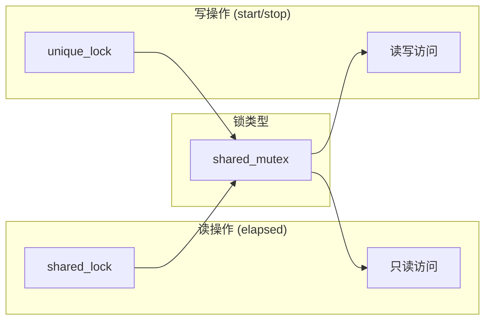

**图表来源**
- [src/chronometer.cpp:58-69](file://src/chronometer.cpp#L58-L69)
- [src/chronometer.cpp:37-42](file://src/chronometer.cpp#L37-L42)

锁策略的优势：
- **读多写少**：elapsed 操作频繁，使用 shared_lock 提高并发度
- **避免死锁**：统一的锁管理策略
- **性能优化**：减少锁竞争，提高整体吞吐量

**章节来源**
- [src/chronometer.cpp:58-69](file://src/chronometer.cpp#L58-L69)
- [src/chronometer.cpp:37-42](file://src/chronometer.cpp#L37-L42)

### 时间单位转换算法

转换函数实现了精确的时间单位换算，确保不同精度下的数值正确性：

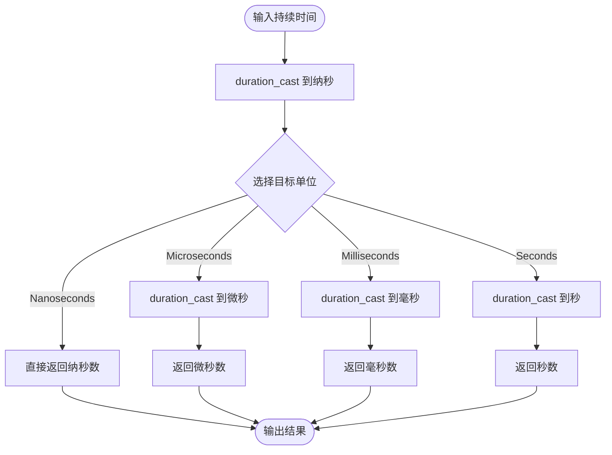

**图表来源**
- [src/chronometer.cpp:10-28](file://src/chronometer.cpp#L10-L28)

转换精度保证：
- **无信息丢失**：先转换到纳秒，再转换到目标单位
- **类型安全**：使用编译时类型检查
- **性能优化**：避免不必要的浮点运算

**章节来源**
- [src/chronometer.cpp:10-28](file://src/chronometer.cpp#L10-L28)

### 内部数据结构选择

库选择了 `std::unordered_map` 作为计时器存储的数据结构：

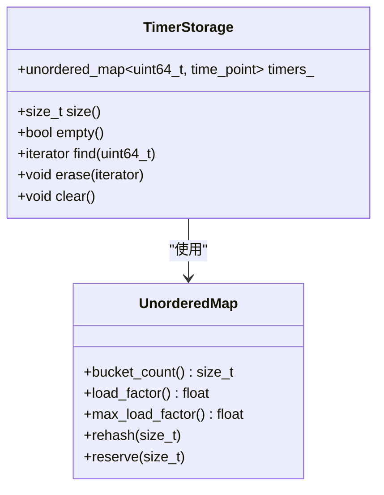

**图表来源**
- [include/chronometer/chronometer.hpp:36](file://include/chronometer/chronometer.hpp#L36)

选择 `unordered_map` 的原因：
- **平均 O(1) 访问**：满足高性能要求
- **动态扩容**：适应不同规模的计时器数量
- **内存效率**：相比其他容器更节省内存
- **查找优化**：支持快速的 ID 查找和删除

**章节来源**
- [include/chronometer/chronometer.hpp:36](file://include/chronometer/chronometer.hpp#L36)

### 异常处理机制

库实现了完善的错误检测和异常处理机制：

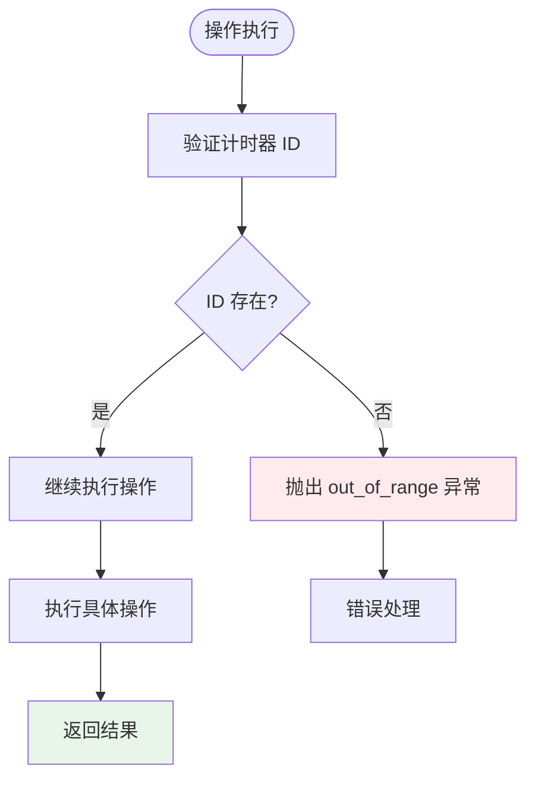

**图表来源**
- [src/chronometer.cpp:44-69](file://src/chronometer.cpp#L44-L69)

异常处理策略：
- **明确的错误语义**：使用标准异常类型
- **详细的错误信息**：提供清晰的错误描述
- **一致的行为**：所有无效操作都抛出相同类型的异常

**章节来源**
- [src/chronometer.cpp:44-69](file://src/chronometer.cpp#L44-L69)

## 依赖关系分析

### 外部依赖

Chronometer 依赖于 C++20 标准库的多个组件：

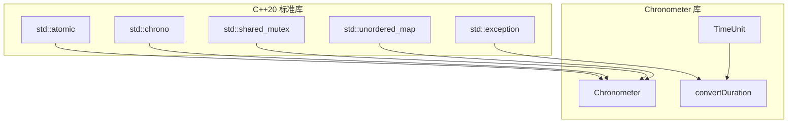

**图表来源**
- [include/chronometer/chronometer.hpp:3-7](file://include/chronometer/chronometer.hpp#L3-L7)
- [src/chronometer.cpp:3-5](file://src/chronometer.cpp#L3-L5)

### 内部模块依赖

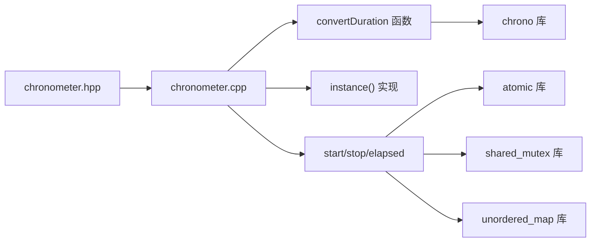

**图表来源**
- [include/chronometer/chronometer.hpp:18-37](file://include/chronometer/chronometer.hpp#L18-L37)
- [src/chronometer.cpp:1-72](file://src/chronometer.cpp#L1-L72)

**章节来源**
- [include/chronometer/chronometer.hpp:3-7](file://include/chronometer/chronometer.hpp#L3-L7)
- [src/chronometer.cpp:1-72](file://src/chronometer.cpp#L1-L72)

## 性能考虑

### 并发性能优化

库在设计时充分考虑了并发场景下的性能表现：

1. **原子操作优化**：ID 生成使用原子操作，避免锁竞争
2. **读写分离**：共享互斥锁允许多个读操作同时进行
3. **非阻塞设计**：大部分操作都是非阻塞的

### 内存管理策略

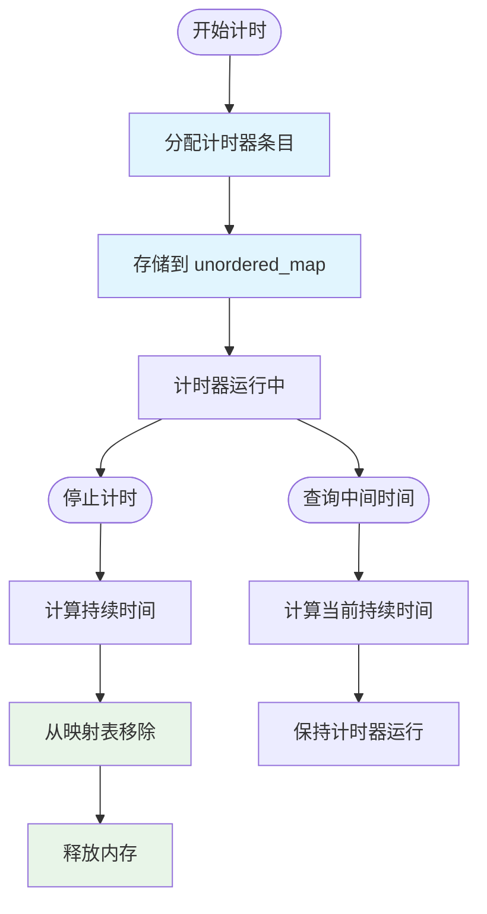

**图表来源**
- [src/chronometer.cpp:37-69](file://src/chronometer.cpp#L37-L69)

内存管理特点：
- **RAII 模式**：使用智能指针和自动资源管理
- **无泄漏设计**：stop 操作确保计时器条目的正确清理
- **缓存友好**：连续内存分配提高访问性能

### 精度保证机制

库通过以下机制确保时间测量的精度：

1. **稳态时钟**：使用 `std::chrono::steady_clock` 避免系统时间调整的影响
2. **纳秒级转换**：先转换到纳秒，再转换到目标单位，避免精度损失
3. **原子计数**：确保 ID 的唯一性和单调性

**章节来源**
- [src/chronometer.cpp:37-69](file://src/chronometer.cpp#L37-L69)

## 故障排除指南

### 常见问题诊断

1. **计时器 ID 不存在**
   - 症状：调用 `stop()` 或 `elapsed()` 抛出 `std::out_of_range`
   - 解决方案：确保使用正确的 ID，检查计时器是否已被停止

2. **并发访问冲突**
   - 症状：多线程环境下出现死锁或数据竞争
   - 解决方案：使用库提供的线程安全接口，避免外部直接修改内部状态

3. **精度问题**
   - 症状：测量结果不符合预期
   - 解决方案：检查系统时钟设置，确认使用合适的精度单位

### 调试技巧

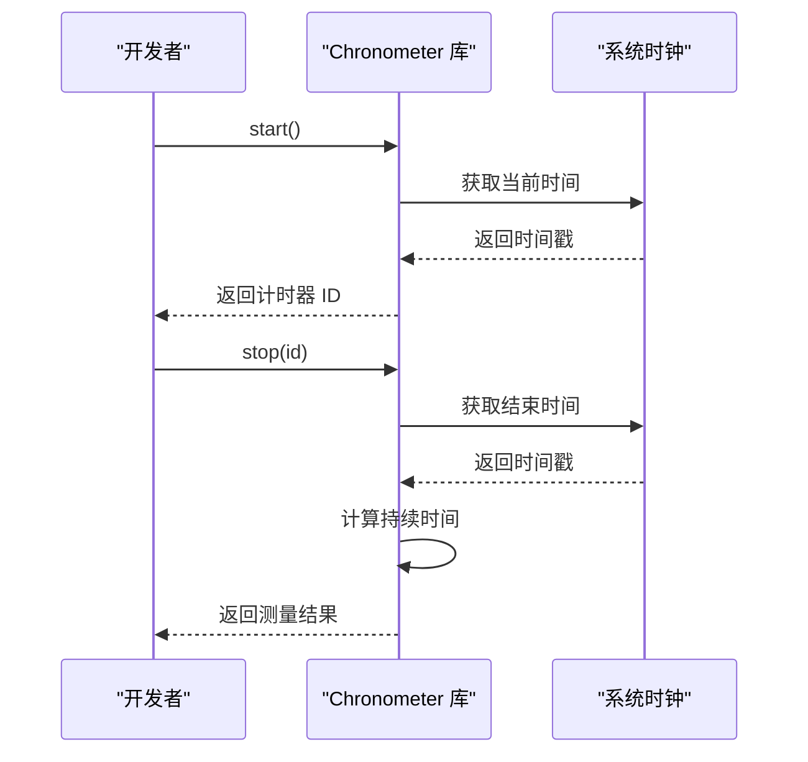

**图表来源**
- [src/chronometer.cpp:37-69](file://src/chronometer.cpp#L37-L69)

**章节来源**
- [test/test_chronometer.cpp:87-96](file://test/test_chronometer.cpp#L87-L96)

## 结论

Chronometer 库通过精心设计的架构和实现，成功地在 C++20 环境下提供了一个高性能、线程安全的计时器解决方案。其核心优势包括：

1. **优雅的单例实现**：利用现代 C++ 特性确保线程安全和简洁性
2. **高效的并发设计**：通过原子操作和读写分离锁优化性能
3. **精确的时间测量**：结合多种时间单位转换确保测量精度
4. **完善的错误处理**：提供清晰的错误语义和一致的行为
5. **良好的可维护性**：模块化设计便于扩展和维护

该库为 C++ 开发者提供了一个可靠的性能测量工具，特别适用于需要精确时间统计的应用场景。

## 附录

### 构建配置

项目使用 CMake 3.14+ 进行构建，支持 C++20 标准：

- **C++ 标准**：C++20 (`CMAKE_CXX_STANDARD 20`)
- **构建选项**：
  - `CHRONOMETER_BUILD_TESTS`: 构建测试套件
  - `CHRONOMETER_BUILD_EXAMPLES`: 构建示例程序

### API 参考

| 方法 | 参数 | 返回值 | 描述 |
|------|------|--------|------|
| `instance()` | 无 | `Chronometer&` | 获取单例实例 |
| `start()` | 无 | `uint64_t` | 开始新的计时器，返回 ID |
| `stop(id, unit)` | `uint64_t, TimeUnit` | `double` | 停止指定计时器并返回时间 |
| `elapsed(id, unit)` | `uint64_t, TimeUnit` | `double` | 查询指定计时器的当前时间 |

### 扩展建议

对于高级开发者，以下方向值得考虑：

1. **自定义时钟源**：支持用户定义的时钟实现
2. **批量操作**：提供批量启动和停止的接口
3. **统计聚合**：支持多次测量的统计分析
4. **可视化支持**：提供性能数据的可视化接口