# 实现细节

<cite>
**本文引用的文件**
- [include/chronometer/chronometer.hpp](file://include/chronometer/chronometer.hpp)
- [src/chronometer.cpp](file://src/chronometer.cpp)
- [include/chronometer/rdtsc_clock.hpp](file://include/chronometer/rdtsc_clock.hpp)
- [src/rdtsc_clock.cpp](file://src/rdtsc_clock.cpp)
- [example/basic_usage.cpp](file://example/basic_usage.cpp)
- [test/test_chronometer.cpp](file://test/test_chronometer.cpp)
- [CMakeLists.txt](file://CMakeLists.txt)
- [cmake/chronometer-config.cmake.in](file://cmake/chronometer-config.cmake.in)
</cite>

## 更新摘要
**变更内容**
- 新增 RDTSC 高精度时钟后端的详细实现分析
- 更新条件编译机制和架构限制说明
- 添加 RDTSC 校准和性能优化策略
- 扩展时间源选择和切换机制
- 更新构建配置和依赖关系分析

## 目录
1. [简介](#简介)
2. [项目结构](#项目结构)
3. [核心组件](#核心组件)
4. [架构概览](#架构概览)
5. [详细组件分析](#详细组件分析)
6. [RDTSC 高精度时钟后端](#rdtsc-高精度时钟后端)
7. [条件编译与架构适配](#条件编译与架构适配)
8. [依赖关系分析](#依赖关系分析)
9. [性能考虑](#性能考虑)
10. [故障排除指南](#故障排除指南)
11. [结论](#结论)
12. [附录](#附录)

## 简介

Chronometer 是一个基于 C++20 标准设计的高性能计时器库，采用单例模式实现全局唯一的计时器实例。该库提供了线程安全的时间测量功能，支持多种时间单位的转换，并通过原子操作和共享互斥锁确保并发访问的安全性。

**新增特性**：库现已支持两种时间源后端：
- **默认后端**：基于 `std::chrono::steady_clock` 的通用计时器
- **RDTSC 后端**：基于 x86 RDTSC 指令的高精度时钟，提供纳秒级精度

该库的核心特性包括：
- 单例模式的线程安全实现
- 原子计数器驱动的唯一标识符生成
- 共享互斥锁的读写分离优化
- C++20 chrono 库的深度集成
- 多种时间单位的精确转换
- 非阻塞操作的设计考虑
- **条件编译支持的架构特定优化**

## 项目结构

项目采用标准的 CMake 构建系统，遵循现代 C++ 库的组织结构，现已扩展支持 RDTSC 后端：

```mermaid
graph TB
subgraph "项目根目录"
Root[CMakeLists.txt]
Config[cmake/chronometer-config.cmake.in]
End
subgraph "头文件"
Header[include/chronometer/chronometer.hpp]
RdtscHeader[include/chronometer/rdtsc_clock.hpp]
End
subgraph "源文件"
Source[src/chronometer.cpp]
RdtscSource[src/rdtsc_clock.cpp]
End
subgraph "示例"
Example[example/basic_usage.cpp]
End
subgraph "测试"
Test[test/test_chronometer.cpp]
End
Root --> Header
Root --> RdtscHeader
Root --> Source
Root --> RdtscSource
Root --> Example
Root --> Test
Root --> Config
```

**图表来源**
- [CMakeLists.txt:1-93](file://CMakeLists.txt#L1-L93)
- [include/chronometer/chronometer.hpp:1-103](file://include/chronometer/chronometer.hpp#L1-L103)
- [include/chronometer/rdtsc_clock.hpp:1-86](file://include/chronometer/rdtsc_clock.hpp#L1-L86)

**章节来源**
- [CMakeLists.txt:1-93](file://CMakeLists.txt#L1-L93)
- [cmake/chronometer-config.cmake.in:1-6](file://cmake/chronometer-config.cmake.in#L1-L6)

## 核心组件

### Chronometer 类设计

Chronometer 类是整个库的核心，实现了单例模式和计时器管理功能，现已支持双后端架构：

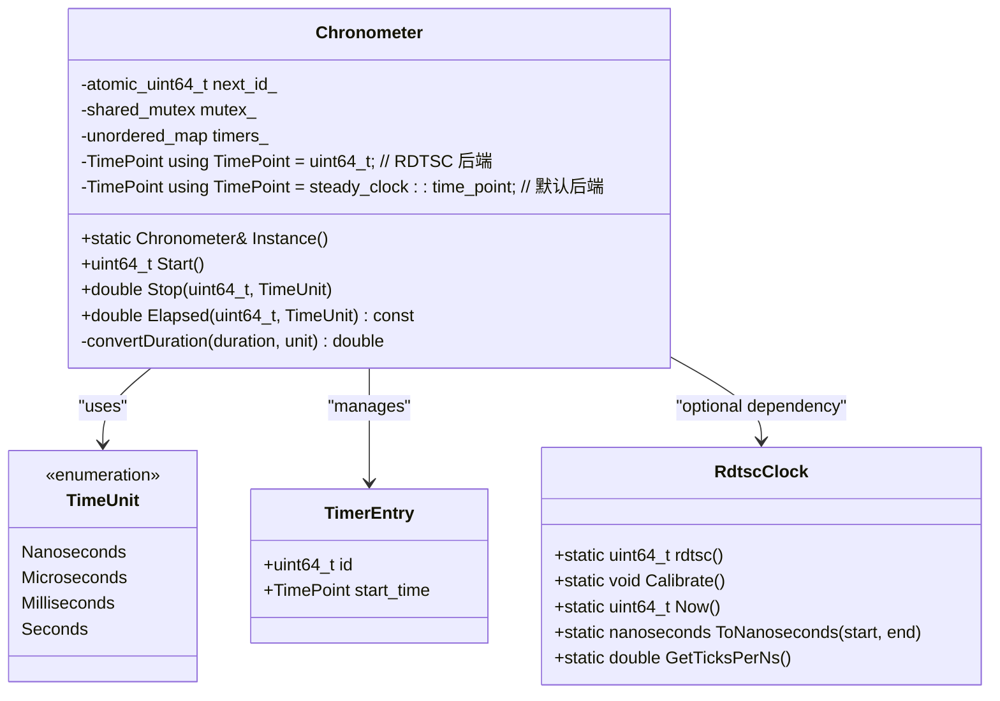

**图表来源**
- [include/chronometer/chronometer.hpp:41-100](file://include/chronometer/chronometer.hpp#L41-L100)

### 时间单位枚举

库定义了四种标准时间单位，支持纳秒到秒的完整范围：

- **Nanoseconds**: 纳秒级精度，适合微基准测试
- **Microseconds**: 微秒级精度，平衡精度与性能
- **Milliseconds**: 毫秒级精度，适合一般性能测量
- **Seconds**: 秒级精度，适合长时间任务监控

**章节来源**
- [include/chronometer/chronometer.hpp:27-32](file://include/chronometer/chronometer.hpp#L27-L32)

## 架构概览

Chronometer 采用了分层架构设计，现已扩展支持条件编译的双后端架构：

```mermaid
graph TB
subgraph "应用层"
App[用户代码]
Example[示例程序]
Test[Test套件]
End
subgraph "接口层"
API[公共API]
Singleton[单例接口]
End
subgraph "业务逻辑层"
TimerManager[计时器管理]
UnitConverter[单位转换器]
IDGenerator[ID生成器]
End
subgraph "基础设施层"
AtomicCounter[原子计数器]
SharedMutex[共享互斥锁]
DefaultClock[稳态时钟]
RdtscBackend[RDTSC 后端]
End
subgraph "条件编译层"
Conditional[CHRONOMETER_USE_RDTSC]
Architecture[x86_64 架构检测]
End
App --> API
Example --> API
Test --> API
API --> Singleton
API --> TimerManager
TimerManager --> UnitConverter
TimerManager --> IDGenerator
IDGenerator --> AtomicCounter
TimerManager --> SharedMutex
TimerManager --> DefaultClock
TimerManager --> RdtscBackend
Conditional --> Architecture
Architecture --> RdtscBackend
```

**图表来源**
- [src/chronometer.cpp:47-58](file://src/chronometer.cpp#L47-L58)
- [include/chronometer/chronometer.hpp:90-94](file://include/chronometer/chronometer.hpp#L90-L94)

## 详细组件分析

### 单例模式实现

Chronometer 采用经典的"局部静态变量"模式实现线程安全的单例，现已集成 RDTSC 校准：

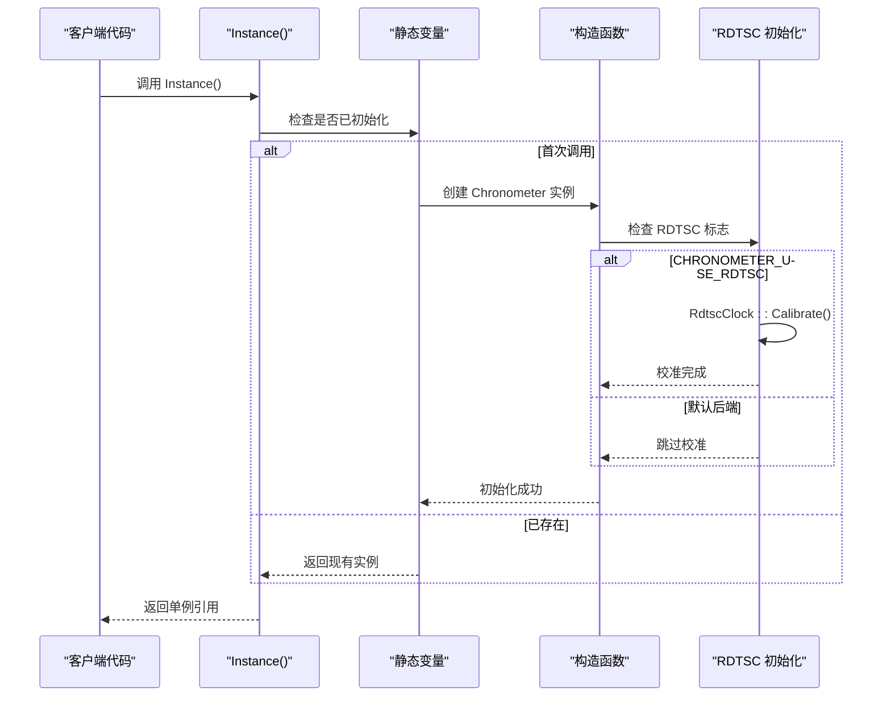

**图表来源**
- [src/chronometer.cpp:47-58](file://src/chronometer.cpp#L47-L58)

**更新**：新增 RDTSC 校准初始化逻辑，确保在首次使用时进行时钟校准。

**章节来源**
- [src/chronometer.cpp:47-58](file://src/chronometer.cpp#L47-L58)

### 原子计数器设计

ID 生成器使用原子计数器确保多线程环境下的唯一性和安全性：

```mermaid
flowchart TD
Start([Start() 调用]) --> FetchAdd["fetch_add(1, memory_order_relaxed)"]
FetchAdd --> GetId["获取自增后的 ID"]
GetId --> PreSample["前置采样时间"]
PreSample --> CheckBackend{"检查后端类型"}
CheckBackend --> |RDTSC| RdtscNow["RdtscClock::Now()"]
CheckBackend --> |默认| SteadyNow["steady_clock::now()"]
RdtscNow --> Lock["获取独占锁"]
SteadyNow --> Lock
Lock --> Insert["插入到映射表"]
Insert --> Unlock["释放锁"]
Unlock --> Return["返回 ID"]
style FetchAdd fill:#e1f5fe
style Lock fill:#fff3e0
style Insert fill:#fff3e0
style Unlock fill:#e8f5e8
style Return fill:#e8f5e8
```

**图表来源**
- [src/chronometer.cpp:60-73](file://src/chronometer.cpp#L60-L73)
- [include/chronometer/chronometer.hpp:96](file://include/chronometer/chronometer.hpp#L96)

**更新**：前置采样时间策略确保计时精度，避免锁竞争影响测量结果。

**章节来源**
- [src/chronometer.cpp:60-73](file://src/chronometer.cpp#L60-L73)
- [include/chronometer/chronometer.hpp:96](file://include/chronometer/chronometer.hpp#L96)

### 共享互斥锁策略

库采用读写分离的共享互斥锁策略，优化了并发性能：

```mermaid
graph LR
subgraph "读操作 (Elapsed)"
ReadLock["shared_lock"]
ReadAccess["只读访问"]
End
subgraph "写操作 (Start/Stop)"
WriteLock["unique_lock"]
WriteAccess["读写访问"]
End
subgraph "锁类型"
SharedMutex["shared_mutex"]
End
ReadLock --> SharedMutex
WriteLock --> SharedMutex
SharedMutex --> ReadAccess
SharedMutex --> WriteAccess
```

**图表来源**
- [src/chronometer.cpp:100-122](file://src/chronometer.cpp#L100-L122)
- [src/chronometer.cpp:60-73](file://src/chronometer.cpp#L60-L73)

**更新**：读写分离策略在 RDTSC 后端下同样适用，确保高并发场景下的最佳性能。

**章节来源**
- [src/chronometer.cpp:100-122](file://src/chronometer.cpp#L100-L122)
- [src/chronometer.cpp:60-73](file://src/chronometer.cpp#L60-L73)

### 时间单位转换算法

转换函数实现了精确的时间单位换算，确保不同精度下的数值正确性：


**图表来源**
- [src/chronometer.cpp:18-43](file://src/chronometer.cpp#L18-L43)

**更新**：转换算法在两种后端下保持一致，确保 API 的统一性。

**章节来源**
- [src/chronometer.cpp:18-43](file://src/chronometer.cpp#L18-L43)

### 内部数据结构选择

库选择了 `std::unordered_map` 作为计时器存储的数据结构：


**图表来源**
- [include/chronometer/chronometer.hpp:98](file://include/chronometer/chronometer.hpp#L98)

**更新**：数据结构在 RDTSC 后端下存储原始 TSC 计数值而非时间点。

**章节来源**
- [include/chronometer/chronometer.hpp:98](file://include/chronometer/chronometer.hpp#L98)

### 异常处理机制

库实现了完善的错误检测和异常处理机制：

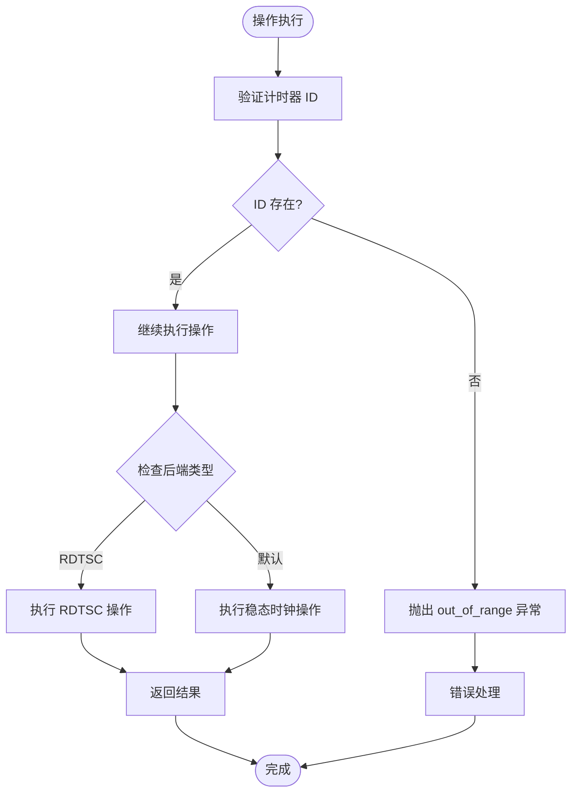

**图表来源**
- [src/chronometer.cpp:75-98](file://src/chronometer.cpp#L75-L98)
- [src/chronometer.cpp:100-122](file://src/chronometer.cpp#L100-L122)

**更新**：异常处理在两种后端下保持一致，确保 API 的可靠性。

**章节来源**
- [src/chronometer.cpp:75-98](file://src/chronometer.cpp#L75-L98)
- [src/chronometer.cpp:100-122](file://src/chronometer.cpp#L100-L122)

## RDTSC 高精度时钟后端

### RDTSC 时钟类设计

RdtscClock 类提供了基于 x86 RDTSC 指令的高精度时钟实现：

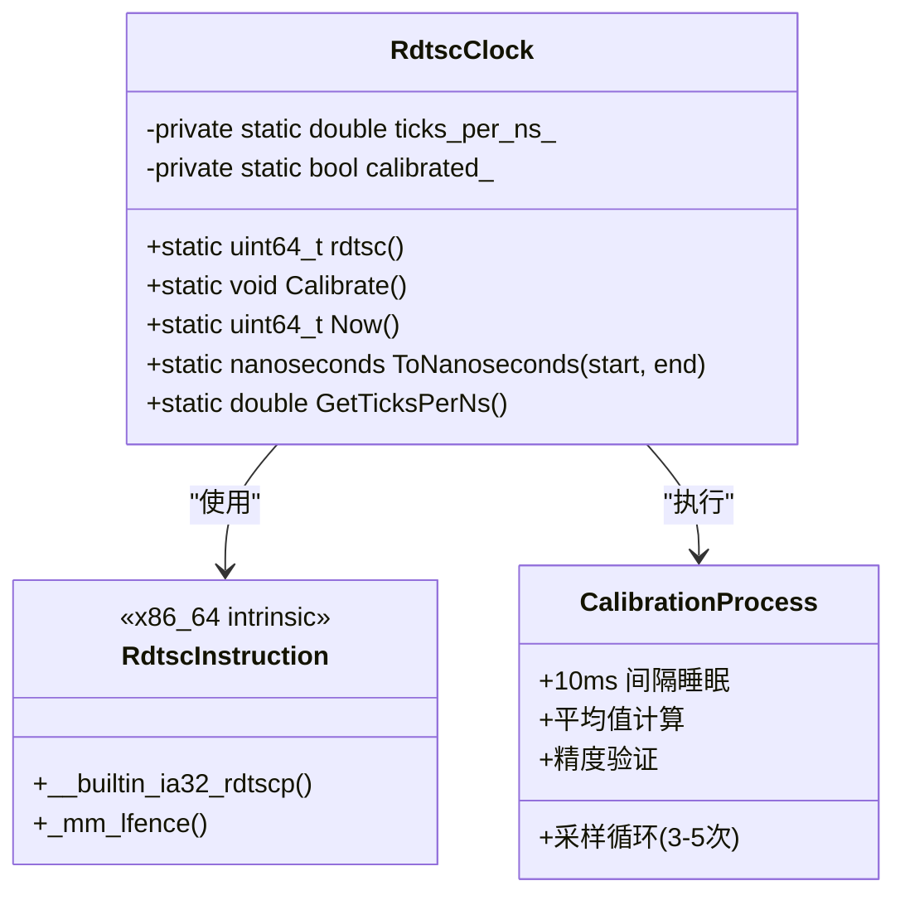

**图表来源**
- [include/chronometer/rdtsc_clock.hpp:28-81](file://include/chronometer/rdtsc_clock.hpp#L28-L81)

### RDTSC 指令实现

RDTSC 后端使用 `__builtin_ia32_rdtscp` 内置函数和 `_mm_lfence` 序列化指令：

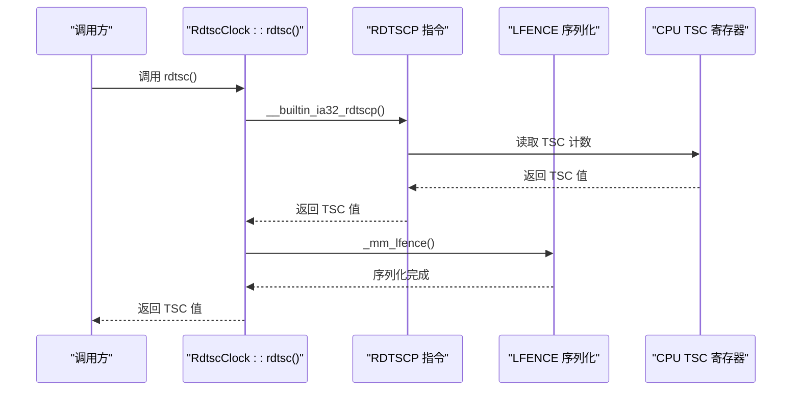

**图表来源**
- [src/rdtsc_clock.cpp:14-19](file://src/rdtsc_clock.cpp#L14-L19)

### 校准算法设计

RdtscClock::Calibrate() 方法实现了高精度的时钟校准：

```mermaid
flowchart TD
Start([Calibrate() 调用]) --> InitVars["初始化变量"]
InitVars --> Loop["循环 3-5 次采样"]
Loop --> Sample1["采样开始: rdtsc()"]
Sample1 --> Sleep["sleep_for(10ms)"]
Sleep --> Sample2["采样结束: rdtsc()"]
Sample2 --> CalcDelta["计算 TSC 和 chrono 差值"]
CalcDelta --> CheckValid{"chrono_delta > 0?"}
CheckValid --> |是| Accumulate["累加比率"]
CheckValid --> |否| Skip["跳过采样"]
Accumulate --> NextIter["下一次采样"]
Skip --> NextIter
NextIter --> Loop
Loop --> Done{"采样完成?"}
Done --> |是| Average["计算平均值"]
Average --> SetFlag["设置 calibrated_ = true"]
SetFlag --> End([校准完成])
Done --> |否| Loop
```

**图表来源**
- [src/rdtsc_clock.cpp:21-53](file://src/rdtsc_clock.cpp#L21-L53)

**更新**：校准精度目标为误差 < 1%，通过多次采样取平均值提高准确性。

**章节来源**
- [src/rdtsc_clock.cpp:21-53](file://src/rdtsc_clock.cpp#L21-L53)
- [include/chronometer/rdtsc_clock.hpp:37-47](file://include/chronometer/rdtsc_clock.hpp#L37-L47)

### TSC 到纳秒转换

RdtscClock::ToNanoseconds() 方法实现了精确的 TSC 计数到纳秒的转换：

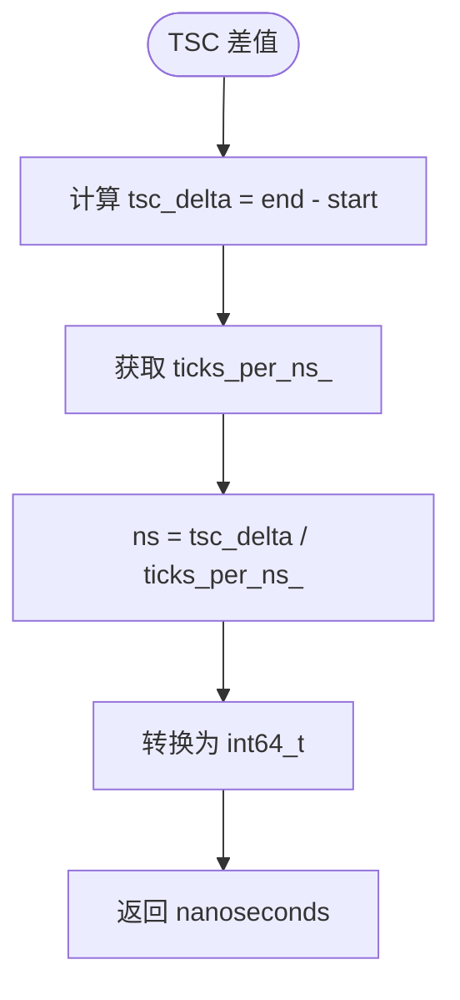

**图表来源**
- [src/rdtsc_clock.cpp:57-62](file://src/rdtsc_clock.cpp#L57-L62)

**更新**：转换精度依赖于校准结果，确保与系统时钟的一致性。

**章节来源**
- [src/rdtsc_clock.cpp:57-62](file://src/rdtsc_clock.cpp#L57-L62)
- [include/chronometer/rdtsc_clock.hpp:58-67](file://include/chronometer/rdtsc_clock.hpp#L58-L67)

## 条件编译与架构适配

### 条件编译机制

库使用宏定义实现条件编译，支持 RDTSC 后端的可选集成：

```mermaid
graph TB
subgraph "编译时配置"
Option[CHRONOMETER_USE_RDTSC]
ArchDetect[x86_64 架构检测]
End
subgraph "编译器行为"
IncludeHeader["包含 rdtsc_clock.hpp"]
AddSource["添加 rdtsc_clock.cpp"]
DefineMacro["定义 CHRONOMETER_USE_RDTSC"]
End
subgraph "运行时行为"
SelectBackend["选择时间源后端"]
RdtscBackend["RDTSC 后端"]
DefaultBackend["默认后端"]
End
Option --> IncludeHeader
ArchDetect --> DefineMacro
IncludeHeader --> SelectBackend
AddSource --> SelectBackend
DefineMacro --> SelectBackend
SelectBackend --> RdtscBackend
SelectBackend --> DefaultBackend
```

**图表来源**
- [CMakeLists.txt:20-27](file://CMakeLists.txt#L20-L27)
- [include/chronometer/chronometer.hpp:16-18](file://include/chronometer/chronometer.hpp#L16-L18)

### 架构限制与验证

CMakeLists.txt 实现了严格的架构限制和验证机制：

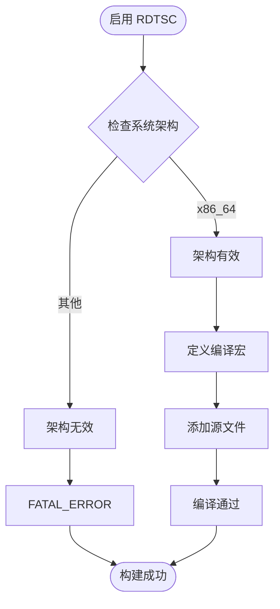

**图表来源**
- [CMakeLists.txt:21-27](file://CMakeLists.txt#L21-L27)

**更新**：架构检测确保只在 x86_64 平台上启用 RDTSC 功能。

**章节来源**
- [CMakeLists.txt:21-27](file://CMakeLists.txt#L21-L27)
- [include/chronometer/rdtsc_clock.hpp:12](file://include/chronometer/rdtsc_clock.hpp#L12)

### 后端切换机制

Chronometer 类实现了透明的后端切换机制：

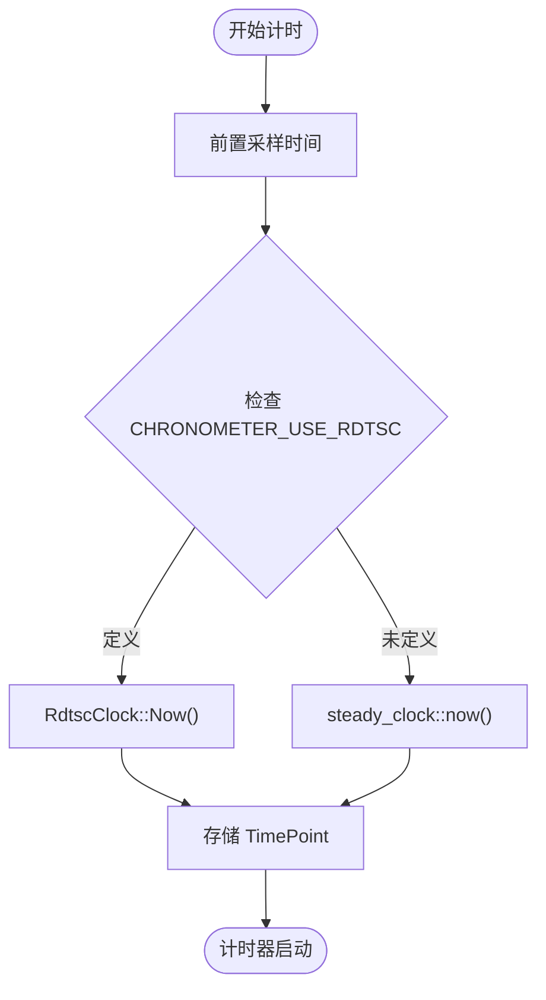

**图表来源**
- [src/chronometer.cpp:64-68](file://src/chronometer.cpp#L64-L68)
- [include/chronometer/chronometer.hpp:90-94](file://include/chronometer/chronometer.hpp#L90-L94)

**更新**：使用 `using` 关键字实现类型级别的后端切换，保持 API 的一致性。

**章节来源**
- [src/chronometer.cpp:64-68](file://src/chronometer.cpp#L64-L68)
- [include/chronometer/chronometer.hpp:90-94](file://include/chronometer/chronometer.hpp#L90-L94)

## 依赖关系分析

### 外部依赖

Chronometer 依赖于 C++20 标准库的多个组件，现已扩展支持 RDTSC 内置函数：

```mermaid
graph TB
subgraph "C++20 标准库"
Atomic[std::atomic]
Chrono[std::chrono]
Mutex[std::shared_mutex]
HashMap[std::unordered_map]
Exception[std::exception]
End
subgraph "RDTSC 特定依赖"
Intrinsics[x86intrin.h]
LFence[_mm_lfence]
End
subgraph "Chronometer 库"
ChronoClass[Chronometer]
TimeUnitEnum[TimeUnit]
Converter[convertDuration]
RdtscClass[RdtscClock]
End
Atomic --> ChronoClass
Chrono --> ChronoClass
Mutex --> ChronoClass
HashMap --> ChronoClass
Exception --> Converter
TimeUnitEnum --> Converter
RdtscClass --> Intrinsics
RdtscClass --> LFence
```

**图表来源**
- [include/chronometer/chronometer.hpp:10-18](file://include/chronometer/chronometer.hpp#L10-L18)
- [include/chronometer/rdtsc_clock.hpp:14](file://include/chronometer/rdtsc_clock.hpp#L14)

### 内部模块依赖

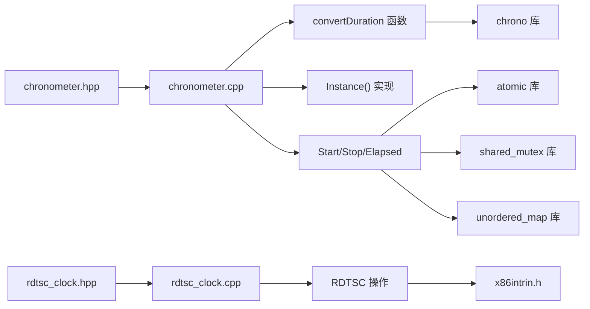

**图表来源**
- [include/chronometer/chronometer.hpp:41-100](file://include/chronometer/chronometer.hpp#L41-L100)
- [src/chronometer.cpp:1-125](file://src/chronometer.cpp#L1-L125)

**更新**：新增 RDTSC 模块的依赖关系，包括 x86intrin.h 和 _mm_lfence。

**章节来源**
- [include/chronometer/chronometer.hpp:10-18](file://include/chronometer/chronometer.hpp#L10-L18)
- [src/chronometer.cpp:1-125](file://src/chronometer.cpp#L1-L125)

## 性能考虑

### 并发性能优化

库在设计时充分考虑了并发场景下的性能表现，现已优化 RDTSC 后端：

1. **原子操作优化**：ID 生成使用原子操作，避免锁竞争
2. **读写分离**：共享互斥锁允许多个读操作同时进行
3. **非阻塞设计**：大部分操作都是非阻塞的
4. ****前置采样**：避免锁竞争影响测量精度

### 内存管理策略

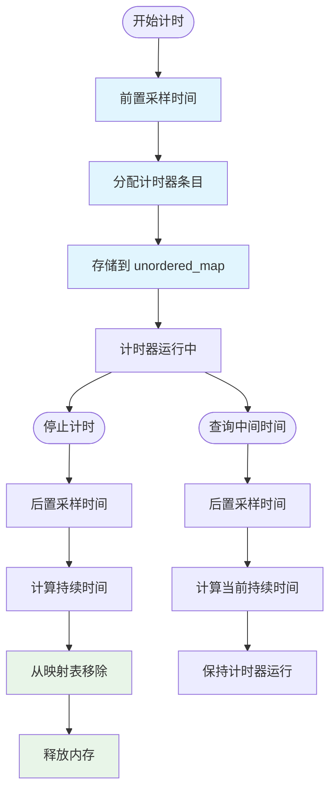

**图表来源**
- [src/chronometer.cpp:60-122](file://src/chronometer.cpp#L60-L122)

**更新**：前置采样策略在 RDTSC 后端下同样适用，确保测量精度。

**章节来源**
- [src/chronometer.cpp:60-122](file://src/chronometer.cpp#L60-L122)

### 精度保证机制

库通过以下机制确保时间测量的精度，现已扩展 RDTSC 校准：

1. **稳态时钟**：使用 `std::chrono::steady_clock` 避免系统时间调整的影响
2. **纳秒级转换**：先转换到纳秒，再转换到目标单位，避免精度损失
3. **原子计数**：确保 ID 的唯一性和单调性
4. ****RDTSC 校准**：通过多次采样计算精确的 TSC 到纳秒转换比率

### RDTSC 性能优化

RDTSC 后端实现了多项性能优化：

1. **低开销读取**：RDTSCP 指令提供快速的 TSC 读取
2. **序列化保证**：LFENCE 指令确保读取的准确性
3. **校准缓存**：校准结果缓存避免重复计算
4. **批量采样**：多次采样取平均值提高精度

**章节来源**
- [src/chronometer.cpp:60-122](file://src/chronometer.cpp#L60-L122)
- [src/rdtsc_clock.cpp:21-53](file://src/rdtsc_clock.cpp#L21-L53)

## 故障排除指南

### 常见问题诊断

1. **计时器 ID 不存在**
   - 症状：调用 `Stop()` 或 `Elapsed()` 抛出 `std::out_of_range`
   - 解决方案：确保使用正确的 ID，检查计时器是否已被停止

2. **并发访问冲突**
   - 症状：多线程环境下出现死锁或数据竞争
   - 解决方案：使用库提供的线程安全接口，避免外部直接修改内部状态

3. **精度问题**
   - 症状：测量结果不符合预期
   - 解决方案：检查系统时钟设置，确认使用合适的精度单位

4. ****RDTSC 后端问题**
   - 症状：编译错误或运行时异常
   - 解决方案：确认在 x86_64 架构上编译，检查 RDTSC 校准是否完成

### 调试技巧

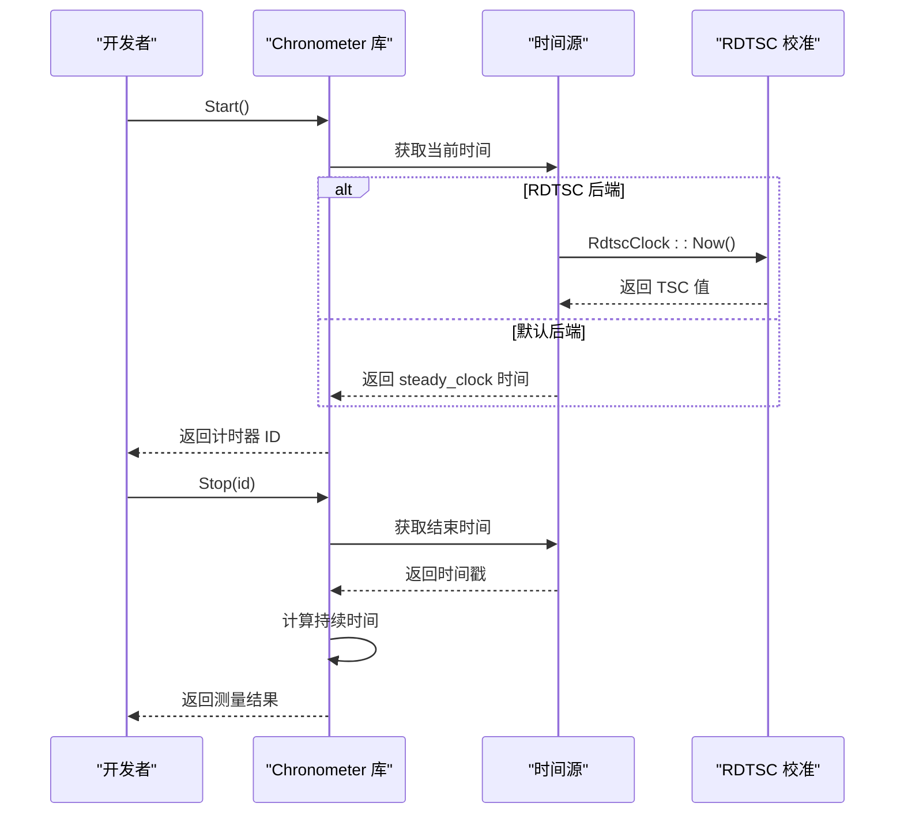

**图表来源**
- [src/chronometer.cpp:60-122](file://src/chronometer.cpp#L60-L122)

**更新**：调试流程现已包含 RDTSC 后端的特殊处理。

**章节来源**
- [test/test_chronometer.cpp:133-201](file://test/test_chronometer.cpp#L133-L201)

## 结论

Chronometer 库通过精心设计的架构和实现，成功地在 C++20 环境下提供了一个高性能、线程安全的计时器解决方案。其核心优势包括：

1. **优雅的单例实现**：利用现代 C++ 特性确保线程安全和简洁性
2. **高效的并发设计**：通过原子操作和读写分离锁优化性能
3. **精确的时间测量**：结合多种时间单位转换确保测量精度
4. **完善的错误处理**：提供清晰的错误语义和一致的行为
5. **良好的可维护性**：模块化设计便于扩展和维护
6. ****条件编译支持**：灵活的架构适配和后端选择
7. ****RDTSC 高精度后端**：为 x86_64 平台提供纳秒级精度的计时能力

**更新**：新增的 RDTSC 后端显著提升了在 x86_64 平台上的计时精度和性能，同时保持了与默认后端的 API 兼容性。

该库为 C++ 开发者提供了一个可靠的性能测量工具，特别适用于需要精确时间统计的应用场景，现已支持从微秒级到纳秒级的广泛精度需求。

## 附录

### 构建配置

项目使用 CMake 3.14+ 进行构建，支持 C++20 标准和 RDTSC 后端：

- **C++ 标准**：C++20 (`CMAKE_CXX_STANDARD 20`)
- **构建选项**：
  - `CHRONOMETER_BUILD_TESTS`: 构建测试套件
  - `CHRONOMETER_BUILD_EXAMPLES`: 构建示例程序
  - `CHRONOMETER_USE_RDTSC`: 启用 RDTSC 高精度时钟后端（x86_64 专用）

### API 参考

| 方法 | 参数 | 返回值 | 描述 |
|------|------|--------|------|
| `Instance()` | 无 | `Chronometer&` | 获取单例实例 |
| `Start()` | 无 | `uint64_t` | 开始新的计时器，返回 ID |
| `Stop(id, unit)` | `uint64_t, TimeUnit` | `double` | 停止指定计时器并返回时间 |
| `Elapsed(id, unit)` | `uint64_t, TimeUnit` | `double` | 查询指定计时器的当前时间 |
| **`RdtscClock::Calibrate()`** | 无 | `void` | 校准 RDTSC 时钟（仅 RDTSC 后端） |
| **`RdtscClock::Now()`** | 无 | `uint64_t` | 获取当前 TSC 计数（仅 RDTSC 后端） |
| **`RdtscClock::ToNanoseconds(start, end)`** | `uint64_t, uint64_t` | `nanoseconds` | TSC 差值转换为纳秒（仅 RDTSC 后端） |

### 扩展建议

对于高级开发者，以下方向值得考虑：

1. **自定义时钟源**：支持用户定义的时钟实现
2. **批量操作**：提供批量启动和停止的接口
3. **统计聚合**：支持多次测量的统计分析
4. **可视化支持**：提供性能数据的可视化接口
5. ****跨平台后端**：实现 ARM NEON 或其他架构的高性能计时器
6. ****硬件计时器抽象**：提供更通用的硬件计时器接口

**更新**：新增 RDTSC 后端相关的 API 扩展建议。