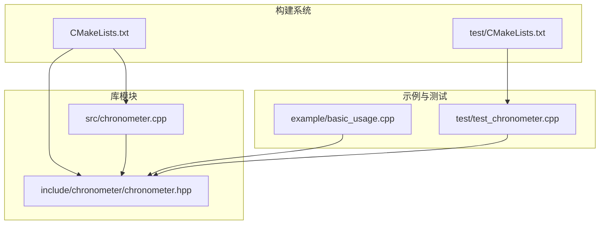
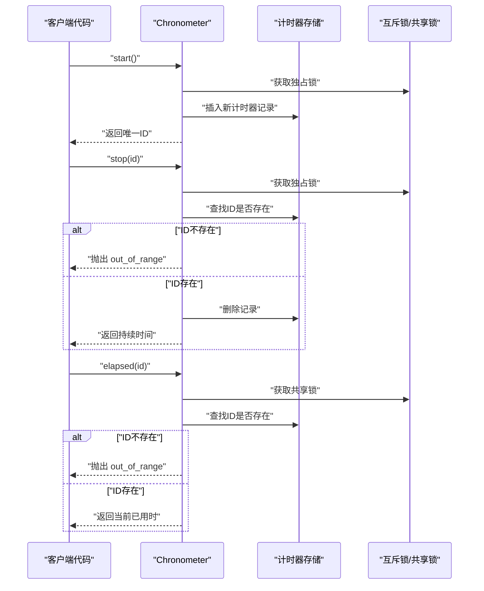
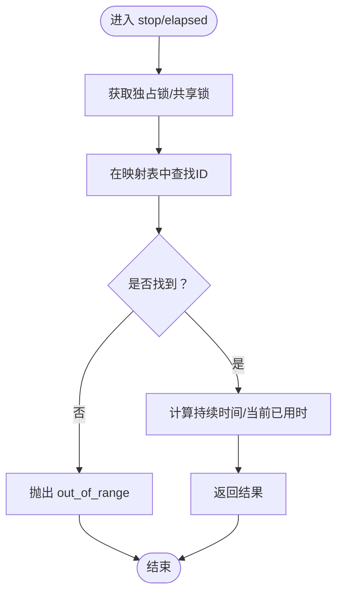
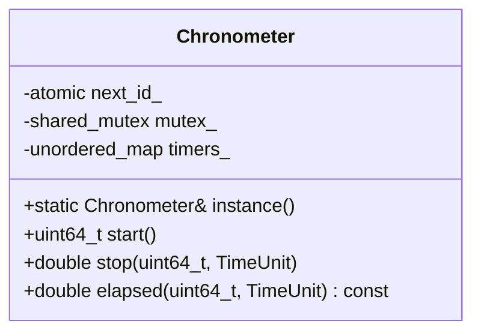
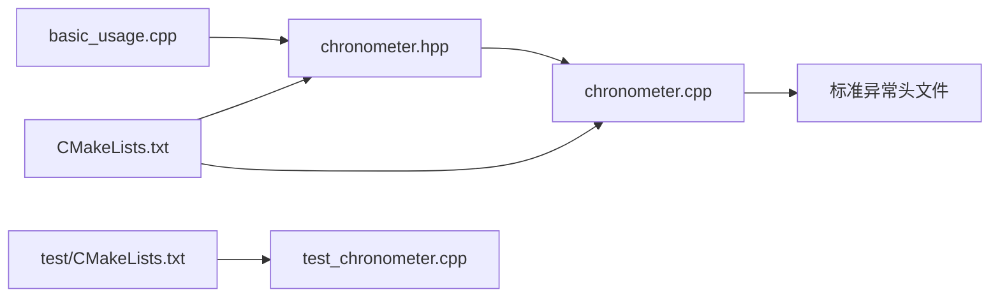

# 异常处理机制

<cite>
**本文档引用的文件**
- [chronometer.hpp](file://include/chronometer/chronometer.hpp)
- [chronometer.cpp](file://src/chronometer.cpp)
- [test_chronometer.cpp](file://test/test_chronometer.cpp)
- [basic_usage.cpp](file://example/basic_usage.cpp)
- [CMakeLists.txt](file://CMakeLists.txt)
- [test/CMakeLists.txt](file://test/CMakeLists.txt)
</cite>

## 目录
1. [简介](#简介)
2. [项目结构](#项目结构)
3. [核心组件](#核心组件)
4. [架构总览](#架构总览)
5. [详细组件分析](#详细组件分析)
6. [依赖分析](#依赖分析)
7. [性能考量](#性能考量)
8. [故障排查指南](#故障排查指南)
9. [结论](#结论)
10. [附录](#附录)

## 简介
本项目提供一个线程安全的高精度计时器管理类，支持纳秒级精度的计时功能，并通过标准异常类进行错误传播。本文档聚焦于异常处理机制，包括：
- 无效 ID 检测的实现逻辑与异常抛出策略
- 异常类型选择与错误信息设计原则
- 异常安全性保证与 RAII 模式应用
- 异常处理对性能的影响与优化策略
- 最佳实践、错误恢复机制与调试技巧
- 与标准异常类别的兼容性与扩展性考虑

## 项目结构
该项目采用 CMake 构建系统，包含以下关键模块：
- 头文件：对外暴露接口与类型定义
- 源文件：实现计时器逻辑与异常处理
- 示例程序：演示基本用法与异常场景
- 测试用例：验证异常行为与并发安全性

**图表来源**
- [CMakeLists.txt:1-82](file://CMakeLists.txt#L1-L82)
- [test/CMakeLists.txt:1-23](file://test/CMakeLists.txt#L1-L23)

**章节来源**
- [CMakeLists.txt:1-82](file://CMakeLists.txt#L1-L82)
- [test/CMakeLists.txt:1-23](file://test/CMakeLists.txt#L1-L23)

## 核心组件
- Chronometer 类：提供单例实例、启动计时、查询已用时、停止计时等能力；内部维护计时器映射表与原子 ID 计数器。
- TimeUnit 枚举：定义可选的时间单位（纳秒、微秒、毫秒、秒）。
- 异常处理：在访问不存在的计时器 ID 时抛出标准异常，确保调用方能够感知错误状态。

关键实现要点：
- 通过互斥锁与共享锁实现线程安全，避免竞态条件。
- 使用原子变量生成唯一 ID，减少锁竞争。
- 在 stop 与 elapsed 方法中检测 ID 是否存在，不存在则抛出异常。

**章节来源**
- [chronometer.hpp:37-90](file://include/chronometer/chronometer.hpp#L37-L90)
- [chronometer.cpp:32-69](file://src/chronometer.cpp#L32-L69)

## 架构总览
下图展示了异常处理在计时器生命周期中的位置与影响路径。

**图表来源**
- [chronometer.cpp:37-69](file://src/chronometer.cpp#L37-L69)

## 详细组件分析

### 异常类型选择与错误信息设计
- 异常类型：使用标准异常类 std::out_of_range 表示“索引或键不存在”的错误语义，符合计时器 ID 查找失败的场景。
- 错误信息：提供简洁明确的描述字符串，便于上层捕获与日志记录。
- 设计原则：
  - 语义清晰：异常名称与错误原因一致，便于快速定位问题。
  - 可诊断：错误信息包含上下文线索（如“Timer id not found”）。
  - 一致性：stop 与 elapsed 两种接口均采用相同的异常策略，保持行为统一。

**章节来源**
- [chronometer.cpp:44-69](file://src/chronometer.cpp#L44-L69)
- [chronometer.hpp:65-81](file://include/chronometer/chronometer.hpp#L65-L81)

### 无效 ID 检测与异常抛出策略
- 检测点：在 stop 与 elapsed 方法中，先尝试在计时器映射表中查找 ID。
- 抛出时机：若未找到，立即抛出异常，避免后续计算与返回无意义结果。
- 异常传播：调用方需在调用处进行异常捕获与处理，确保资源不泄漏且状态一致。

**图表来源**
- [chronometer.cpp:44-69](file://src/chronometer.cpp#L44-L69)

**章节来源**
- [chronometer.cpp:44-69](file://src/chronometer.cpp#L44-L69)

### 异常安全性与 RAII 模式应用
- RAII：Chronometer 内部使用智能锁（unique_lock/shared_lock）自动管理锁的获取与释放，避免死锁与资源泄漏。
- 异常安全：当异常发生时，锁会自动释放，确保数据结构的一致性与后续操作的安全性。
- 并发模型：读写分离（shared_mutex），提高并发读取效率；写入路径严格加锁，保证原子性。

**图表来源**
- [chronometer.hpp:37-90](file://include/chronometer/chronometer.hpp#L37-L90)

**章节来源**
- [chronometer.hpp:37-90](file://include/chronometer/chronometer.hpp#L37-L90)
- [chronometer.cpp:37-69](file://src/chronometer.cpp#L37-L69)

### 异常处理对性能的影响与优化策略
- 影响因素：
  - 异常抛出与栈展开的成本通常高于普通分支判断，应尽量避免在热路径频繁触发异常。
  - 本实现将异常用于错误场景而非常规控制流，符合性能最佳实践。
- 优化建议：
  - 在调用前进行显式检查（例如缓存最近一次 start 的 ID），减少异常触发概率。
  - 将异常处理集中在边界层（如业务入口），避免在循环内重复 try/catch。
  - 使用局部变量缓存计时器状态，降低锁持有时间。

**章节来源**
- [chronometer.cpp:37-69](file://src/chronometer.cpp#L37-L69)

### 异常场景分析与处理示例
- 场景一：对不存在的 ID 调用 stop 或 elapsed
  - 触发条件：传入的 ID 从未被 start 或已被 stop 删除。
  - 预期行为：抛出 std::out_of_range，调用方可据此进行错误恢复或重试。
  - 测试覆盖：单元测试明确断言异常类型与参数组合。
- 场景二：并发访问同一 ID
  - 触发条件：多个线程同时对同一 ID 进行 stop/elapsed。
  - 预期行为：互斥锁保证原子性，异常仅在 ID 不存在时抛出，避免竞态。
- 场景三：ID 被提前 stop 后再次访问
  - 触发条件：对已停止的 ID 调用 elapsed 或 stop。
  - 预期行为：抛出异常，提示 ID 已失效。

**章节来源**
- [test_chronometer.cpp:87-96](file://test/test_chronometer.cpp#L87-L96)
- [chronometer.cpp:44-69](file://src/chronometer.cpp#L44-L69)

### 与标准异常类别的兼容性与扩展性
- 兼容性：使用标准异常类（std::out_of_range）提升与现有 C++ 生态的兼容性，便于上层框架统一处理。
- 扩展性：若未来需要更细粒度的错误分类，可在头文件中新增自定义异常类型，并在源文件中按相同策略抛出与处理。

**章节来源**
- [chronometer.cpp:44-69](file://src/chronometer.cpp#L44-L69)
- [chronometer.hpp:65-81](file://include/chronometer/chronometer.hpp#L65-L81)

### 最佳实践与错误恢复机制
- 最佳实践：
  - 在调用 stop/elapsed 前，确保 ID 来自最近一次 start 且尚未被 stop。
  - 对外部输入的 ID 进行预校验，必要时使用 try/catch 包裹关键路径。
  - 在日志中记录异常上下文（如 ID、调用时间、线程 ID），便于定位问题。
- 错误恢复：
  - 当捕获到异常时，优先回退到安全状态（如重新发起计时、记录错误并继续执行）。
  - 对于可重试的操作，设置最大重试次数与退避策略，避免无限重试导致资源耗尽。

**章节来源**
- [basic_usage.cpp:1-69](file://example/basic_usage.cpp#L1-L69)

### 调试技巧
- 使用单元测试验证异常行为：通过 GoogleTest 断言异常类型与参数组合，确保异常路径正确。
- 并发调试：在多线程场景下，结合锁的使用与原子变量，逐步缩小问题范围。
- 日志与断言：在关键节点输出 ID 与时间戳，配合断言验证计时器状态一致性。

**章节来源**
- [test_chronometer.cpp:87-96](file://test/test_chronometer.cpp#L87-L96)
- [test_chronometer.cpp:98-125](file://test/test_chronometer.cpp#L98-L125)

## 依赖分析
- 头文件依赖：Chronometer 类依赖标准库容器、原子类型与互斥锁。
- 源文件依赖：实现文件引入标准异常头文件，用于异常抛出。
- 构建依赖：CMake 控制库与示例/测试的编译与安装。

**图表来源**
- [chronometer.hpp:10-14](file://include/chronometer/chronometer.hpp#L10-L14)
- [chronometer.cpp:1-5](file://src/chronometer.cpp#L1-L5)
- [CMakeLists.txt:1-82](file://CMakeLists.txt#L1-L82)
- [test/CMakeLists.txt:1-23](file://test/CMakeLists.txt#L1-L23)

**章节来源**
- [chronometer.hpp:10-14](file://include/chronometer/chronometer.hpp#L10-L14)
- [chronometer.cpp:1-5](file://src/chronometer.cpp#L1-L5)
- [CMakeLists.txt:1-82](file://CMakeLists.txt#L1-L82)
- [test/CMakeLists.txt:1-23](file://test/CMakeLists.txt#L1-L23)

## 性能考量
- 异常成本：异常抛出与栈展开的开销通常高于正常路径，应避免在高频路径中频繁触发。
- 锁竞争：start 与 stop 使用独占锁，elapsed 使用共享锁，平衡吞吐与一致性。
- 原子 ID：使用原子变量生成 ID，减少锁竞争，提升并发性能。
- 建议：在热点路径中尽量避免异常，通过预检查与健壮的输入校验降低异常触发概率。

**章节来源**
- [chronometer.cpp:37-69](file://src/chronometer.cpp#L37-L69)

## 故障排查指南
- 症状：调用 stop/elapsed 抛出异常
  - 排查步骤：
    - 确认 ID 是否来自最近一次 start 且未被 stop。
    - 检查是否存在并发访问导致 ID 被提前删除。
    - 在调用处添加 try/catch 并记录上下文信息。
- 症状：多线程下出现死锁或性能下降
  - 排查步骤：
    - 确认锁的使用是否正确（独占锁用于写，共享锁用于读）。
    - 检查是否有长时间持有锁的逻辑。
    - 使用单元测试复现并发场景，验证异常与锁行为。

**章节来源**
- [test_chronometer.cpp:87-96](file://test/test_chronometer.cpp#L87-L96)
- [test_chronometer.cpp:98-125](file://test/test_chronometer.cpp#L98-L125)

## 结论
本项目的异常处理机制以标准异常类为核心，围绕无效 ID 场景提供一致、可诊断的行为。通过 RAII 与互斥锁保障异常安全性，结合合理的并发模型与性能优化策略，在保证正确性的同时兼顾了运行效率。建议在实际使用中遵循最佳实践，完善错误恢复与调试手段，以获得稳定可靠的计时体验。

## 附录
- 示例程序展示了基本用法与不同时间单位的使用方式，有助于理解异常场景下的行为差异。
- 单元测试覆盖了异常行为与并发安全性，可作为回归测试与集成测试的基础。

**章节来源**
- [basic_usage.cpp:1-69](file://example/basic_usage.cpp#L1-L69)
- [test_chronometer.cpp:87-96](file://test/test_chronometer.cpp#L87-L96)
- [test_chronometer.cpp:98-125](file://test/test_chronometer.cpp#L98-L125)