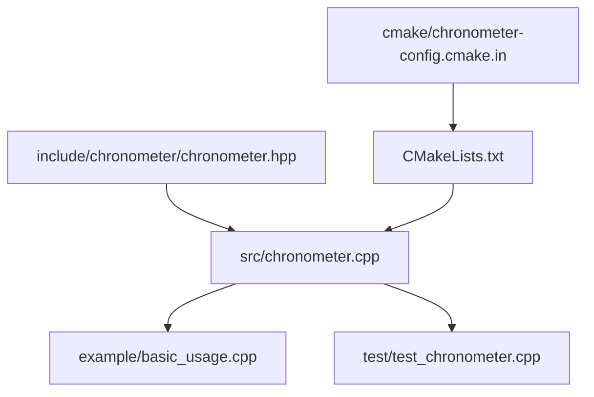
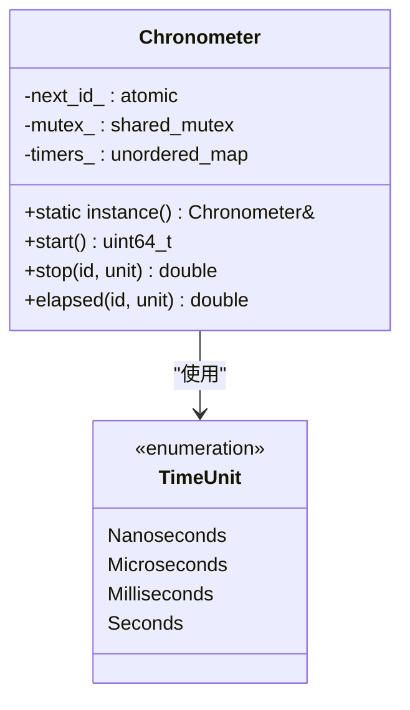
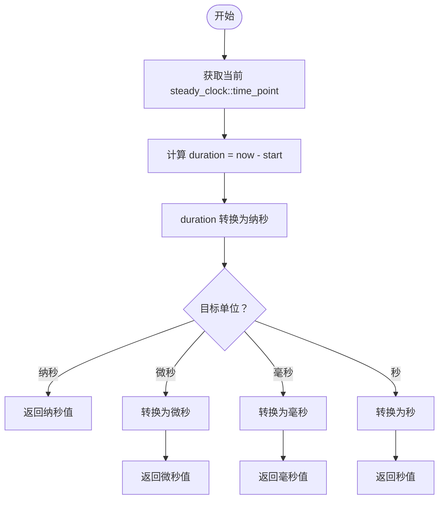
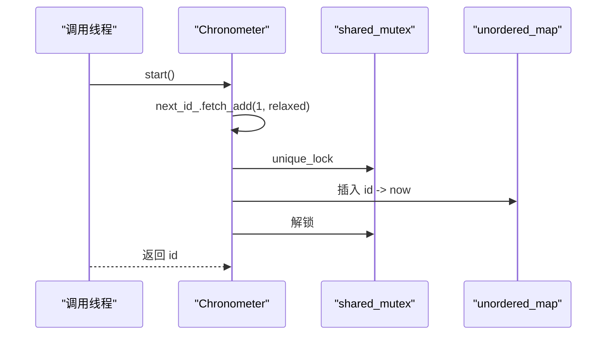
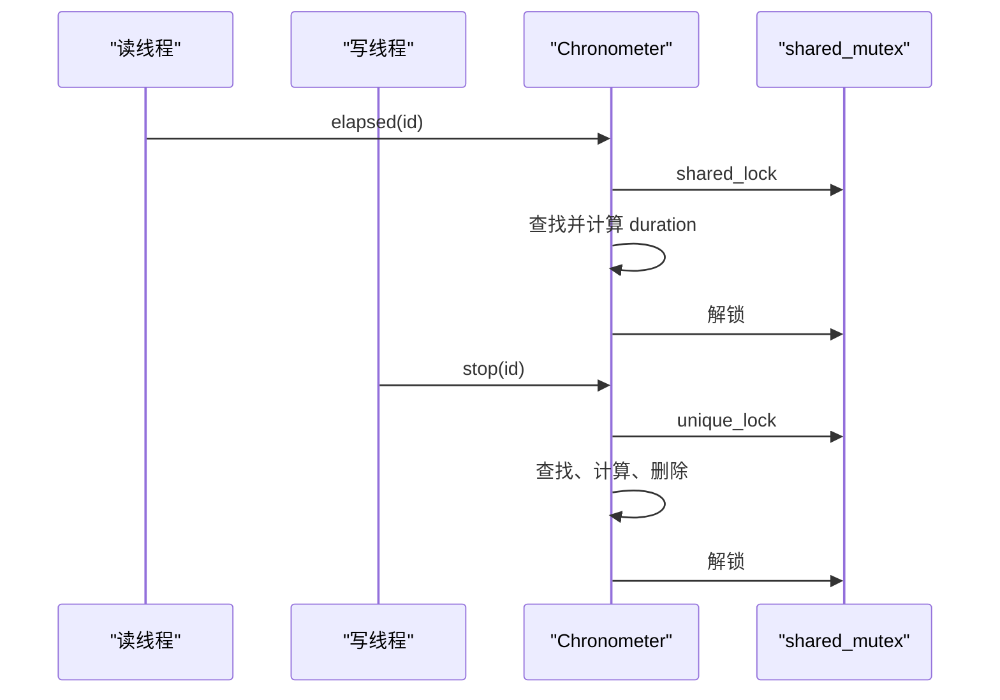
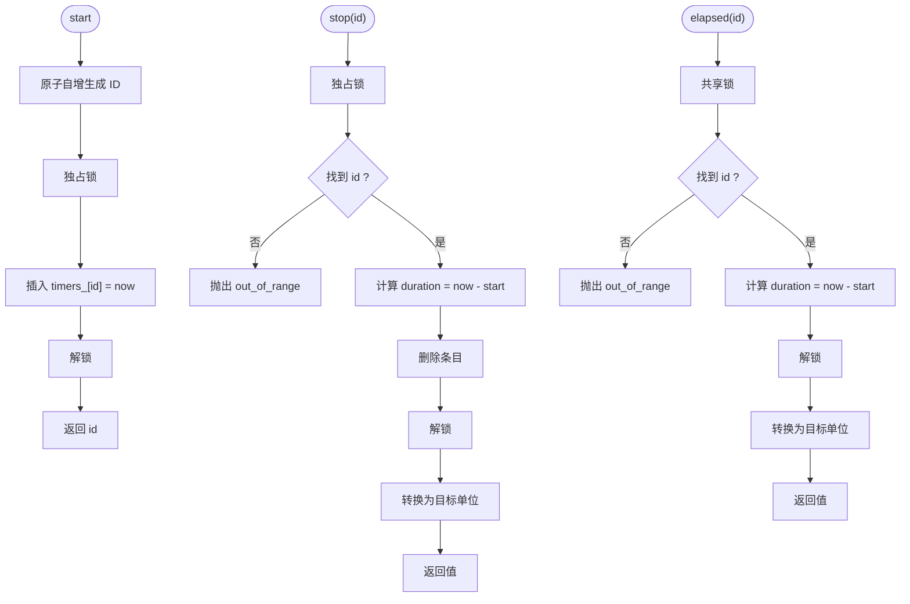
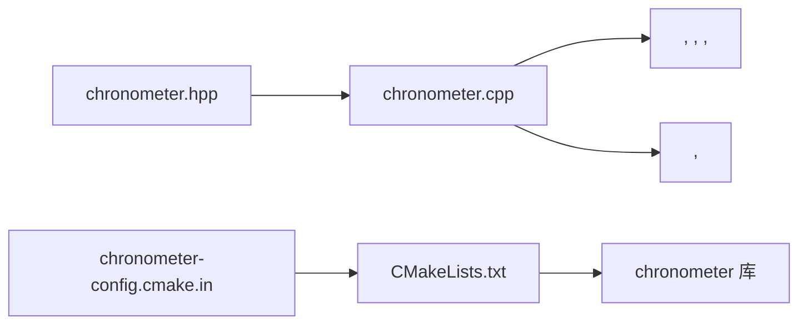

# 数据结构与算法

<cite>
**本文引用的文件**
- [chronometer.hpp](file://include/chronometer/chronometer.hpp)
- [chronometer.cpp](file://src/chronometer.cpp)
- [basic_usage.cpp](file://example/basic_usage.cpp)
- [test_chronometer.cpp](file://test/test_chronometer.cpp)
- [CMakeLists.txt](file://CMakeLists.txt)
- [chronometer-config.cmake.in](file://cmake/chronometer-config.cmake.in)
</cite>

## 目录
1. [引言](#引言)
2. [项目结构](#项目结构)
3. [核心组件](#核心组件)
4. [架构总览](#架构总览)
5. [详细组件分析](#详细组件分析)
6. [依赖分析](#依赖分析)
7. [性能考虑](#性能考虑)
8. [故障排查指南](#故障排查指南)
9. [结论](#结论)
10. [附录](#附录)

## 引言
本文件围绕线程安全高精度计时器的实现，系统梳理数据结构与算法设计，重点包括：
- unordered_map 的选择原因与性能特征（查找、插入、删除的期望复杂度）
- time_point 的存储策略与时间戳管理机制
- ID 生成算法（原子计数器）与分配策略
- 时间单位转换函数的实现与精度保证
- 内存管理与资源清理
- 技术选型背景与性能权衡
- 算法流程图与基准测试结果说明

## 项目结构
该项目采用 C++20 标准，提供一个线程安全的单例计时器库，核心接口通过头文件暴露，实现位于源文件中；示例与测试分别位于 example 与 test 目录；CMake 构建脚本负责编译、安装与包配置。

**图表来源**
- [chronometer.hpp:1-93](file://include/chronometer/chronometer.hpp#L1-L93)
- [chronometer.cpp:1-72](file://src/chronometer.cpp#L1-L72)
- [basic_usage.cpp:1-69](file://example/basic_usage.cpp#L1-L69)
- [test_chronometer.cpp:1-126](file://test/test_chronometer.cpp#L1-L126)
- [CMakeLists.txt:1-82](file://CMakeLists.txt#L1-L82)
- [chronometer-config.cmake.in:1-6](file://cmake/chronometer-config.cmake.in#L1-L6)

**章节来源**
- [CMakeLists.txt:1-82](file://CMakeLists.txt#L1-L82)
- [chronometer.hpp:1-93](file://include/chronometer/chronometer.hpp#L1-L93)

## 核心组件
- 单例计时器类 Chronometer：提供 start、stop、elapsed 三个核心方法，内部维护计时器 ID 与起始时间的映射，并通过读写锁保障并发安全。
- 时间单位枚举 TimeUnit：支持纳秒、微秒、毫秒、秒四种输出单位。
- 原子计数器 next_id_：用于无锁生成唯一 ID。
- 读写锁 mutex_：在 stop/elapsed/start 场景下分别使用独占锁与共享锁，提升并发读性能。
- 哈希表 timers_：以 ID 为键、steady_clock::time_point 为值，保存计时起点。

**章节来源**
- [chronometer.hpp:37-90](file://include/chronometer/chronometer.hpp#L37-L90)
- [chronometer.cpp:32-72](file://src/chronometer.cpp#L32-L72)

## 架构总览
Chronometer 采用“单例 + 哈希表 + 原子计数器 + 读写锁”的组合架构，既保证了高并发下的正确性，又兼顾了查询与更新的性能。

**图表来源**
- [chronometer.hpp:18-90](file://include/chronometer/chronometer.hpp#L18-L90)
- [chronometer.cpp:32-72](file://src/chronometer.cpp#L32-L72)

## 详细组件分析

### 数据结构选择与性能特征
- 哈希表 unordered_map 的选择
  - 键为 64 位无符号整数 ID，值为 steady_clock::time_point，键空间大且分布均匀，适合哈希表。
  - 平均时间复杂度：查找 O(1)，插入 O(1)，删除 O(1)；最坏情况下退化为 O(n)，但概率极低。
  - 本实现通过原子 ID 生成避免冲突，进一步降低碰撞风险。
- 读写锁 shared_mutex 的选择
  - 读多写少场景下，共享锁允许多个并发读，显著提升吞吐。
  - stop/elapsed 使用独占锁，start 使用独占锁，确保互斥更新 timers_。
- 原子计数器 atomic<uint64_t> 的选择
  - 无锁生成唯一 ID，避免加锁开销；fetch_add 提供自增语义，保证单调递增。
  - 与 shared_mutex 协同，start 仅持锁进行一次插入，其余时间无锁生成 ID。

**章节来源**
- [chronometer.hpp:86-89](file://include/chronometer/chronometer.hpp#L86-L89)
- [chronometer.cpp:37-42](file://src/chronometer.cpp#L37-L42)

### 时间戳存储策略与时间单位管理
- 存储策略
  - 使用 std::chrono::steady_clock::time_point 作为起始时间，避免系统时钟回拨影响。
  - stop 时计算 end - start，得到纳秒级 duration，再按目标单位转换。
- 时间单位转换
  - 提供 convertDuration 函数，根据 TimeUnit 枚举进行类型转换与数值换算。
  - 精度保证：先转为纳秒，再按目标单位换算，避免中间精度损失。
- 单位一致性
  - elapsed 与 stop 均以纳秒为中间单位，确保不同单位间的换算稳定可靠。

**图表来源**
- [chronometer.cpp:10-28](file://src/chronometer.cpp#L10-L28)
- [chronometer.cpp:54-55](file://src/chronometer.cpp#L54-L55)

**章节来源**
- [chronometer.cpp:10-28](file://src/chronometer.cpp#L10-L28)
- [chronometer.cpp:54-69](file://src/chronometer.cpp#L54-L69)

### ID 生成算法与分配策略
- 原子计数器 next_id_
  - start 中通过 fetch_add(1, memory_order_relaxed) 无锁生成自增 ID。
  - memory_order_relaxed 要求最小同步开销，满足 ID 唯一性需求。
- 分配策略
  - 生成 ID 后立即独占锁插入 timers_，随后释放锁，减少临界区时间。
  - 由于 ID 为单调递增且来自原子计数器，冲突概率极低，无需额外去重逻辑。
- 生命周期管理
  - stop 会从哈希表中移除对应条目，防止内存无限增长。
  - elapsed 不修改哈希表，仅读取当前计时器状态。

**图表来源**
- [chronometer.cpp:37-42](file://src/chronometer.cpp#L37-L42)
- [chronometer.hpp:86-89](file://include/chronometer/chronometer.hpp#L86-L89)

**章节来源**
- [chronometer.cpp:37-42](file://src/chronometer.cpp#L37-L42)
- [chronometer.hpp:86-89](file://include/chronometer/chronometer.hpp#L86-L89)

### 并发控制与错误处理
- 并发模型
  - start：独占锁保护插入，其余时间无锁生成 ID。
  - elapsed：共享锁允许多线程并发读取。
  - stop：独占锁保护查找、计算与删除。
- 错误处理
  - 对不存在的 ID 调用 stop 或 elapsed 抛出 out_of_range，便于上层快速定位问题。
- 死锁与竞态
  - 通过明确的锁粒度与顺序（先生成 ID，再持锁插入），避免死锁。
  - 读写锁分离减少写路径对读的影响。

**图表来源**
- [chronometer.cpp:58-69](file://src/chronometer.cpp#L58-L69)
- [chronometer.cpp:44-56](file://src/chronometer.cpp#L44-L56)

**章节来源**
- [chronometer.cpp:44-69](file://src/chronometer.cpp#L44-L69)

### 内存管理与资源清理
- 哈希表容量与负载
  - unordered_map 在键空间大且分布均匀时表现良好；本实现通过原子 ID 保证键的稀疏性，降低碰撞与 rehash 频率。
- 生命周期
  - stop 显式 erase 对应条目，避免长期占用内存。
  - 单例实例生命周期由 C++ 语言保证，无需手动释放。
- 资源清理
  - 无动态分配或外部句柄，无额外资源需显式清理。

**章节来源**
- [chronometer.cpp:52-55](file://src/chronometer.cpp#L52-L55)
- [chronometer.hpp:86-89](file://include/chronometer/chronometer.hpp#L86-L89)

### 算法流程图与性能基准测试
- start 流程
  - 生成 ID（原子自增）→ 独占锁 → 插入哈希表 → 释放锁 → 返回 ID。
- stop 流程
  - 独占锁 → 查找 ID → 计算 duration → 删除条目 → 释放锁 → 返回目标单位值。
- elapsed 流程
  - 共享锁 → 查找 ID → 计算 duration → 释放锁 → 返回目标单位值。
- 基准测试结果说明
  - 单元测试覆盖了基本功能、单位换算、并发安全性与异常路径，未包含独立的性能基准测试文件。
  - 可参考以下测试要点：
    - start/stop 返回正值（正向回归）。
    - elapsed 不移除计时器，多次调用值递增。
    - 不同单位换算关系符合预期（如毫秒/微秒/纳秒比例）。
    - 并发场景下无崩溃、无死锁，成功计时次数等于迭代次数。

**图表来源**
- [chronometer.cpp:37-42](file://src/chronometer.cpp#L37-L42)
- [chronometer.cpp:44-56](file://src/chronometer.cpp#L44-L56)
- [chronometer.cpp:58-69](file://src/chronometer.cpp#L58-L69)

**章节来源**
- [test_chronometer.cpp:9-16](file://test/test_chronometer.cpp#L9-L16)
- [test_chronometer.cpp:18-33](file://test/test_chronometer.cpp#L18-L33)
- [test_chronometer.cpp:35-49](file://test/test_chronometer.cpp#L35-L49)
- [test_chronometer.cpp:51-85](file://test/test_chronometer.cpp#L51-L85)
- [test_chronometer.cpp:87-96](file://test/test_chronometer.cpp#L87-L96)
- [test_chronometer.cpp:98-125](file://test/test_chronometer.cpp#L98-L125)

## 依赖分析
- 头文件依赖
  - chronometer.hpp 依赖 chrono、atomic、shared_mutex、unordered_map。
- 源文件依赖
  - chronometer.cpp 依赖 chronometer.hpp，并使用 mutex、stdexcept 进行错误处理。
- 构建依赖
  - CMake 设置 C++20 标准，导出库目标与安装规则，生成包配置文件。

**图表来源**
- [chronometer.hpp:10-14](file://include/chronometer/chronometer.hpp#L10-L14)
- [chronometer.cpp:1-5](file://src/chronometer.cpp#L1-L5)
- [CMakeLists.txt:1-82](file://CMakeLists.txt#L1-L82)
- [chronometer-config.cmake.in:1-6](file://cmake/chronometer-config.cmake.in#L1-L6)

**章节来源**
- [chronometer.hpp:10-14](file://include/chronometer/chronometer.hpp#L10-L14)
- [chronometer.cpp:1-5](file://src/chronometer.cpp#L1-L5)
- [CMakeLists.txt:1-82](file://CMakeLists.txt#L1-L82)

## 性能考虑
- 哈希表性能
  - 本实现键空间大、分布均匀，平均 O(1) 操作；建议在高并发场景下保持合理的负载因子，避免频繁 rehash。
- 原子与锁
  - start 仅持锁进行一次插入，其余时间无锁生成 ID，降低竞争；shared_mutex 在读多写少场景下收益明显。
- 时间单位转换
  - 以纳秒为中间单位，避免重复转换带来的精度损失；switch 分支清晰，编译器可优化。
- 内存占用
  - timers_ 仅保存活跃计时器，stop 后自动清理；若长时间存在大量活跃计时器，建议及时 stop 以控制内存。
- 基准测试建议
  - 可在独立基准工程中对比 unordered_map 与有序容器（如 map）在不同键分布与并发度下的性能差异；记录 start/stop/elapsed 的延迟与吞吐。

[本节为通用性能讨论，不直接分析具体文件]

## 故障排查指南
- 常见问题
  - 使用不存在的 ID 调用 stop/elapsed：抛出 out_of_range，检查 ID 是否来自同一实例的 start。
  - 单位换算异常：确认传入 TimeUnit 与期望一致；注意不同单位的量级关系。
  - 并发访问异常：确保所有调用通过同一单例实例；避免跨实例共享 ID。
- 定位手段
  - 使用单元测试中的断言模式快速复现问题。
  - 在 start/stop 前后打印 ID 与耗时，核对是否重复使用或提前结束。

**章节来源**
- [test_chronometer.cpp:87-96](file://test/test_chronometer.cpp#L87-L96)
- [chronometer.cpp:44-56](file://src/chronometer.cpp#L44-L56)
- [chronometer.cpp:58-69](file://src/chronometer.cpp#L58-L69)

## 结论
本实现以线程安全为核心目标，结合原子计数器、读写锁与哈希表，实现了高并发下的高效计时能力。通过以纳秒为中间单位的时间转换与严格的错误处理，保证了结果的准确性与可维护性。在实际应用中，建议关注活跃计时器数量与并发模式，以获得最佳性能。

[本节为总结性内容，不直接分析具体文件]

## 附录
- 使用示例
  - 基本 start/stop 用法、elapsed 中间测量、不同时间单位输出、代码块性能测量等。
- 测试覆盖
  - 基本功能、单位换算、并发安全性、异常路径等。

**章节来源**
- [basic_usage.cpp:15-65](file://example/basic_usage.cpp#L15-L65)
- [test_chronometer.cpp:9-16](file://test/test_chronometer.cpp#L9-L16)
- [test_chronometer.cpp:51-85](file://test/test_chronometer.cpp#L51-L85)
- [test_chronometer.cpp:98-125](file://test/test_chronometer.cpp#L98-L125)