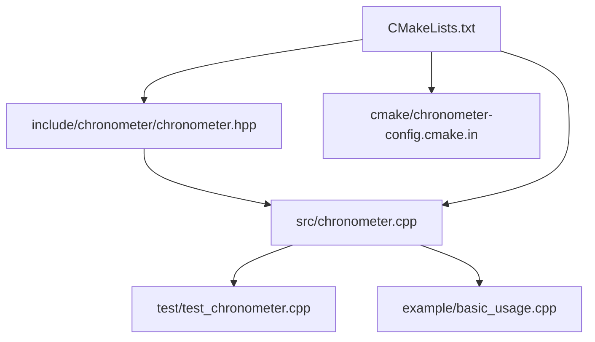
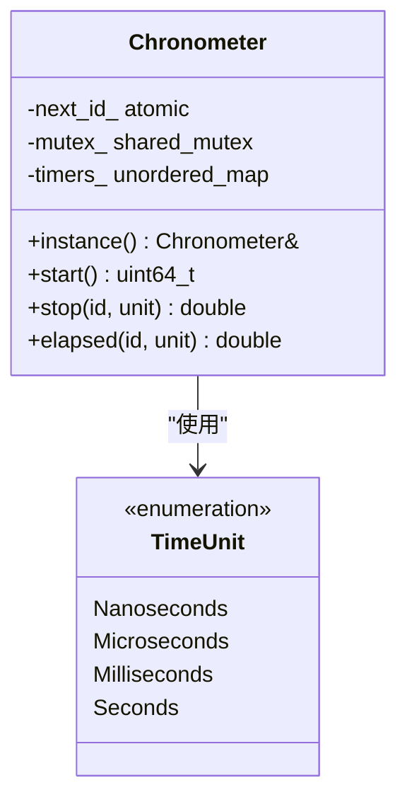
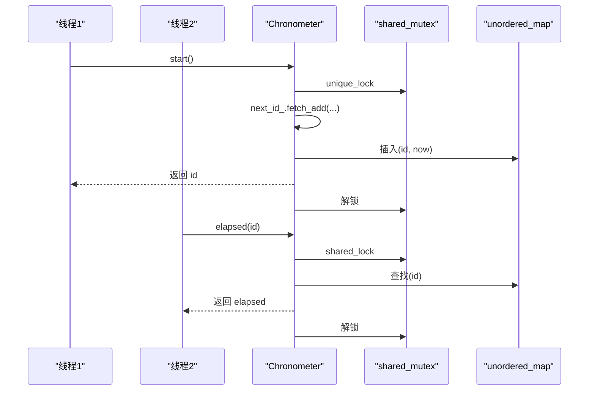
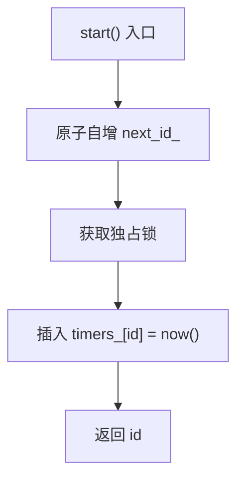
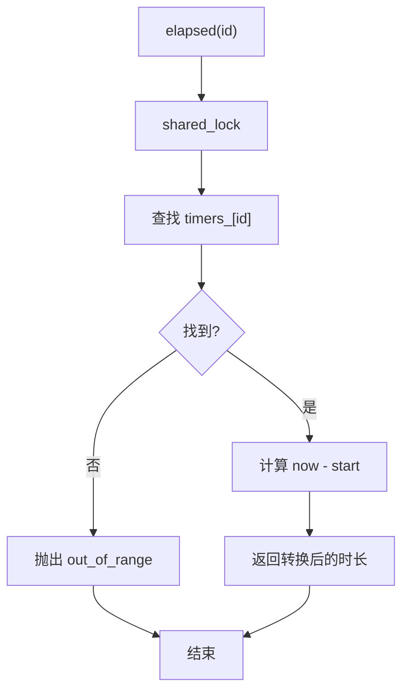
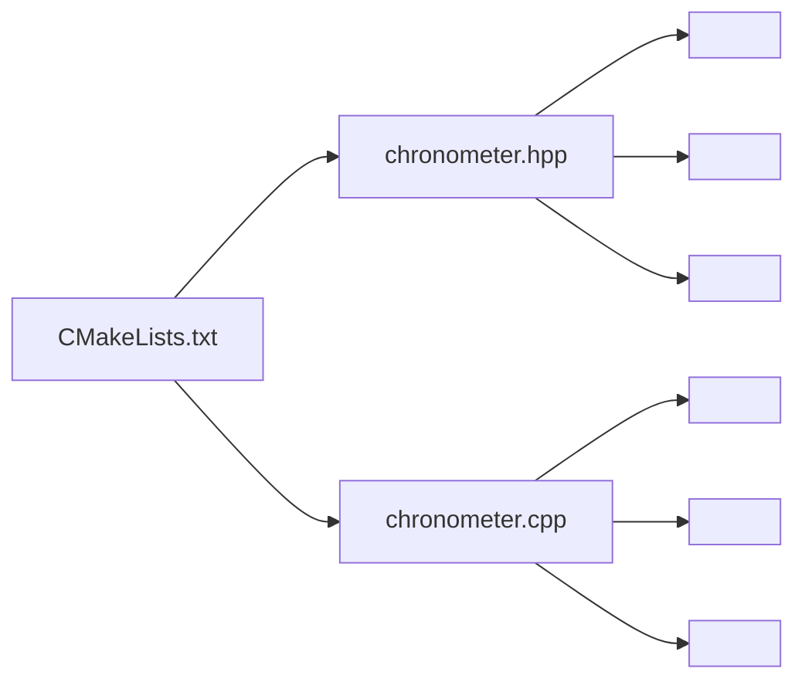

# 线程安全机制

<cite>
**本文引用的文件列表**
- [chronometer.hpp](file://include/chronometer/chronometer.hpp)
- [chronometer.cpp](file://src/chronometer.cpp)
- [test_chronometer.cpp](file://test/test_chronometer.cpp)
- [basic_usage.cpp](file://example/basic_usage.cpp)
- [CMakeLists.txt](file://CMakeLists.txt)
- [chronometer-config.cmake.in](file://cmake/chronometer-config.cmake.in)
</cite>

## 目录
1. [引言](#引言)
2. [项目结构](#项目结构)
3. [核心组件](#核心组件)
4. [架构总览](#架构总览)
5. [详细组件分析](#详细组件分析)
6. [依赖关系分析](#依赖关系分析)
7. [性能考量](#性能考量)
8. [故障排查指南](#故障排查指南)
9. [结论](#结论)
10. [附录](#附录)

## 引言
本文件围绕线程安全机制进行系统化梳理，重点分析以下方面：
- shared_mutex 的使用策略：读写锁分离设计与性能优势
- 原子操作在 next_id_ 上的应用：确保 ID 生成的线程安全与原子性
- 互斥锁在并发访问中的保护范围与锁定策略
- 读写操作的并发控制机制：如何避免竞态条件
- 多线程环境下使用计时器的正确示例与注意事项
- 线程安全与性能之间的权衡考虑
- 并发场景分析与测试策略

## 项目结构
该项目采用 C++20 标准，提供一个单例计时器类，支持多线程安全地启动、查询与停止计时。核心源码位于 include 与 src 目录，测试与示例分别位于 test 与 example 目录；CMake 构建脚本负责编译、安装与导出目标。

图表来源
- [chronometer.hpp:1-40](file://include/chronometer/chronometer.hpp#L1-L40)
- [chronometer.cpp:1-72](file://src/chronometer.cpp#L1-L72)
- [test_chronometer.cpp:1-126](file://test/test_chronometer.cpp#L1-L126)
- [basic_usage.cpp:1-69](file://example/basic_usage.cpp#L1-L69)
- [CMakeLists.txt:1-82](file://CMakeLists.txt#L1-L82)
- [chronometer-config.cmake.in:1-6](file://cmake/chronometer-config.cmake.in#L1-L6)

章节来源
- [CMakeLists.txt:1-82](file://CMakeLists.txt#L1-L82)
- [chronometer.hpp:1-40](file://include/chronometer/chronometer.hpp#L1-L40)

## 核心组件
- 单例计时器类 Chronometer：提供 start/stop/elapsed 接口，内部维护计时器映射表与自增 ID，并通过共享互斥锁保护数据结构。
- 时间单位枚举 TimeUnit：用于 stop/elapsed 的输出单位转换。
- 原子变量 next_id_：保证 ID 生成的原子性与无锁自增。
- 共享互斥锁 mutex_：区分读写路径，提升并发读取性能。
- 计时器存储 timers_：以 ID 为键的时间点映射，支持并发读写访问。

章节来源
- [chronometer.hpp:18-37](file://include/chronometer/chronometer.hpp#L18-L37)
- [chronometer.cpp:32-72](file://src/chronometer.cpp#L32-L72)

## 架构总览
下图展示了线程安全相关的组件交互：start/stop/elapsed 三个接口对共享数据结构进行不同粒度的加锁；原子变量 next_id_ 独立于锁之外，避免热点竞争。

图表来源
- [chronometer.hpp:18-37](file://include/chronometer/chronometer.hpp#L18-L37)

## 详细组件分析

### 1) 读写锁分离与共享互斥锁策略
- 写路径（start/stop）使用独占锁（unique_lock），确保插入、删除与修改的原子性与一致性。
- 读路径（elapsed）使用共享锁（shared_lock），允许多个读操作并发执行，减少锁竞争，提升吞吐。
- 保护的数据结构：timers_ 映射表，防止并发读写导致的未定义行为。

图表来源
- [chronometer.cpp:37-69](file://src/chronometer.cpp#L37-L69)

章节来源
- [chronometer.cpp:37-69](file://src/chronometer.cpp#L37-L69)

### 2) 原子操作与 ID 生成
- next_id_ 使用原子类型，start 中通过原子自增生成全局唯一且单调递增的 ID，避免锁竞争。
- 由于 ID 生成不依赖锁，start 的开销显著降低，适合高并发场景。
- 注意：ID 仅保证全局唯一与单调递增，不保证连续性。

图表来源
- [chronometer.cpp:37-42](file://src/chronometer.cpp#L37-L42)
- [chronometer.hpp:34-36](file://include/chronometer/chronometer.hpp#L34-L36)

章节来源
- [chronometer.cpp:37-42](file://src/chronometer.cpp#L37-L42)
- [chronometer.hpp:34-36](file://include/chronometer/chronometer.hpp#L34-L36)

### 3) 并发控制与竞态条件规避
- 写路径（stop）在独占锁内查找并删除计时项，避免迭代器失效与并发修改。
- 读路径（elapsed）在共享锁内只读访问，不修改容器，避免读写冲突。
- 错误处理：对不存在的 ID 抛出异常，避免空指针或未定义行为。

图表来源
- [chronometer.cpp:58-69](file://src/chronometer.cpp#L58-L69)

章节来源
- [chronometer.cpp:44-69](file://src/chronometer.cpp#L44-L69)

### 4) 多线程使用计时器的正确示例与注意事项
- 正确示例：示例程序演示了基本 start/stop、中间 elapsed 查询、不同时间单位输出等用法。
- 注意事项：
  - 每个线程独立管理自己的计时 ID，避免跨线程误用 ID。
  - 在高并发场景下，优先使用 elapsed 进行多次采样，减少锁持有时间。
  - 单例模式下，多个线程共享同一 Chronometer 实例，注意不要在不同线程中混用彼此的 ID。

章节来源
- [basic_usage.cpp:8-69](file://example/basic_usage.cpp#L8-L69)

### 5) 并发场景分析与测试策略
- 场景一：大量线程并发 start/stop
  - 测试策略：创建多个线程，每个线程循环执行 start/stop，统计成功次数，验证不崩溃、无死锁。
  - 测试结果：断言成功计数等于线程数 × 每线程迭代次数。
- 场景二：读多写少的高频采样
  - 测试策略：多个线程并发调用 elapsed，验证读路径的共享锁能并发执行且不报错。
  - 测试结果：elapsed 返回值随时间单调递增，stop 后不再存在对应 ID。
- 场景三：非法 ID 访问
  - 测试策略：对不存在的 ID 调用 stop/elapsed，验证抛出异常。
  - 测试结果：四种单位组合均抛出异常。

章节来源
- [test_chronometer.cpp:98-126](file://test/test_chronometer.cpp#L98-L126)
- [test_chronometer.cpp:87-96](file://test/test_chronometer.cpp#L87-L96)
- [test_chronometer.cpp:18-33](file://test/test_chronometer.cpp#L18-L33)

## 依赖关系分析
- 头文件依赖：chronometer.hpp 依赖 <atomic>、<shared_mutex>、<unordered_map>，并在类中声明原子变量与共享互斥锁。
- 实现文件依赖：chronometer.cpp 依赖 chrono、mutex、stdexcept，实现 start/stop/elapsed 逻辑与单位转换。
- 构建依赖：CMakeLists.txt 指定 C++20 标准，导出库目标并安装头文件与配置文件。

图表来源
- [chronometer.hpp:3-7](file://include/chronometer/chronometer.hpp#L3-L7)
- [chronometer.cpp:1-5](file://src/chronometer.cpp#L1-L5)
- [CMakeLists.txt:1-82](file://CMakeLists.txt#L1-L82)

章节来源
- [chronometer.hpp:3-7](file://include/chronometer/chronometer.hpp#L3-L7)
- [chronometer.cpp:1-5](file://src/chronometer.cpp#L1-L5)
- [CMakeLists.txt:1-82](file://CMakeLists.txt#L1-L82)

## 性能考量
- 原子自增 ID：避免锁竞争，提高 start 的吞吐，适合高并发场景。
- 共享锁读路径：允许多个线程同时读取，降低锁争用，提升整体性能。
- 写路径独占锁：保证插入/删除的原子性，但会阻塞其他写操作与读操作。
- 单位转换：在读路径上进行，避免在写路径上做额外计算，减少锁持有时间。
- 测试验证：并发测试覆盖了大量线程的 start/stop，验证无死锁与正确性。

章节来源
- [chronometer.cpp:37-69](file://src/chronometer.cpp#L37-L69)
- [test_chronometer.cpp:98-126](file://test/test_chronometer.cpp#L98-L126)

## 故障排查指南
- 症状：对不存在的 ID 调用 stop/elapsed 抛出异常
  - 原因：elapsed/stop 在独占锁内查找并校验 ID 存在性，不存在则抛出异常。
  - 处理：确保每个线程使用自身 start 返回的 ID，避免跨线程误用。
- 症状：高并发下出现性能瓶颈
  - 原因：写路径独占锁可能成为热点。
  - 处理：尽量减少 stop 调用频率，使用 elapsed 进行多次采样；必要时拆分计时域或使用更细粒度的计时器。
- 症状：测试中出现死锁或崩溃
  - 原因：锁粒度过粗或错误的锁顺序。
  - 处理：确认 start/stop/elapsed 的锁粒度与持有时间，遵循先获取独占锁再共享锁的原则。

章节来源
- [chronometer.cpp:44-69](file://src/chronometer.cpp#L44-L69)
- [test_chronometer.cpp:87-96](file://test/test_chronometer.cpp#L87-L96)

## 结论
本项目通过“原子自增 + 共享互斥锁”的组合策略，在保证线程安全的前提下实现了高效的并发计时能力：
- 原子变量 next_id_ 提升 ID 生成性能；
- shared_mutex 将读写分离，显著降低读路径的锁争用；
- 明确的锁粒度与错误处理保障了正确性与稳定性；
- 测试覆盖了并发 start/stop、读多写少、非法 ID 等关键场景，验证了线程安全与健壮性。

## 附录
- 构建与安装：CMakeLists.txt 指定 C++20，导出库目标并安装头文件与配置文件，便于集成到其他项目。
- 包配置：chronometer-config.cmake.in 提供包发现与目标导入的基础配置。

章节来源
- [CMakeLists.txt:1-82](file://CMakeLists.txt#L1-L82)
- [chronometer-config.cmake.in:1-6](file://cmake/chronometer-config.cmake.in#L1-L6)