# 快速开始

<cite>
**本文档引用的文件**
- [CMakeLists.txt](file://CMakeLists.txt)
- [chronometer.hpp](file://include/chronometer/chronometer.hpp)
- [chronometer.cpp](file://src/chronometer.cpp)
- [basic_usage.cpp](file://example/basic_usage.cpp)
- [CMakeLists.txt](file://example/CMakeLists.txt)
- [test_chronometer.cpp](file://test/test_chronometer.cpp)
- [CMakeLists.txt](file://test/CMakeLists.txt)
- [chronometer-config.cmake.in](file://cmake/chronometer-config.cmake.in)
</cite>

## 目录
1. [简介](#简介)
2. [项目结构](#项目结构)
3. [安装与依赖](#安装与依赖)
4. [编译与构建](#编译与构建)
5. [核心组件](#核心组件)
6. [基础使用示例](#基础使用示例)
7. [常见使用模式](#常见使用模式)
8. [高级用法](#高级用法)
9. [故障排除](#故障排除)
10. [最佳实践](#最佳实践)
11. [总结](#总结)

## 简介

Chronometer 是一个轻量级的 C++20 计时库，提供了简单易用的性能测量功能。它采用单例设计模式，支持多线程安全操作，可以精确测量代码段的执行时间，并支持多种时间单位（纳秒、微秒、毫秒、秒）。

该库的核心特性包括：
- 单例模式的全局计时器实例
- 多线程安全的并发访问
- 精确的时间测量能力
- 灵活的时间单位转换
- 简洁的 API 设计

## 项目结构

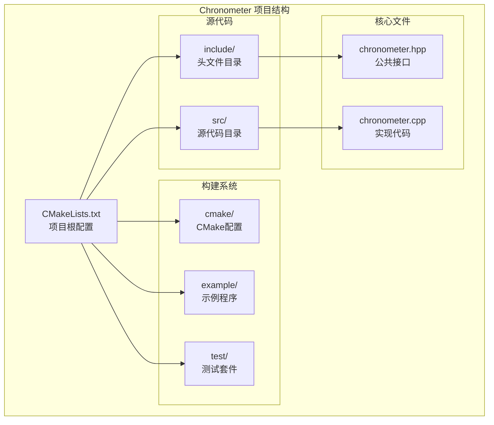

**图表来源**
- [CMakeLists.txt:1-82](file://CMakeLists.txt#L1-L82)
- [chronometer.hpp:1-40](file://include/chronometer/chronometer.hpp#L1-L40)
- [chronometer.cpp:1-72](file://src/chronometer.cpp#L1-L72)

**章节来源**
- [CMakeLists.txt:1-82](file://CMakeLists.txt#L1-L82)
- [chronometer.hpp:1-40](file://include/chronometer/chronometer.hpp#L1-L40)

## 安装与依赖

### 系统要求

- **C++ 编译器**: 支持 C++20 标准的编译器
- **CMake**: 版本 3.14 或更高版本
- **操作系统**: Linux, macOS, Windows (理论上支持所有平台)

### 依赖项

Chronometer 库具有最小的外部依赖：

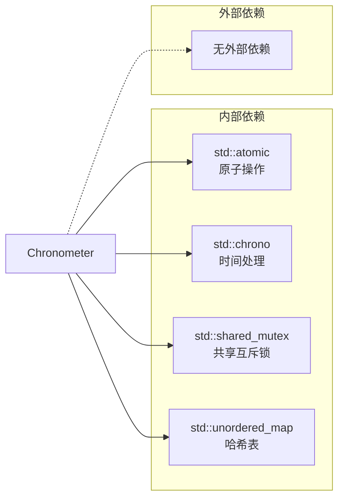

**图表来源**
- [chronometer.hpp:3-7](file://include/chronometer/chronometer.hpp#L3-L7)

### 安装方式

#### 方式一：直接集成到现有项目

1. 将 `include/chronometer/chronometer.hpp` 头文件复制到你的项目中
2. 将 `src/chronometer.cpp` 源文件添加到你的构建系统
3. 确保编译器支持 C++20 标准

#### 方式二：通过 CMake 子模块集成

```cmake
# 在你的 CMakeLists.txt 中添加
add_subdirectory(path/to/chronometer)
target_link_libraries(your_target PRIVATE chronometer::chronometer)
```

#### 方式三：使用包管理器

```cmake
# 通过 FetchContent
include(FetchContent)
FetchContent_Declare(
    chronometer
    GIT_REPOSITORY https://github.com/your-repo/chronometer.git
    GIT_TAG main
)
FetchContent_MakeAvailable(chronometer)
```

**章节来源**
- [CMakeLists.txt:1-82](file://CMakeLists.txt#L1-L82)
- [chronometer.hpp:1-40](file://include/chronometer/chronometer.hpp#L1-L40)

## 编译与构建

### CMake 配置选项

Chronometer 提供了灵活的 CMake 配置选项：

| 选项名称 | 默认值 | 描述 |
|---------|--------|------|
| CHRONOMETER_BUILD_TESTS | `${PROJECT_IS_TOP_LEVEL}` | 是否构建测试套件 |
| CHRONOMETER_BUILD_EXAMPLES | `${PROJECT_IS_TOP_LEVEL}` | 是否构建示例程序 |

### 构建步骤

#### 基础构建

```bash
# 创建构建目录
mkdir build && cd build

# 配置项目
cmake ..

# 编译项目
cmake --build .

# 运行测试（可选）
ctest

# 安装库（可选）
cmake --install .
```

#### 高级配置

```bash
# 只构建库而不包含测试和示例
cmake -DCHRONOMETER_BUILD_TESTS=OFF -DCHRONOMETER_BUILD_EXAMPLES=OFF ..

# 指定安装前缀
cmake -DCMAKE_INSTALL_PREFIX=/usr/local ..

# 生成 Ninja 构建文件
cmake -G Ninja ..
```

### 编译器要求

- **GCC**: 版本 10 或更高
- **Clang**: 版本 12 或更高  
- **MSVC**: Visual Studio 2019 或更高

### 平台兼容性

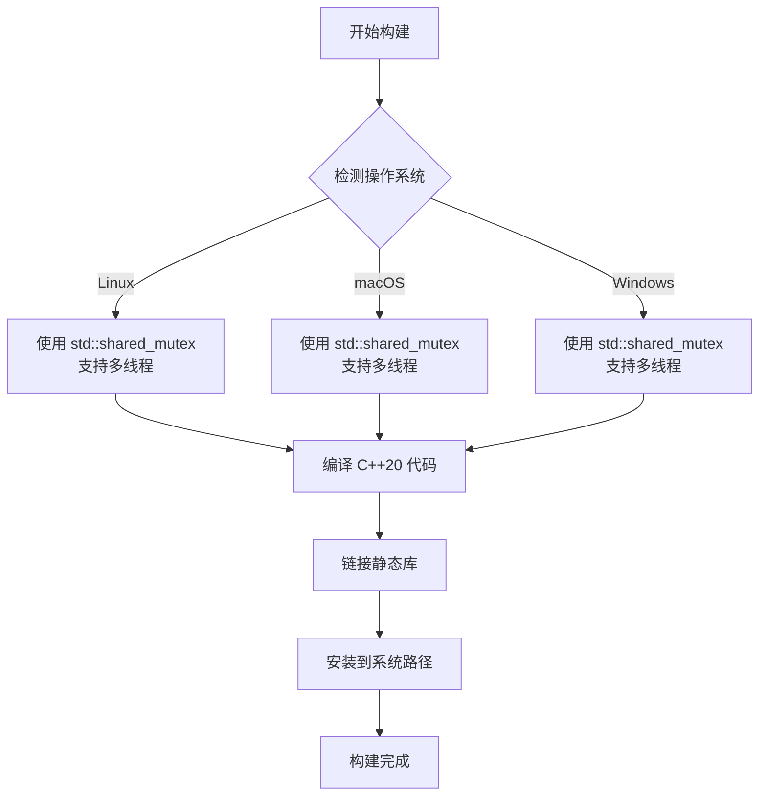

**图表来源**
- [CMakeLists.txt:1-82](file://CMakeLists.txt#L1-L82)

**章节来源**
- [CMakeLists.txt:1-82](file://CMakeLists.txt#L1-L82)
- [CMakeLists.txt:1-7](file://example/CMakeLists.txt#L1-L7)
- [CMakeLists.txt:1-23](file://test/CMakeLists.txt#L1-L23)

## 核心组件

### Chronometer 类架构

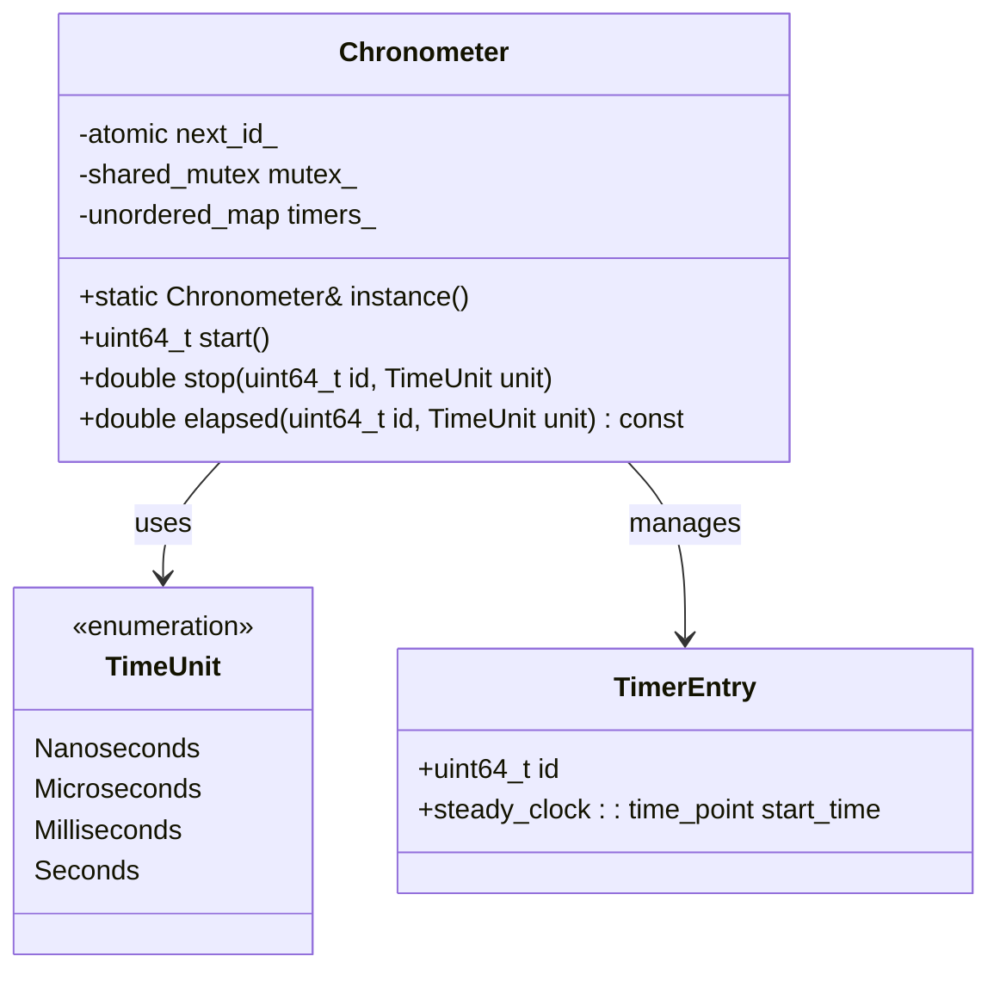

**图表来源**
- [chronometer.hpp:18-37](file://include/chronometer/chronometer.hpp#L18-L37)

### 关键数据结构

#### 时间单位枚举

| 时间单位 | 精度 | 适用场景 |
|---------|------|----------|
| Nanoseconds | 最高精度 | 高频测量、微秒级以下计时 |
| Microseconds | 标准精度 | 一般性能测量、函数调用时间 |
| Milliseconds | 适中精度 | 大块代码段测量、用户交互响应 |
| Seconds | 最低精度 | 长时间任务、批处理作业 |

#### 内部存储结构

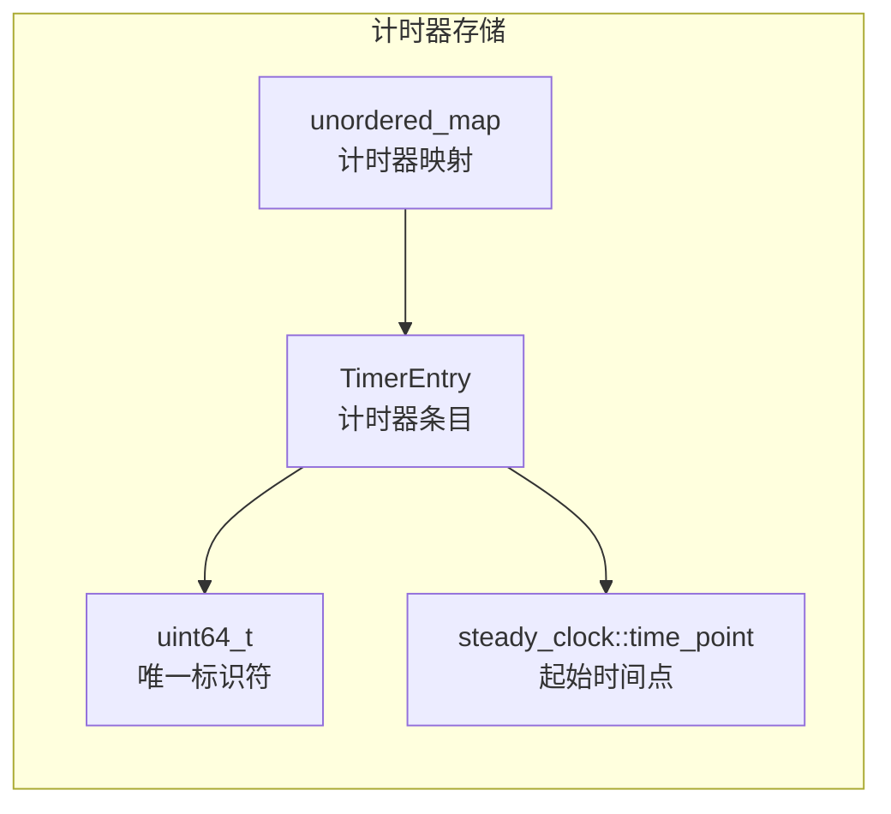

**图表来源**
- [chronometer.hpp:34-36](file://include/chronometer/chronometer.hpp#L34-L36)

**章节来源**
- [chronometer.hpp:1-40](file://include/chronometer/chronometer.hpp#L1-L40)
- [chronometer.cpp:1-72](file://src/chronometer.cpp#L1-L72)

## 基础使用示例

### 最简单的计时器使用

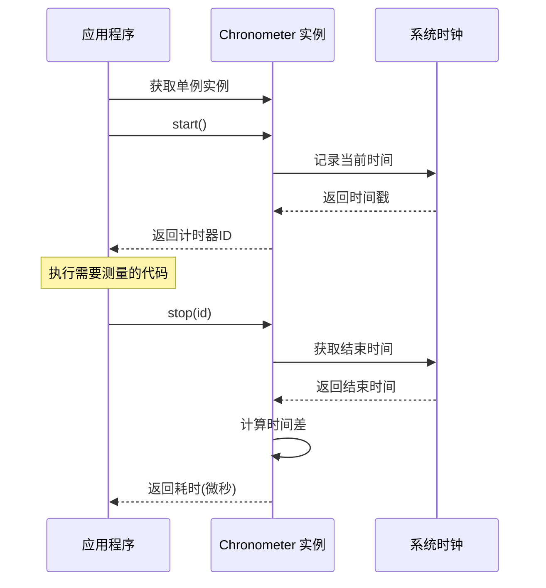

**图表来源**
- [basic_usage.cpp:15-21](file://example/basic_usage.cpp#L15-L21)
- [chronometer.cpp:37-56](file://src/chronometer.cpp#L37-L56)

### 完整的基础示例

以下是一个完整的基础使用示例，展示了 Chronometer 的核心功能：

1. **获取实例**: 通过 `Chronometer::instance()` 获取全局单例
2. **开始计时**: 调用 `start()` 方法启动计时器
3. **执行代码**: 在计时期间执行需要测量的代码
4. **停止计时**: 调用 `stop(id)` 获取耗时
5. **查看中间结果**: 使用 `elapsed(id)` 查看中间耗时

### 预期输出格式

运行基础示例程序会产生类似以下的输出：
- 基本用法: 显示微秒级别的耗时结果
- 中间耗时: 展示在不结束计时的情况下查看进度
- 不同单位: 显示纳秒、微秒、毫秒、秒之间的转换关系
- 代码块测量: 演示如何测量特定代码段的执行时间

**章节来源**
- [basic_usage.cpp:1-69](file://example/basic_usage.cpp#L1-L69)
- [chronometer.cpp:32-69](file://src/chronometer.cpp#L32-L69)

## 常见使用模式

### 一次性计时

一次性计时是最简单的使用模式，适用于测量单个代码段的执行时间：

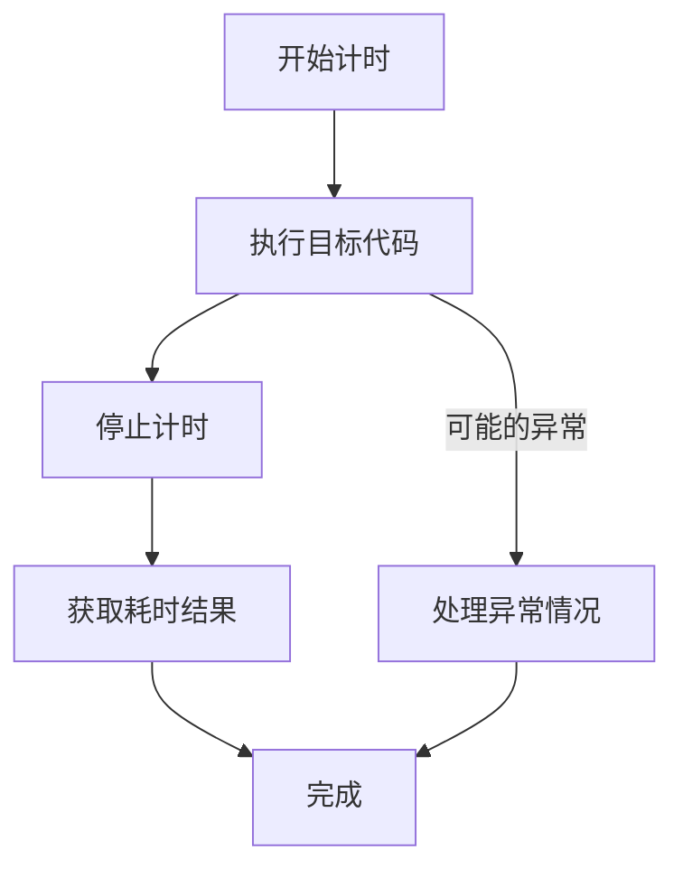

**图表来源**
- [basic_usage.cpp:15-21](file://example/basic_usage.cpp#L15-L21)

### 多次测量

支持对同一段代码进行多次测量以获得更准确的结果：

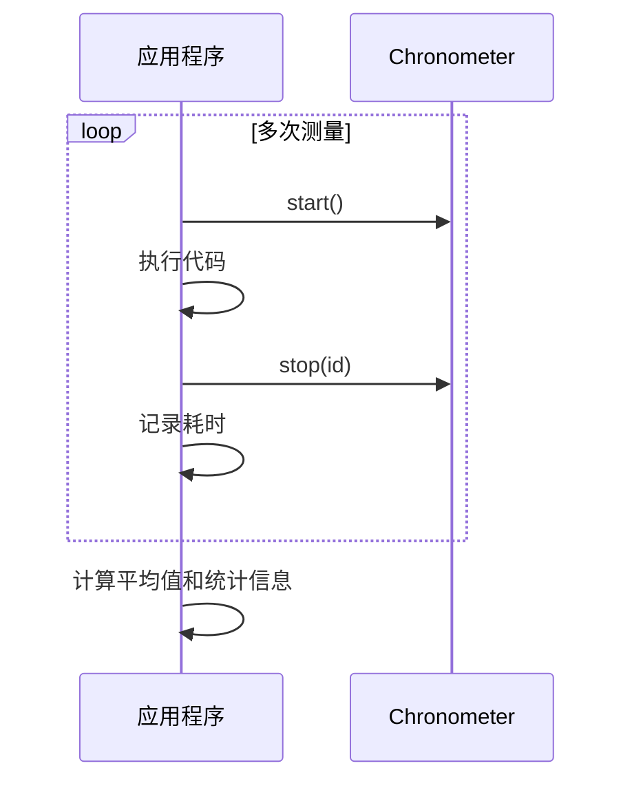

**图表来源**
- [test_chronometer.cpp:10-16](file://test/test_chronometer.cpp#L10-L16)

### 并发使用

Chronometer 支持多线程环境下的并发使用：

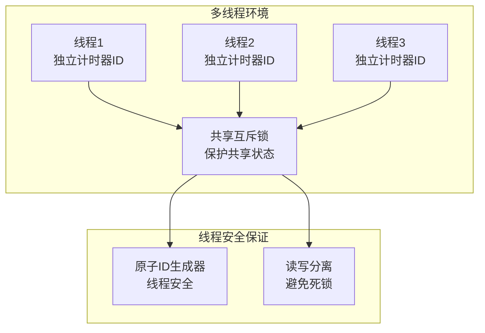

**图表来源**
- [chronometer.hpp:34-36](file://include/chronometer/chronometer.hpp#L34-L36)
- [chronometer.cpp:37-69](file://src/chronometer.cpp#L37-L69)

**章节来源**
- [test_chronometer.cpp:98-125](file://test/test_chronometer.cpp#L98-L125)

## 高级用法

### 时间单位转换

Chronometer 支持多种时间单位的精确转换：

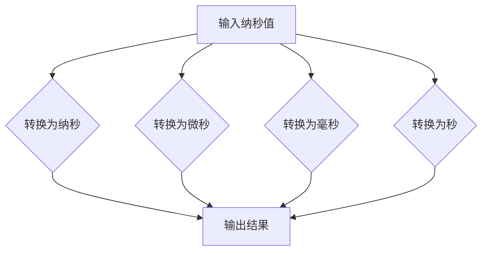

**图表来源**
- [chronometer.cpp:10-28](file://src/chronometer.cpp#L10-L28)

### 错误处理机制

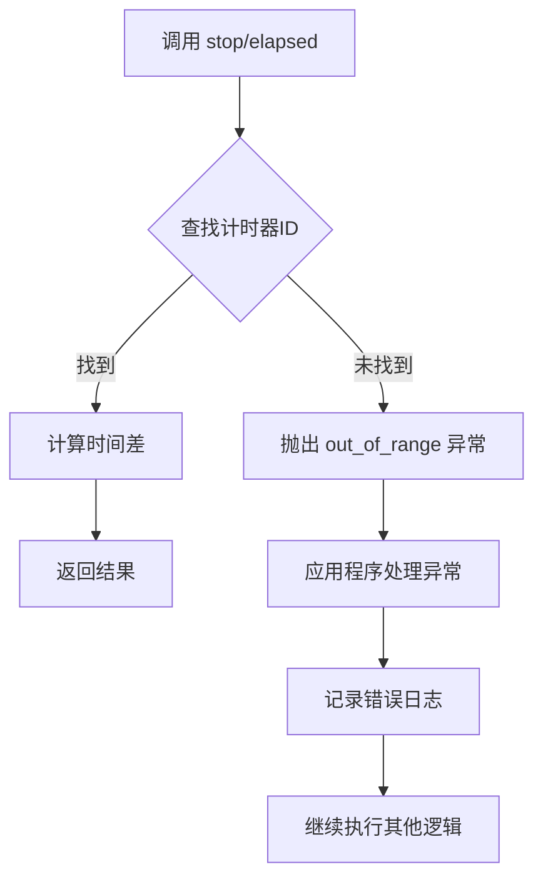

**图表来源**
- [chronometer.cpp:44-68](file://src/chronometer.cpp#L44-L68)

**章节来源**
- [chronometer.cpp:10-28](file://src/chronometer.cpp#L10-L28)
- [chronometer.cpp:44-68](file://src/chronometer.cpp#L44-L68)

## 故障排除

### 常见编译问题

#### C++20 标准不支持

**问题**: 编译器不支持 C++20 标准
**解决方案**: 
- 升级到支持 C++20 的编译器版本
- 或者手动修改 CMakeLists.txt 中的标准设置

#### 头文件找不到

**问题**: 编译时报错找不到 `chronometer/chronometer.hpp`
**解决方案**:
```cmake
# 确保包含正确的头文件路径
target_include_directories(your_target PRIVATE ${CMAKE_CURRENT_SOURCE_DIR}/include)
```

#### 链接错误

**问题**: 链接阶段找不到 Chronometer 符号
**解决方案**:
```cmake
# 确保正确链接库
target_link_libraries(your_target PRIVATE chronometer::chronometer)
```

### 运行时问题

#### 计时器ID无效

**问题**: 调用 `stop()` 或 `elapsed()` 时抛出 `std::out_of_range` 异常
**原因**: 使用了不存在或已过期的计时器ID
**解决方案**:
```cpp
try {
    double elapsed = chrono.stop(invalid_id);
} catch (const std::out_of_range& e) {
    // 处理无效ID的情况
    std::cerr << "计时器ID无效: " << e.what() << std::endl;
}
```

#### 性能问题

**问题**: 计时精度不符合预期
**解决方案**:
- 使用 `TimeUnit::Nanoseconds` 获取最高精度
- 避免在极短的时间间隔内进行大量测量
- 考虑系统时钟分辨率的限制

### 调试技巧

#### 启用详细日志

```cpp
#include <iostream>

// 在关键位置添加调试输出
std::cout << "开始计时，ID: " << id << std::endl;
double elapsed = chrono.stop(id);
std::cout << "耗时: " << elapsed << " 微秒" << std::endl;
```

#### 性能基准测试

```cpp
// 运行多次测量取平均值
double total = 0;
const int iterations = 1000;
for (int i = 0; i < iterations; ++i) {
    uint64_t id = chrono.start();
    // 被测代码
    double elapsed = chrono.stop(id);
    total += elapsed;
}
double average = total / iterations;
```

**章节来源**
- [test_chronometer.cpp:87-96](file://test/test_chronometer.cpp#L87-L96)

## 最佳实践

### 代码组织建议

1. **单例模式使用**: 通过 `Chronometer::instance()` 获取全局实例
2. **RAII 模式**: 考虑封装计时器生命周期
3. **异常处理**: 始终处理可能的 `std::out_of_range` 异常
4. **线程安全**: 在多线程环境中正确使用计时器

### 性能优化建议

1. **最小化开销**: 避免在热路径中频繁创建临时对象
2. **批量测量**: 对相似的操作进行批量测量
3. **适当的时间单位**: 根据测量精度需求选择合适的时间单位
4. **内存管理**: 注意计时器ID的生命周期管理

### 测试策略

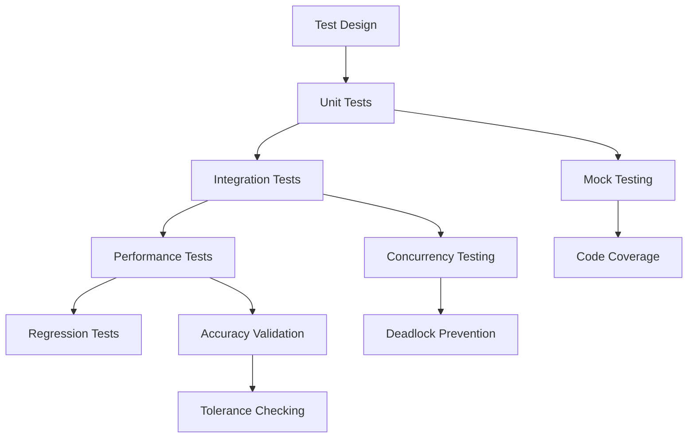

**图表来源**
- [test_chronometer.cpp:1-126](file://test/test_chronometer.cpp#L1-L126)

**章节来源**
- [test_chronometer.cpp:1-126](file://test/test_chronometer.cpp#L1-L126)

## 总结

Chronometer 库为 C++ 开发者提供了一个简洁、高效且线程安全的计时解决方案。通过本文档的学习，您应该能够：

1. **成功安装和配置** Chronometer 库
2. **理解核心概念** 和 API 设计
3. **掌握基本使用方法** 和常见模式
4. **应对常见问题** 和故障排除
5. **应用最佳实践** 进行生产环境部署

### 下一步学习

- 探索更高级的性能分析技术
- 结合其他性能监控工具
- 实现自定义的计时器包装器
- 开发针对特定场景的优化方案

记住，性能测量是一个持续的过程，需要根据实际应用场景不断调整和优化。希望 Chronometer 能够成为您性能优化工作中的得力助手！