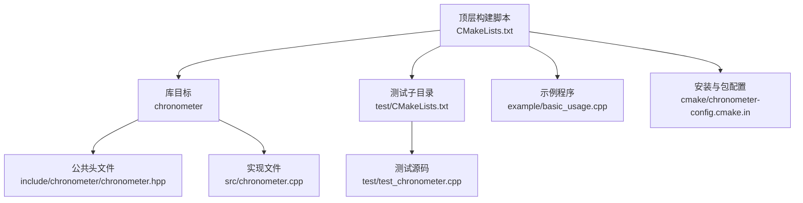
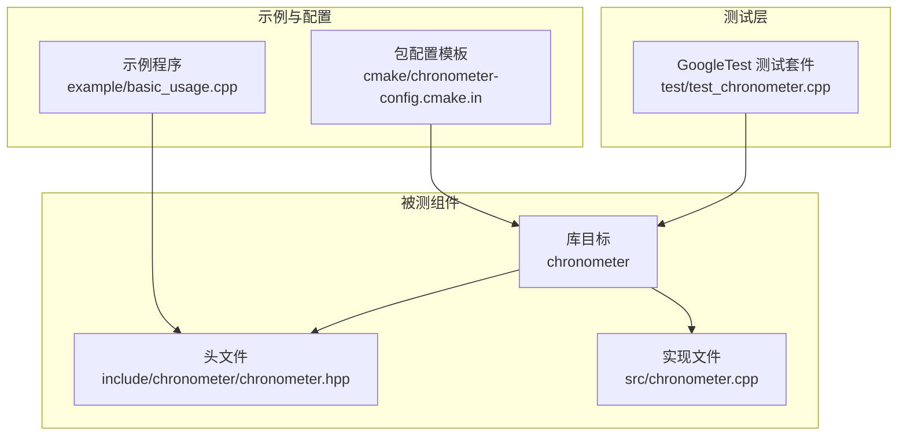
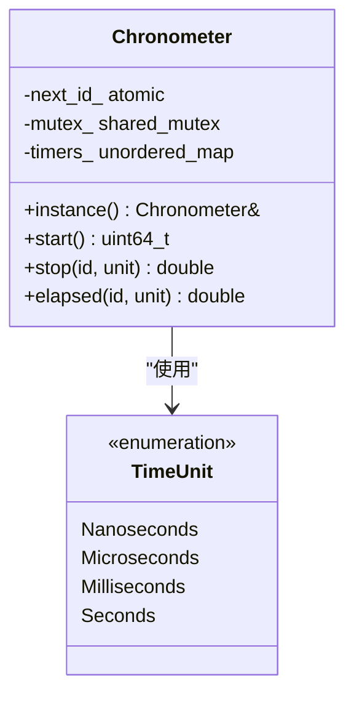
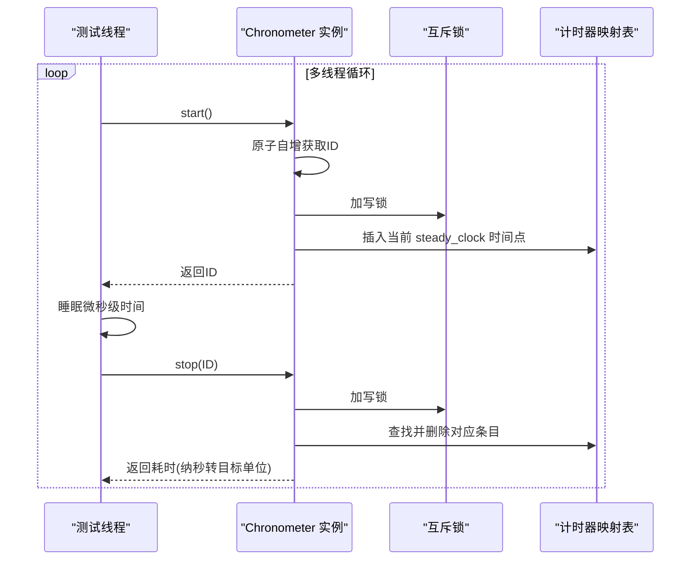
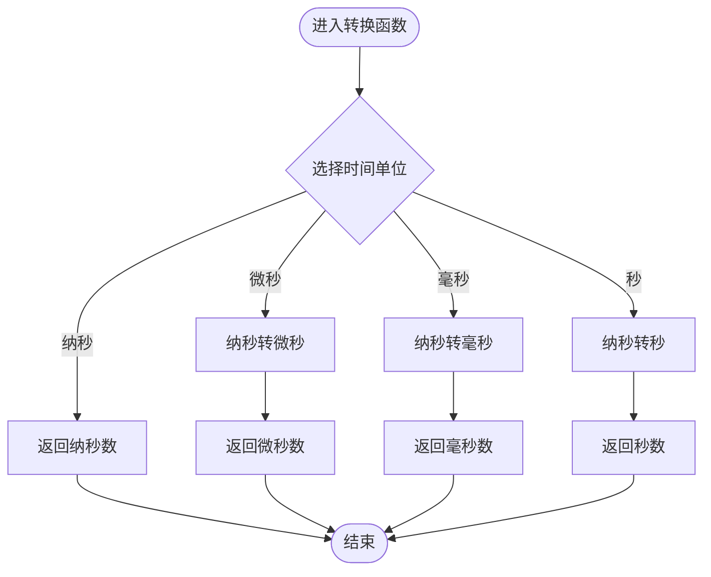
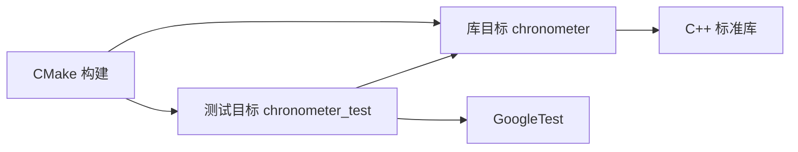

# 测试策略与质量保证

<cite>
**本文引用的文件**
- [CMakeLists.txt](file://CMakeLists.txt)
- [include/chronometer/chronometer.hpp](file://include/chronometer/chronometer.hpp)
- [src/chronometer.cpp](file://src/chronometer.cpp)
- [test/test_chronometer.cpp](file://test/test_chronometer.cpp)
- [test/CMakeLists.txt](file://test/CMakeLists.txt)
- [example/basic_usage.cpp](file://example/basic_usage.cpp)
- [cmake/chronometer-config.cmake.in](file://cmake/chronometer-config.cmake.in)
</cite>

## 目录
1. [引言](#引言)
2. [项目结构](#项目结构)
3. [核心组件](#核心组件)
4. [架构总览](#架构总览)
5. [详细组件分析](#详细组件分析)
6. [依赖分析](#依赖分析)
7. [性能考虑](#性能考虑)
8. [故障排查指南](#故障排查指南)
9. [结论](#结论)
10. [附录](#附录)

## 引言
本文件面向 Chronometer 库的测试策略与质量保证，目标是建立系统化的测试体系，覆盖功能正确性、边界条件、异常处理、并发安全性与性能表现，并提供可执行的测试环境搭建、持续集成与自动化测试配置、覆盖率评估与回归验证方法，以及测试驱动开发的最佳实践建议，确保项目的长期可维护性与高质量交付。

## 项目结构
Chronometer 采用 CMake 构建系统，核心由头文件声明、源文件实现、单元测试与示例组成。关键特性：
- 单例计时器类提供多线程安全的时间测量能力
- 支持多种时间单位转换
- 内部使用原子变量与共享互斥锁保证并发安全
- 提供 elapsed 与 stop 两种读取模式，前者不移除计时器，后者移除并返回耗时

图表来源
- [CMakeLists.txt:1-82](file://CMakeLists.txt#L1-L82)
- [test/CMakeLists.txt:1-23](file://test/CMakeLists.txt#L1-L23)
- [example/basic_usage.cpp:1-69](file://example/basic_usage.cpp#L1-L69)
- [include/chronometer/chronometer.hpp:1-40](file://include/chronometer/chronometer.hpp#L1-L40)
- [src/chronometer.cpp:1-72](file://src/chronometer.cpp#L1-L72)
- [cmake/chronometer-config.cmake.in:1-6](file://cmake/chronometer-config.cmake.in#L1-L6)

章节来源
- [CMakeLists.txt:1-82](file://CMakeLists.txt#L1-L82)
- [test/CMakeLists.txt:1-23](file://test/CMakeLists.txt#L1-L23)
- [example/basic_usage.cpp:1-69](file://example/basic_usage.cpp#L1-L69)

## 核心组件
- 单例计时器类 Chronometer
  - 提供 start、stop、elapsed 三个核心接口
  - 使用原子自增生成唯一计时器 ID
  - 使用共享互斥锁保护内部计时器映射表
  - 时间单位转换在实现文件内完成
- TimeUnit 枚举支持纳秒、微秒、毫秒、秒四种单位
- 线程安全模型
  - start：原子自增 ID，写入计时器映射表
  - stop/elapsed：读取或删除计时器映射表，使用共享互斥锁

章节来源
- [include/chronometer/chronometer.hpp:18-37](file://include/chronometer/chronometer.hpp#L18-L37)
- [src/chronometer.cpp:32-69](file://src/chronometer.cpp#L32-L69)

## 架构总览
下图展示了测试策略与被测组件之间的关系：测试通过 GoogleTest 运行，直接链接到库目标；库目标依赖头文件与实现文件；示例程序演示库的典型使用方式。

图表来源
- [test/test_chronometer.cpp:1-126](file://test/test_chronometer.cpp#L1-L126)
- [include/chronometer/chronometer.hpp:1-40](file://include/chronometer/chronometer.hpp#L1-L40)
- [src/chronometer.cpp:1-72](file://src/chronometer.cpp#L1-L72)
- [example/basic_usage.cpp:1-69](file://example/basic_usage.cpp#L1-L69)
- [cmake/chronometer-config.cmake.in:1-6](file://cmake/chronometer-config.cmake.in#L1-L6)

## 详细组件分析

### Chronometer 类与接口测试
- 功能测试要点
  - start/stop：启动后睡眠一段时间再停止，断言返回耗时大于 0
  - elapsed 不移除计时器：多次调用 elapsed 应单调递增
  - 不同时间单位：验证 ns/us/ms 的数量级关系与基本范围
  - 异常处理：对无效 ID 调用 stop/elapsed 抛出 out_of_range
- 并发测试要点
  - 多线程并发 start/stop：避免崩溃与死锁，统计成功次数
- 边界条件测试要点
  - 非零最小耗时、不同单位下的数值范围、秒单位的舍入行为

图表来源
- [include/chronometer/chronometer.hpp:18-37](file://include/chronometer/chronometer.hpp#L18-L37)

章节来源
- [include/chronometer/chronometer.hpp:18-37](file://include/chronometer/chronometer.hpp#L18-L37)
- [src/chronometer.cpp:32-69](file://src/chronometer.cpp#L32-L69)
- [test/test_chronometer.cpp:9-96](file://test/test_chronometer.cpp#L9-L96)

### 并发测试流程
并发测试通过多线程同时调用 start/stop，结合原子计数器统计成功次数，验证线程安全与无死锁。

图表来源
- [src/chronometer.cpp:37-56](file://src/chronometer.cpp#L37-L56)
- [test/test_chronometer.cpp:98-125](file://test/test_chronometer.cpp#L98-L125)

章节来源
- [src/chronometer.cpp:37-56](file://src/chronometer.cpp#L37-L56)
- [test/test_chronometer.cpp:98-125](file://test/test_chronometer.cpp#L98-L125)

### 算法与流程图：时间单位转换
实现内部包含一个转换函数，根据目标单位将纳秒转换为相应倍数的值。

图表来源
- [src/chronometer.cpp:10-28](file://src/chronometer.cpp#L10-L28)

章节来源
- [src/chronometer.cpp:10-28](file://src/chronometer.cpp#L10-L28)

## 依赖分析
- 构建与测试依赖
  - CMake 3.14+，C++20 标准
  - GoogleTest 1.15.2（通过 FetchContent 获取）
  - 可选：示例程序与安装规则
- 运行时依赖
  - C++ 标准库中的 chrono、atomic、shared_mutex、unordered_map
- 组件耦合
  - 测试仅依赖公共头文件，耦合度低
  - 实现文件封装了转换逻辑与并发细节，便于测试隔离

图表来源
- [CMakeLists.txt:10-18](file://CMakeLists.txt#L10-L18)
- [test/CMakeLists.txt:3-19](file://test/CMakeLists.txt#L3-L19)

章节来源
- [CMakeLists.txt:10-18](file://CMakeLists.txt#L10-L18)
- [test/CMakeLists.txt:3-19](file://test/CMakeLists.txt#L3-L19)

## 性能考虑
- 计时精度与开销
  - 使用 steady_clock 提供单调时钟，避免系统时间回退影响
  - start/stop 操作包含原子自增与互斥锁，适合中等并发场景
- 单位转换成本
  - 转换函数为 O(1)，开销极小
- 并发性能
  - shared_mutex 在读多写少场景下具备较好吞吐
  - 建议在高并发场景下减少频繁 stop，优先使用 elapsed 观察阶段性耗时

章节来源
- [src/chronometer.cpp:37-69](file://src/chronometer.cpp#L37-L69)
- [include/chronometer/chronometer.hpp:34-36](file://include/chronometer/chronometer.hpp#L34-L36)

## 故障排查指南
- 常见问题与定位
  - 无效 ID 导致异常：检查是否先 start 再 stop/elapsed，确认 ID 未被提前移除
  - 单位换算异常：核对目标单位与期望范围，注意秒单位的舍入
  - 并发崩溃或死锁：确认多线程中未持有锁过久，避免在锁内做重操作
- 排查步骤
  - 使用最小可复现用例（单线程 start/stop/elapsed）
  - 逐步增加并发度，观察失败点
  - 使用日志或断点定位异常抛出位置

章节来源
- [test/test_chronometer.cpp:87-96](file://test/test_chronometer.cpp#L87-L96)
- [src/chronometer.cpp:44-69](file://src/chronometer.cpp#L44-L69)

## 结论
本测试策略围绕功能正确性、边界条件、异常处理与并发安全性展开，结合示例程序与 CMake 配置形成完整的测试闭环。通过 GoogleTest 与 CMake 的集成，可实现本地与 CI 的自动化执行。建议在后续迭代中补充更多边界与性能场景，完善覆盖率与回归验证机制，持续提升质量保障水平。

## 附录

### 测试策略与覆盖范围
- 功能测试
  - 基本 start/stop 行为
  - elapsed 不移除计时器的行为
  - 多次 elapsed 的单调递增
  - 不同时间单位的数量级与范围
- 边界条件测试
  - 最小可测量耗时、秒单位舍入
  - 非法 ID 的异常路径
- 异常处理测试
  - 对不存在 ID 的访问应抛出 out_of_range
- 并发测试
  - 多线程并发 start/stop，统计成功次数
  - 验证无死锁与无崩溃

章节来源
- [test/test_chronometer.cpp:9-96](file://test/test_chronometer.cpp#L9-L96)
- [test/test_chronometer.cpp:98-125](file://test/test_chronometer.cpp#L98-L125)

### 测试用例编写原则与数据准备
- 原则
  - 每个测试聚焦单一行为或边界
  - 使用稳定的时间间隔（如毫秒级）确保可重复性
  - 断言使用合理容差（如 EXPECT_NEAR），避免平台差异导致的误判
- 数据准备
  - 使用 sleep 等待固定时长，避免忙等待
  - 对单位转换使用已知比例关系进行交叉验证

章节来源
- [test/test_chronometer.cpp:52-85](file://test/test_chronometer.cpp#L52-L85)
- [test/test_chronometer.cpp:9-16](file://test/test_chronometer.cpp#L9-L16)

### 线程安全性验证方法
- 读写分离：使用 shared_mutex，读多写少场景下提高吞吐
- 锁粒度控制：仅在访问共享映射表时加锁，减少锁持有时间
- 并发压力测试：多线程高频 start/stop，统计成功计数与异常次数

章节来源
- [include/chronometer/chronometer.hpp:35-36](file://include/chronometer/chronometer.hpp#L35-L36)
- [src/chronometer.cpp:37-69](file://src/chronometer.cpp#L37-L69)
- [test/test_chronometer.cpp:98-125](file://test/test_chronometer.cpp#L98-L125)

### 性能表现验证
- 基准指标
  - start/stop 成功率、平均耗时、最大/最小耗时
  - 多线程下的吞吐量与延迟分布
- 方法
  - 固定迭代次数与线程数，统计结果并绘制趋势
  - 对比不同单位的转换开销

章节来源
- [test/test_chronometer.cpp:98-125](file://test/test_chronometer.cpp#L98-L125)
- [src/chronometer.cpp:10-28](file://src/chronometer.cpp#L10-L28)

### 测试环境搭建与执行流程
- 环境要求
  - CMake 3.14+，C++20 编译器
  - 可选：GoogleTest（自动通过 FetchContent 获取）
- 本地执行
  - 启用测试选项并构建测试目标
  - 使用 ctest 或运行可执行文件执行测试
- 安装与包配置
  - 安装库与头文件，生成包配置文件以便外部项目使用

章节来源
- [CMakeLists.txt:30-41](file://CMakeLists.txt#L30-L41)
- [test/CMakeLists.txt:1-23](file://test/CMakeLists.txt#L1-L23)
- [cmake/chronometer-config.cmake.in:1-6](file://cmake/chronometer-config.cmake.in#L1-L6)

### 持续集成与自动化测试
- 配置要点
  - 在 CI 中启用 CHRONOMETER_BUILD_TESTS
  - 自动发现并执行测试（gtest_discover_tests）
  - 将测试结果与覆盖率工具集成（建议）
- 建议
  - 使用多平台矩阵（Linux/macOS/Windows）与多编译器版本
  - 将测试日志与报告归档

章节来源
- [CMakeLists.txt:30-41](file://CMakeLists.txt#L30-L41)
- [test/CMakeLists.txt:21-22](file://test/CMakeLists.txt#L21-L22)

### 测试覆盖率评估与改进
- 评估标准
  - 语句覆盖率、分支覆盖率、函数覆盖率
  - 关键路径（异常分支、并发路径）的覆盖率
- 改进措施
  - 针对未覆盖路径补充测试用例
  - 使用断言覆盖工具（如 gcov/lcov）生成报告
  - 将覆盖率阈值纳入 CI 检查

[本节为通用指导，无需特定文件来源]

### 回归测试与版本兼容性验证
- 回归测试
  - 将现有测试集作为基线，每次变更后执行
  - 新增功能时同步补充测试用例
- 版本兼容性
  - 使用 CMake 包配置文件进行安装与查找
  - 验证不同 C++ 标准与编译器版本下的行为一致性

章节来源
- [cmake/chronometer-config.cmake.in:1-6](file://cmake/chronometer-config.cmake.in#L1-L6)
- [CMakeLists.txt:71-75](file://CMakeLists.txt#L71-L75)

### 测试驱动开发实践建议
- 先写失败的测试，再实现最小可用逻辑
- 保持测试独立与可重复，避免外部状态干扰
- 使用参数化测试覆盖更多边界条件
- 将并发测试与性能测试分离，分别验证正确性与稳定性

[本节为通用指导，无需特定文件来源]