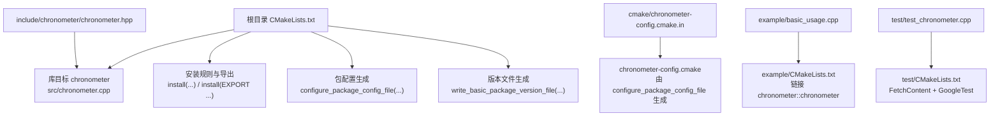
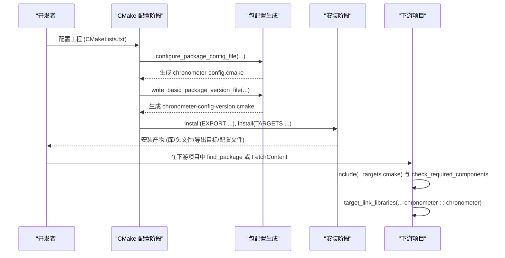
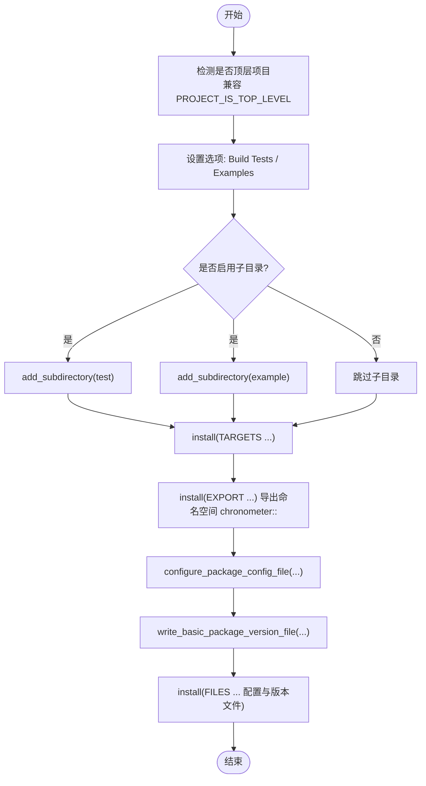
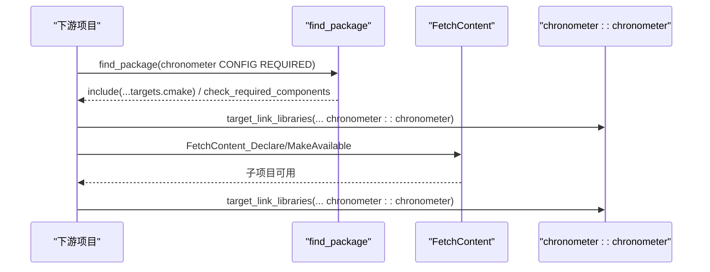
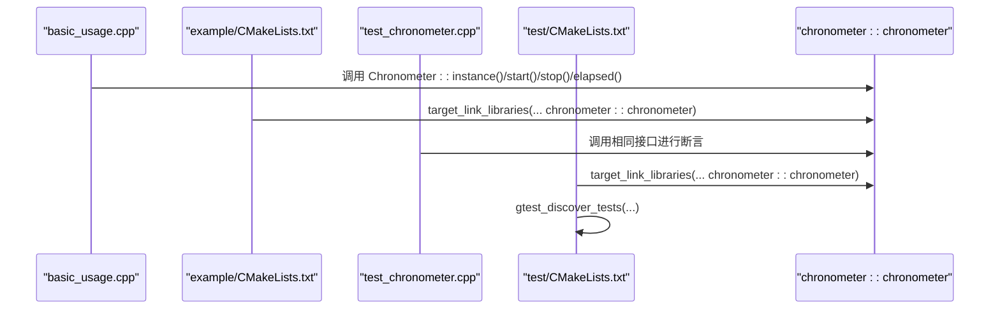
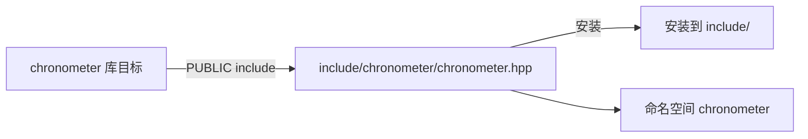
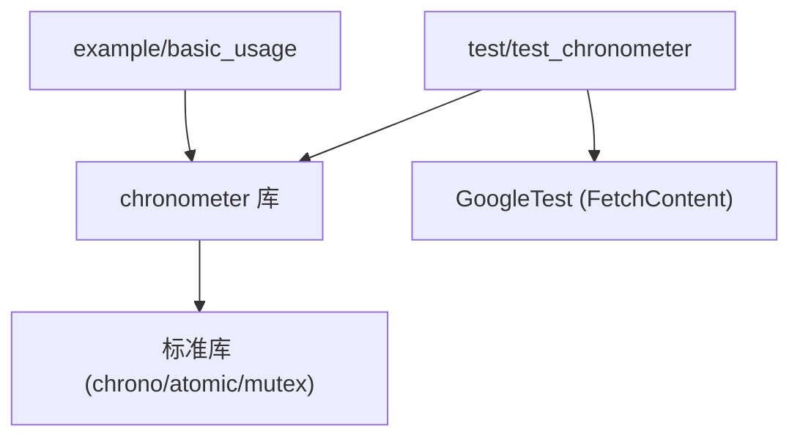

# 部署与集成指南

<cite>
**本文引用的文件**
- [CMakeLists.txt](file://CMakeLists.txt)
- [chronometer-config.cmake.in](file://cmake/chronometer-config.cmake.in)
- [chronometer.hpp](file://include/chronometer/chronometer.hpp)
- [chronometer.cpp](file://src/chronometer.cpp)
- [basic_usage.cpp](file://example/basic_usage.cpp)
- [example/CMakeLists.txt](file://example/CMakeLists.txt)
- [test/CMakeLists.txt](file://test/CMakeLists.txt)
- [test_chronometer.cpp](file://test/test_chronometer.cpp)
</cite>

## 目录
1. [简介](#简介)
2. [项目结构](#项目结构)
3. [核心组件](#核心组件)
4. [架构总览](#架构总览)
5. [详细组件分析](#详细组件分析)
6. [依赖分析](#依赖分析)
7. [性能考量](#性能考量)
8. [故障排查指南](#故障排查指南)
9. [结论](#结论)
10. [附录](#附录)

## 简介
本指南面向需要在不同构建系统与平台上集成 Chronometer 库的开发者，提供从 CMake 包配置、find_package 与 FetchContent 使用、安装与导出目标、版本管理与兼容性、跨平台编译、打包分发、命名空间与头文件安装、CI/CD 集成到安全与性能优化的全流程实践说明。内容基于仓库现有实现，确保可操作性与可追溯性。

## 项目结构
仓库采用标准 CMake 工程布局，包含库源码、头文件、示例、测试与 CMake 包配置模板：
- 根目录 CMakeLists.txt：主工程配置、库目标、安装与包导出
- include/chronometer/chronometer.hpp：公共接口头文件
- src/chronometer.cpp：库实现
- example/：示例程序与 CMake 配置
- test/：单元测试与 GoogleTest 集成
- cmake/chronometer-config.cmake.in：CMake 包配置模板

图表来源
- [CMakeLists.txt:1-82](file://CMakeLists.txt#L1-L82)
- [chronometer-config.cmake.in:1-6](file://cmake/chronometer-config.cmake.in#L1-L6)
- [chronometer.hpp:1-40](file://include/chronometer/chronometer.hpp#L1-L40)
- [chronometer.cpp:1-72](file://src/chronometer.cpp#L1-L72)
- [basic_usage.cpp:1-69](file://example/basic_usage.cpp#L1-L69)
- [example/CMakeLists.txt:1-7](file://example/CMakeLists.txt#L1-L7)
- [test/CMakeLists.txt:1-23](file://test/CMakeLists.txt#L1-L23)
- [test_chronometer.cpp:1-126](file://test/test_chronometer.cpp#L1-L126)

章节来源
- [CMakeLists.txt:1-82](file://CMakeLists.txt#L1-L82)
- [chronometer.hpp:1-40](file://include/chronometer/chronometer.hpp#L1-L40)
- [chronometer.cpp:1-72](file://src/chronometer.cpp#L1-L72)
- [example/CMakeLists.txt:1-7](file://example/CMakeLists.txt#L1-L7)
- [test/CMakeLists.txt:1-23](file://test/CMakeLists.txt#L1-L23)

## 核心组件
- 库目标与别名
  - 目标名称：chronometer
  - 别名：chronometer::chronometer
  - 作用域：PUBLIC include 目录对构建与安装均可见
- 接口与实现
  - 头文件定义了单例类 Chronometer 及时间单位枚举
  - 实现提供 start/stop/elapsed 方法与多线程安全机制
- 包配置与导出
  - 通过 CMakePackageConfigHelpers 生成包配置与版本文件
  - 导出目标命名空间为 chronometer::

章节来源
- [CMakeLists.txt:10-18](file://CMakeLists.txt#L10-L18)
- [CMakeLists.txt:43-81](file://CMakeLists.txt#L43-L81)
- [chronometer.hpp:18-37](file://include/chronometer/chronometer.hpp#L18-L37)
- [chronometer.cpp:32-69](file://src/chronometer.cpp#L32-L69)

## 架构总览
下图展示了 CMake 包配置与安装导出的关键流程，以及示例与测试如何消费库目标。

图表来源
- [CMakeLists.txt:64-81](file://CMakeLists.txt#L64-L81)
- [chronometer-config.cmake.in:1-6](file://cmake/chronometer-config.cmake.in#L1-L6)

## 详细组件分析

### CMake 包配置与导出
- 目标导出与命名空间
  - install(EXPORT ...) 导出目标，命名空间为 chronometer::
  - 安装路径遵循 GNUInstallDirs 规范
- 包配置模板
  - chronometer-config.cmake.in 通过 @PACKAGE_INIT@ 初始化，包含导出的目标文件，并校验必需组件
- 版本文件
  - write_basic_package_version_file(...) 生成版本文件，采用 SameMajorVersion 兼容策略
- 安装规则
  - 安装库目标、头文件目录、导出目标与配置文件至标准位置

图表来源
- [CMakeLists.txt:20-41](file://CMakeLists.txt#L20-L41)
- [CMakeLists.txt:43-81](file://CMakeLists.txt#L43-L81)
- [chronometer-config.cmake.in:1-6](file://cmake/chronometer-config.cmake.in#L1-L6)

章节来源
- [CMakeLists.txt:20-41](file://CMakeLists.txt#L20-L41)
- [CMakeLists.txt:43-81](file://CMakeLists.txt#L43-L81)
- [chronometer-config.cmake.in:1-6](file://cmake/chronometer-config.cmake.in#L1-L6)

### find_package 与 FetchContent 使用
- find_package 方式
  - 在下游项目中使用 find_package(chronometer CONFIG REQUIRED)，随后 include(...) 导入导出目标并链接 chronometer::chronometer
  - 该方式依赖已安装的包配置与导出目标
- FetchContent 方式
  - 在下游项目中使用 FetchContent_Declare/MakeAvailable 引入本仓库作为子项目，直接链接 chronometer::chronometer
  - 适合内联集成或快速迭代场景

图表来源
- [chronometer-config.cmake.in:1-6](file://cmake/chronometer-config.cmake.in#L1-L6)
- [CMakeLists.txt:10-12](file://CMakeLists.txt#L10-L12)
- [example/CMakeLists.txt:1-7](file://example/CMakeLists.txt#L1-L7)

章节来源
- [chronometer-config.cmake.in:1-6](file://cmake/chronometer-config.cmake.in#L1-L6)
- [CMakeLists.txt:10-12](file://CMakeLists.txt#L10-L12)
- [example/CMakeLists.txt:1-7](file://example/CMakeLists.txt#L1-L7)

### 示例与测试集成
- 示例程序
  - basic_usage.cpp 展示了单例获取、start/stop/elapsed 的基本用法与多单位输出
  - example/CMakeLists.txt 将示例链接到 chronometer::chronometer
- 测试
  - test/CMakeLists.txt 使用 FetchContent 引入 GoogleTest 并启用 gtest_discover_tests
  - test_chronometer.cpp 覆盖 start/stop、elapsed 行为、单位换算、异常与并发场景

图表来源
- [basic_usage.cpp:1-69](file://example/basic_usage.cpp#L1-L69)
- [example/CMakeLists.txt:1-7](file://example/CMakeLists.txt#L1-L7)
- [test_chronometer.cpp:1-126](file://test/test_chronometer.cpp#L1-L126)
- [test/CMakeLists.txt:1-23](file://test/CMakeLists.txt#L1-L23)

章节来源
- [basic_usage.cpp:1-69](file://example/basic_usage.cpp#L1-L69)
- [example/CMakeLists.txt:1-7](file://example/CMakeLists.txt#L1-L7)
- [test_chronometer.cpp:1-126](file://test/test_chronometer.cpp#L1-L126)
- [test/CMakeLists.txt:1-23](file://test/CMakeLists.txt#L1-L23)

### 头文件与命名空间
- 头文件安装
  - include(DIRECTORY include/) 安装 include/ 目录至标准头文件安装路径
- 命名空间
  - Chronometer 类位于 chronometer 命名空间，避免与外部冲突
- 目标 include 目录
  - target_include_directories 提供 BUILD_INTERFACE 与 INSTALL_INTERFACE，保证构建与安装后均可正确解析头文件

图表来源
- [CMakeLists.txt:14-18](file://CMakeLists.txt#L14-L18)
- [CMakeLists.txt:55-57](file://CMakeLists.txt#L55-L57)
- [chronometer.hpp:9-39](file://include/chronometer/chronometer.hpp#L9-L39)

章节来源
- [CMakeLists.txt:14-18](file://CMakeLists.txt#L14-L18)
- [CMakeLists.txt:55-57](file://CMakeLists.txt#L55-L57)
- [chronometer.hpp:9-39](file://include/chronometer/chronometer.hpp#L9-L39)

### 版本管理与兼容性
- 版本号
  - 项目版本在 project(chronometer VERSION ...) 中声明
- 兼容策略
  - write_basic_package_version_file(...) 使用 SameMajorVersion，允许主版本一致的补丁/次版本升级
- 兼容性处理
  - 对 CMake 3.21 以下版本手动模拟 PROJECT_IS_TOP_LEVEL，确保选项默认行为一致

章节来源
- [CMakeLists.txt:3](file://CMakeLists.txt#L3)
- [CMakeLists.txt:71-75](file://CMakeLists.txt#L71-L75)
- [CMakeLists.txt:20-28](file://CMakeLists.txt#L20-L28)

### 跨平台编译与依赖管理
- C++ 标准
  - 设置 C++20 标准，确保 chrono、原子与并发特性可用
- 依赖
  - 库自身无外部依赖，仅使用标准库组件
  - 示例与测试通过 FetchContent 引入 GoogleTest，便于在不同平台统一测试框架
- 平台差异
  - GNUInstallDirs 与 CMakePackageConfigHelpers 提供跨平台安装与包发现支持

章节来源
- [CMakeLists.txt:5-8](file://CMakeLists.txt#L5-L8)
- [test/CMakeLists.txt:1-9](file://test/CMakeLists.txt#L1-L9)
- [chronometer.cpp:3-5](file://src/chronometer.cpp#L3-L5)

### 打包与分发最佳实践
- 安装路径
  - 使用 GNUInstallDirs，确保符合各发行版安装约定
- 包配置与版本文件
  - 安装生成的配置与版本文件，便于下游 find_package 正确解析
- 发行版打包建议
  - RPM/DEB：将库目标、头文件、导出目标与配置文件按标准路径打包；版本文件与配置文件需随包分发以支持版本检查与包发现
  - 注意：本仓库未提供具体打包脚本，以上为通用实践建议

章节来源
- [CMakeLists.txt:44-57](file://CMakeLists.txt#L44-L57)
- [CMakeLists.txt:77-81](file://CMakeLists.txt#L77-L81)

### 与其他构建系统集成
- Meson
  - 可通过自定义模块或 pkg-config 文件间接消费 CMake 导出目标；若需直接集成，可在 Meson 中调用 CMake 生成与安装步骤
- Bazel
  - 可通过 external_repository 或自定义规则引入 CMake 工程；或直接使用 FetchContent 的思想在 WORKSPACE 中拉取源码并构建
- 通用建议
  - 优先使用 find_package(CONFIG) 与 install(EXPORT ...)，确保下游构建系统可自动发现目标

[本节为概念性说明，不直接分析具体文件]

### CI/CD 集成与自动化部署
- 建议流程
  - 构建：CMake 配置 + 编译
  - 测试：启用测试并运行 GoogleTest
  - 安装：安装库、头文件、导出目标与配置文件
  - 打包：RPM/DEB 包含上述产物
  - 发布：上传制品与版本标签
- 自动化要点
  - 使用同一 CMake 配置在多平台矩阵中执行
  - 将安装产物归档以便后续打包

[本节为通用实践说明，不直接分析具体文件]

## 依赖分析
- 内部依赖
  - 库目标 chronometer 依赖标准库（chrono、atomic、shared_mutex、unordered_map）
- 外部依赖
  - 示例与测试通过 FetchContent 引入 GoogleTest
- 目标耦合
  - 示例与测试均通过 chronometer::chronometer 与库交互，保持低耦合高内聚

图表来源
- [chronometer.cpp:3-7](file://src/chronometer.cpp#L3-L7)
- [basic_usage.cpp:1-5](file://example/basic_usage.cpp#L1-L5)
- [test_chronometer.cpp:1-6](file://test/test_chronometer.cpp#L1-L6)
- [test/CMakeLists.txt:3-9](file://test/CMakeLists.txt#L3-L9)

章节来源
- [chronometer.cpp:3-7](file://src/chronometer.cpp#L3-L7)
- [basic_usage.cpp:1-5](file://example/basic_usage.cpp#L1-L5)
- [test_chronometer.cpp:1-6](file://test/test_chronometer.cpp#L1-L6)
- [test/CMakeLists.txt:3-9](file://test/CMakeLists.txt#L3-L9)

## 性能考量
- 计时精度
  - 使用 steady_clock 提供单调时钟，避免系统时间回拨影响
- 并发模型
  - 使用 shared_mutex 支持读多写少场景下的并发访问
  - 原子变量 next_id_ 保证 ID 生成的无锁性
- 单例设计
  - 静态单例减少重复初始化开销
- 时间单位换算
  - 在实现内部进行纳秒到目标单位的换算，避免在高频调用路径上重复计算

章节来源
- [chronometer.cpp:10-28](file://src/chronometer.cpp#L10-L28)
- [chronometer.cpp:37-69](file://src/chronometer.cpp#L37-L69)
- [chronometer.hpp:34-36](file://include/chronometer/chronometer.hpp#L34-L36)

## 故障排查指南
- 找不到包或目标
  - 确认已安装包配置与导出目标；或在下游项目中使用 FetchContent 引入
  - 检查 find_package(chronometer CONFIG REQUIRED) 是否成功
- 链接失败
  - 确保链接到 chronometer::chronometer（而非原始目标名）
- 运行时异常
  - 对不存在的计时器 ID 调用 stop/elapsed 会抛出 out_of_range，需在业务侧捕获并处理
- 并发问题
  - 若出现死锁或数据竞争，请确认使用单例接口与正确的生命周期管理

章节来源
- [chronometer-config.cmake.in:1-6](file://cmake/chronometer-config.cmake.in#L1-L6)
- [test_chronometer.cpp:87-96](file://test/test_chronometer.cpp#L87-L96)
- [chronometer.cpp:44-48](file://src/chronometer.cpp#L44-L48)

## 结论
本指南基于仓库现有实现，系统阐述了 Chronometer 库的 CMake 包配置、安装与导出、find_package 与 FetchContent 集成、跨平台编译与打包分发、命名空间与头文件安装、版本兼容性与故障排查等关键环节。建议在实际项目中优先采用 find_package(CONFIG) 与 install(EXPORT ...)，配合 GNUInstallDirs 与 CMakePackageConfigHelpers，确保下游构建系统可无缝发现与链接库目标。

## 附录
- 关键实现参考路径
  - 包配置模板：[chronometer-config.cmake.in](file://cmake/chronometer-config.cmake.in)
  - 主工程配置：[CMakeLists.txt](file://CMakeLists.txt)
  - 库接口头文件：[chronometer.hpp](file://include/chronometer/chronometer.hpp)
  - 库实现：[chronometer.cpp](file://src/chronometer.cpp)
  - 示例程序：[basic_usage.cpp](file://example/basic_usage.cpp)
  - 示例 CMake：[example/CMakeLists.txt](file://example/CMakeLists.txt)
  - 测试工程：[test/CMakeLists.txt](file://test/CMakeLists.txt)
  - 测试用例：[test_chronometer.cpp](file://test/test_chronometer.cpp)