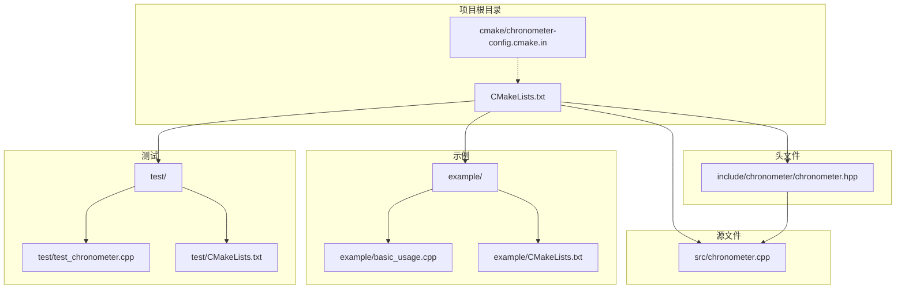
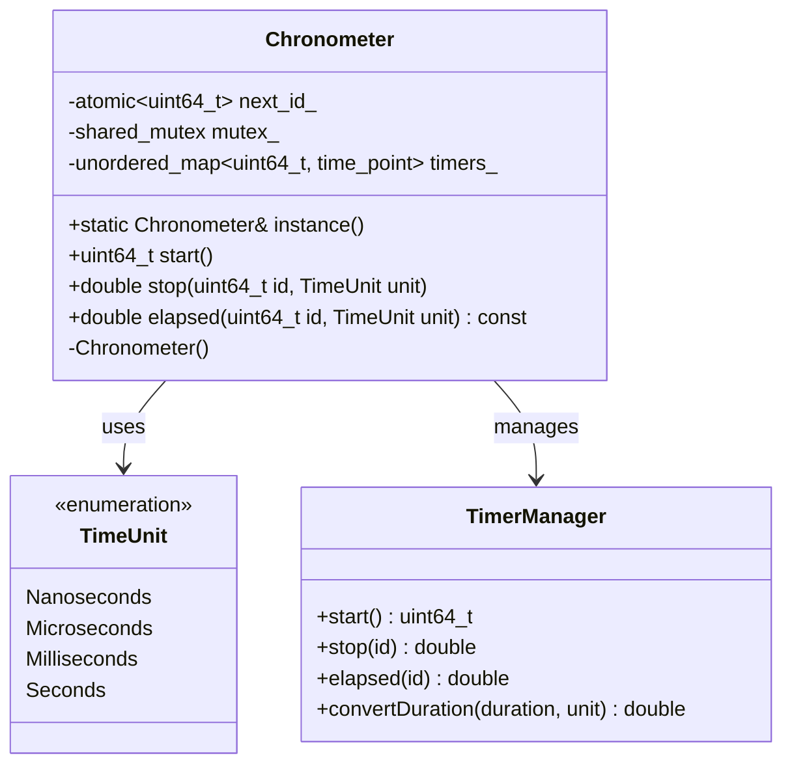
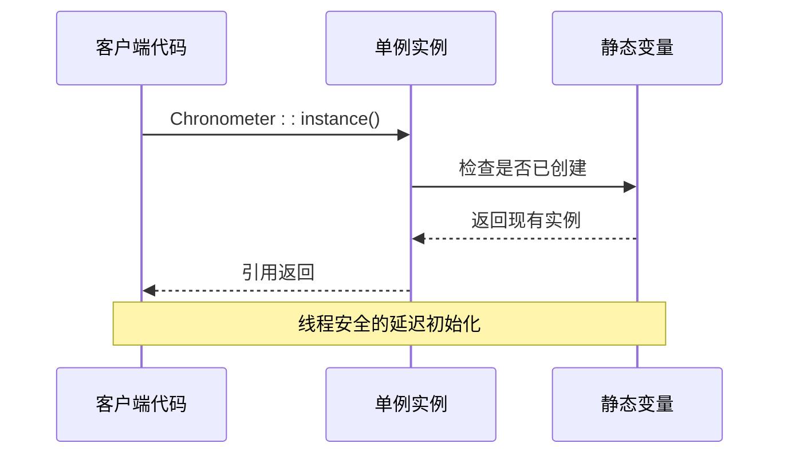
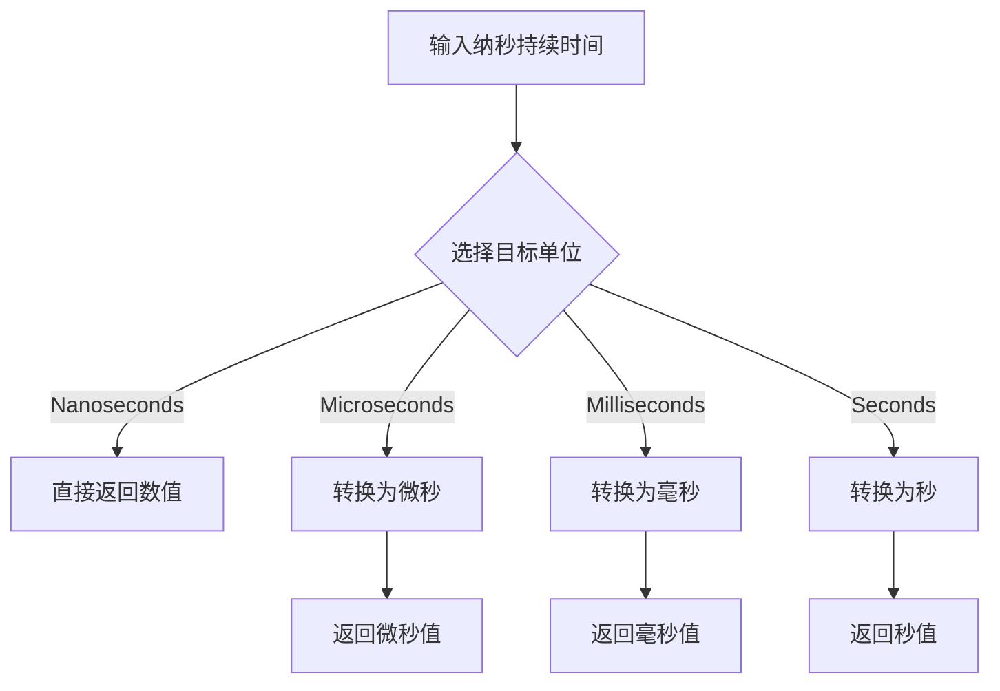
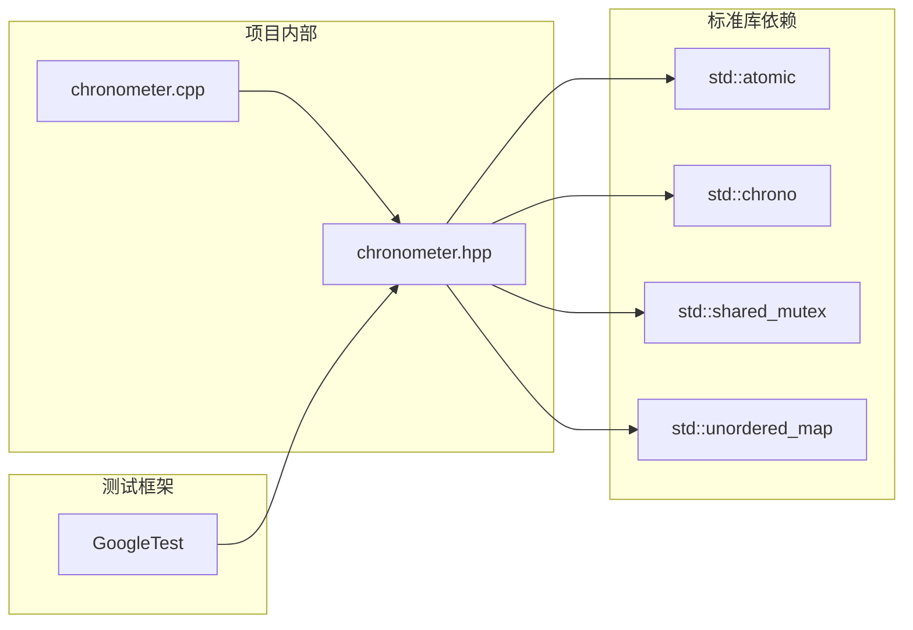

# 项目概述

<cite>
**本文档引用的文件**
- [include/chronometer/chronometer.hpp](file://include/chronometer/chronometer.hpp)
- [src/chronometer.cpp](file://src/chronometer.cpp)
- [example/basic_usage.cpp](file://example/basic_usage.cpp)
- [CMakeLists.txt](file://CMakeLists.txt)
- [test/test_chronometer.cpp](file://test/test_chronometer.cpp)
- [cmake/chronometer-config.cmake.in](file://cmake/chronometer-config.cmake.in)
- [example/CMakeLists.txt](file://example/CMakeLists.txt)
- [test/CMakeLists.txt](file://test/CMakeLists.txt)
</cite>

## 目录
1. [简介](#简介)
2. [项目结构](#项目结构)
3. [核心组件](#核心组件)
4. [架构概览](#架构概览)
5. [详细组件分析](#详细组件分析)
6. [依赖分析](#依赖分析)
7. [性能考虑](#性能考虑)
8. [故障排除指南](#故障排除指南)
9. [结论](#结论)
10. [附录](#附录)

## 简介

Chronometer 是一个专为 C++20 设计的高性能单例模式线程安全计时器库。该项目的核心价值在于提供简单易用且功能强大的计时能力，同时确保在多线程环境下的完全安全性。通过采用现代 C++ 技术和最佳实践，Chronometer 为开发者提供了可靠的性能监控、代码分析和基准测试解决方案。

### 设计理念

Chronometer 的设计理念围绕以下几个核心原则：
- **单例模式**：确保全局唯一性，避免重复初始化开销
- **线程安全**：支持多线程并发访问，无死锁风险
- **非阻塞操作**：最小化锁竞争，提高并发性能
- **C++20 标准**：充分利用现代 C++ 特性
- **简洁 API**：提供直观易用的接口设计

### 目标受众

该库适用于以下用户群体：
- **系统程序员**：需要精确性能测量的底层开发
- **游戏开发者**：实时性能监控和帧率分析
- **科学计算工程师**：算法性能评估和优化
- **Web 开发者**：后端服务性能监控
- **研究人员**：实验数据的时间戳记录

### 典型使用场景

- **性能监控**：实时监控系统组件性能
- **代码分析**：识别性能瓶颈和热点代码
- **基准测试**：算法和数据结构的性能比较
- **调试工具**：程序执行时间分析
- **日志系统**：带时间戳的性能日志记录

## 项目结构

Chronometer 项目采用清晰的分层结构，遵循现代 C++ 库的标准组织方式：



**图表来源**
- [CMakeLists.txt:1-82](file://CMakeLists.txt#L1-L82)
- [include/chronometer/chronometer.hpp:1-40](file://include/chronometer/chronometer.hpp#L1-L40)
- [src/chronometer.cpp:1-72](file://src/chronometer.cpp#L1-L72)

**章节来源**
- [CMakeLists.txt:1-82](file://CMakeLists.txt#L1-L82)
- [include/chronometer/chronometer.hpp:1-40](file://include/chronometer/chronometer.hpp#L1-L40)

## 核心组件

### Chronometer 类

Chronometer 类是整个库的核心，实现了单例模式和完整的计时功能。该类提供了线程安全的计时能力，支持多种时间单位和并发操作。

#### 主要特性

- **单例实例管理**：通过静态工厂方法提供全局唯一实例
- **多线程支持**：使用共享互斥锁实现读写分离
- **原子 ID 分配**：无锁 ID 生成机制
- **灵活的时间单位**：支持纳秒、微秒、毫秒、秒四种单位
- **异常安全**：对无效操作抛出明确的异常

#### 关键成员函数

- `instance()`：获取单例实例
- `start()`：启动新的计时器并返回唯一标识符
- `stop(id, unit)`：停止指定计时器并返回持续时间
- `elapsed(id, unit)`：查询指定计时器的当前持续时间

**章节来源**
- [include/chronometer/chronometer.hpp:18-37](file://include/chronometer/chronometer.hpp#L18-L37)
- [src/chronometer.cpp:32-69](file://src/chronometer.cpp#L32-L69)

## 架构概览

Chronometer 采用了经典的单例模式架构，结合现代 C++ 的并发编程技术：



**图表来源**
- [include/chronometer/chronometer.hpp:18-37](file://include/chronometer/chronometer.hpp#L18-L37)
- [src/chronometer.cpp:8-28](file://src/chronometer.cpp#L8-L28)

### 并发控制机制

项目采用了分层的并发控制策略：

1. **原子操作**：用于 ID 分配，避免锁竞争
2. **共享互斥锁**：读操作使用共享锁，写操作使用独占锁
3. **无锁容器**：使用 unordered_map 进行高效查找

**章节来源**
- [src/chronometer.cpp:37-69](file://src/chronometer.cpp#L37-L69)

## 详细组件分析

### 单例模式实现

Chronometer 使用了 C++11 标准的静态局部变量保证线程安全的单例实现：



**图表来源**
- [src/chronometer.cpp:32-35](file://src/chronometer.cpp#L32-L35)

### 计时器生命周期管理

每个计时器都有独立的生命周期，支持多次查询和一次性停止：

```mermaid
flowchart TD
Start([调用 start]) --> GenID[生成唯一ID<br/>next_id_.fetch_add]
GenID --> StoreTime[存储起始时间<br/>timers_[id] = now]
StoreTime --> ReturnID[返回ID给调用者]
ReturnID --> QueryElapsed[调用 elapsed]
QueryElapsed --> GetNow[获取当前时间]
GetNow --> CalcDuration[计算持续时间]
CalcDuration --> ReturnElapsed[返回中间值]
ReturnID --> StopTimer[调用 stop]
StopTimer --> FindTimer[查找计时器]
FindTimer --> EraseTimer[从映射中移除]
EraseTimer --> ReturnDuration[返回总持续时间]
```

**图表来源**
- [src/chronometer.cpp:37-69](file://src/chronometer.cpp#L37-L69)

**章节来源**
- [src/chronometer.cpp:37-69](file://src/chronometer.cpp#L37-L69)

### 时间单位转换机制

项目实现了灵活的时间单位转换系统，支持四种标准时间单位：



**图表来源**
- [src/chronometer.cpp:10-28](file://src/chronometer.cpp#L10-L28)

**章节来源**
- [src/chronometer.cpp:10-28](file://src/chronometer.cpp#L10-L28)

## 依赖分析

### 外部依赖

Chronometer 项目具有极简的外部依赖：



**图表来源**
- [include/chronometer/chronometer.hpp:3-7](file://include/chronometer/chronometer.hpp#L3-L7)
- [src/chronometer.cpp:1-5](file://src/chronometer.cpp#L1-L5)

### 内部模块依赖

项目内部模块之间的依赖关系清晰且单一：

- **头文件模块**：仅包含必要的标准库头文件
- **实现模块**：依赖头文件定义
- **示例模块**：依赖公共 API
- **测试模块**：依赖公共 API 和测试框架

**章节来源**
- [include/chronometer/chronometer.hpp:1-40](file://include/chronometer/chronometer.hpp#L1-L40)
- [src/chronometer.cpp:1-72](file://src/chronometer.cpp#L1-L72)

## 性能考虑

### 并发性能优化

Chronometer 在设计时充分考虑了并发性能：

- **原子操作优先**：ID 分配使用原子操作，避免锁竞争
- **读写分离**：读操作使用共享锁，写操作使用独占锁
- **无锁容器**：使用哈希表进行 O(1) 平均查找复杂度
- **内存局部性**：时间戳存储在连续内存区域

### 内存管理

- **栈分配**：单例实例在静态存储期分配
- **RAII 管理**：自动资源管理，无泄漏风险
- **移动语义禁用**：防止意外的资源转移

### 时间精度

- **高精度时钟**：使用 steady_clock 提供单调递增时间
- **纳秒级精度**：内部以纳秒为基准进行计算
- **单位转换**：按需转换到目标单位，避免精度损失

## 故障排除指南

### 常见问题及解决方案

#### 1. 计时器 ID 未找到错误

**症状**：调用 `stop()` 或 `elapsed()` 时抛出 `std::out_of_range` 异常

**原因**：
- 使用了不存在的计时器 ID
- 计时器已被停止并从映射中移除
- ID 跨线程传递导致过期

**解决方案**：
- 确保使用正确的计时器 ID
- 避免跨线程传递计时器 ID
- 在调用前检查计时器状态

#### 2. 并发访问冲突

**症状**：多线程环境下出现死锁或数据竞争

**原因**：不正确的锁使用或竞态条件

**解决方案**：
- 使用库提供的线程安全接口
- 避免在计时器生命周期外访问
- 确保正确的锁顺序

#### 3. 性能问题

**症状**：计时操作影响程序性能

**原因**：
- 过度频繁的计时操作
- 锁竞争导致的性能下降

**解决方案**：
- 合理使用计时器，避免过度监控
- 将计时操作集中在关键路径
- 考虑批量处理计时结果

**章节来源**
- [test/test_chronometer.cpp:87-96](file://test/test_chronometer.cpp#L87-L96)
- [src/chronometer.cpp:44-68](file://src/chronometer.cpp#L44-L68)

## 结论

Chronometer C++ 计时器库是一个精心设计的高性能工具，它成功地将现代 C++ 技术与实用的计时需求相结合。通过采用单例模式、线程安全机制和 C++20 标准，该库为开发者提供了一个可靠、高效的性能监控解决方案。

### 主要优势

1. **设计简洁**：API 设计直观，易于理解和使用
2. **性能卓越**：最小化的锁竞争和高效的内存管理
3. **线程安全**：完全支持多线程并发访问
4. **标准兼容**：充分利用 C++20 新特性
5. **维护成本低**：极简的依赖和清晰的架构

### 技术特色

- **单例模式**：确保全局唯一性和资源效率
- **原子操作**：无锁 ID 分配机制
- **共享互斥锁**：读写分离的并发控制
- **灵活的时间单位**：支持多种精度级别
- **异常安全**：明确的错误处理机制

对于需要精确性能测量和监控的应用程序，Chronometer 提供了理想的解决方案。无论是系统级开发还是应用级性能优化，这个库都能满足各种使用场景的需求。

## 附录

### 快速开始指南

以下是最基本的使用步骤：

1. **获取单例实例**：通过 `Chronometer::instance()` 获取全局计时器
2. **启动计时**：调用 `start()` 方法开始计时，获得唯一 ID
3. **查询中间值**：使用 `elapsed(id)` 获取当前持续时间
4. **停止计时**：调用 `stop(id)` 获取总持续时间

### 实际使用示例

项目包含完整的示例代码，展示了各种使用场景：

- **基本用法**：演示最简单的 start/stop 操作
- **中间值查询**：展示如何在不中断计时的情况下获取进度
- **多单位支持**：演示不同时间单位的使用
- **代码块测量**：展示实际代码段的性能测量

**章节来源**
- [example/basic_usage.cpp:8-68](file://example/basic_usage.cpp#L8-L68)

### 编译和安装

项目使用 CMake 构建系统，支持标准的安装流程：

- **编译选项**：支持构建测试和示例
- **安装规则**：提供完整的安装配置
- **包管理**：支持 CMake 包发现机制

**章节来源**
- [CMakeLists.txt:10-82](file://CMakeLists.txt#L10-L82)
- [cmake/chronometer-config.cmake.in:1-6](file://cmake/chronometer-config.cmake.in#L1-L6)